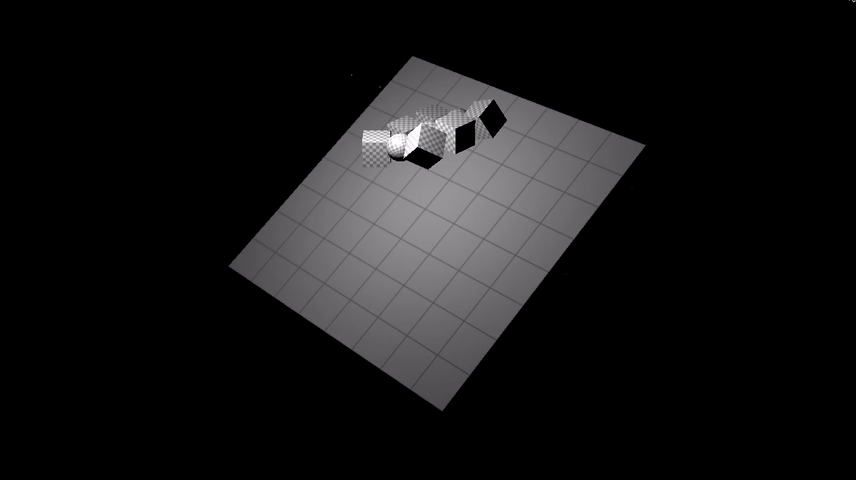

# Yocto/GL: Single File Libraries for Physically-Based Graphics

Yocto/GL is a collection of single-file libraries for building physically-based graphics applications. Yocto/GL is written in C++14, with compilation supported on C++11, and compiles on OSX (clang/gcc), Linux (gcc) and Windows (MSVC 2017).

Yocto/GL libraries are released under the permissive MIT license, while the example apps are released under the 2-clause BSD (to include warranty for binary distribution).

## Libraries

- [**yocto_obj**](doc/yocto_obj.md) (.h/.cpp): Wavefront OBJ/MTL loader and writer that supports arbitrary polygons (with/without triangulation), lines, and points. Includes optionals extensions for per-vertex color and radius, camera, instancing and environment mapping. Provides both a high level interface for easy data access and a low level interface for complete control of the format.
- [**yocto_gltf**](doc/yocto_gltf.md) (.h/.cpp): Khronos glTF loader and writer automatically generated from the spec. Supports all glTF format including Khronos extensions. Provides both a high level interface for easy data access and a low level interface for complete control of the format.
- [**yocto_bvh**](doc/yocto_bvh.md) (.h and .cpp): Ray casting and closet point queries for points, lines and triangles accelerated by a two-level bounding volume hierarchy.
- [**yocto_trace**](doc/yocto_trace.md) (.h/.cpp): Path tracer with support for point, line or triangle geometry, mesh area lights and environment maps, materials with either GGX or Phong (only opaque for now). Support both incremental and offline computation on single- or multi-core machines.
- [**yocto_math**](doc/yocto_math.md) (.h only): Vector and matrix math, shape and image manipulation.
- [**yocto_utils**](doc/yocto_utils.md) (.h only): Utilities for writing applications. Includes command line parsing, logging, thread pools, string and path manipulation.
- [**yocto_sym**](doc/yocto_sym.md) (.h/.cpp): Rigid body solver supporting convex and concave triangle meshes based on Sequential Impulses.
- [**yocto_glu**](doc/yocto_glu.md) (.h/.cpp): Quick and dirty rendering of images and shapes in OpenGL, useful to create interactive viewers.
- [**yocto_gui**](doc/yocto_gui.md) (.h/.cpp): A wrapper for GLFW and ImGui for window management and immediate mode widgets.
- [**yocto_img**](doc/yocto_img.md) (.h/.cpp): A wrapper for single-file libraries for image loading and saving.

## Applications

This repository contains Yocto/GL applications written to test the libraries.

- **yview**: Simple OpenGL viewer for OBJ and glTF scenes.
- **ytrace**: Interactive/Offline path-tracer.
- **ysym**: Interactive/Offline rigid body demo.
- **yobj2gltf**: Converts Wavefront OBJ to glTF 2.
- **ytestgen**: Creates various test cases for the path tracer and GL viewer.
- **yimview**: HDR/PNG/JPG image viewer with exposure/gamma tone mapping.
- **yimproc**: Offline image manipulation.

## Tools

This repository contains tools used for code generation and documentation
extraction.

- **ygltfgen.cpp**: glTF parsing code generation.
- **ydocgen.cpp**: Documentation generation.

## Building

You can build the non-interactive example apps using [cmake](http://cmake.org)
with

    mkdir cmake
    cd cmake
    cmake ..
    make -j4        # linux/OSX
    msbuild         # Windows

The interactive apps use OpenGL, GLFW and GLEW. We include binaries for Windows, but you have to install the libraries yourself on Linux (we use `apt-get`) and OSX (we use [homebrew](http://brew.sh)). If these libraries and not available you can compile without interactive viewer support with

    cmake -DYOCTO_NO_OPENGL=ON ..

## Example Screenshots

A few screenshots from **ytrace** are included here for demonstration.

A screen capture from **ysym** is included here for demonstration.

## Documentation

Each library is documented entirely in source code. Documentation is extracted for easier viewing in the docs folder.
