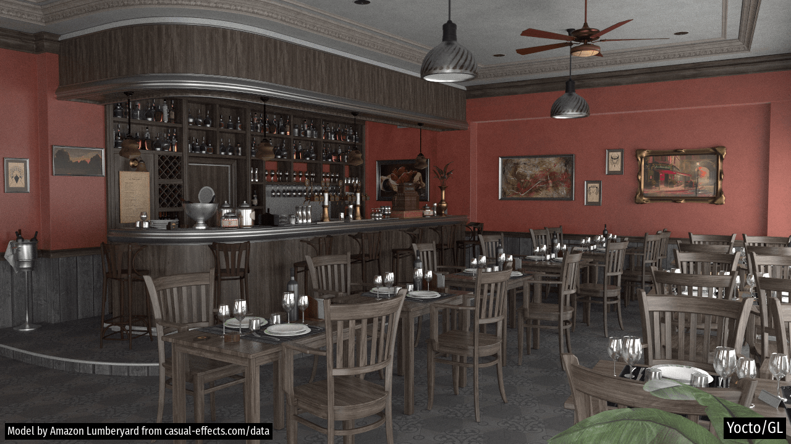

---
hide:
  - toc # Hide table of contents
---

# Gallery

This page contains a collection of images rendered with the Yocto/GL path tracer.

## Environments

## Interiors

## Objects

## Vehicles

## Minecraft

