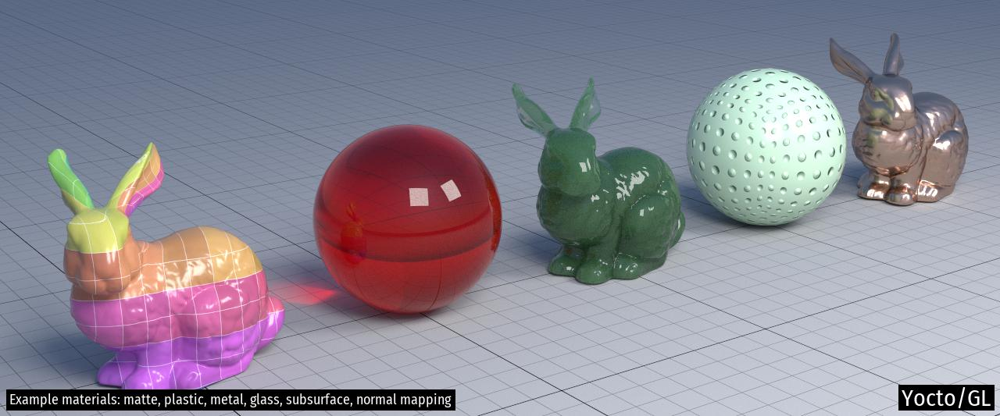
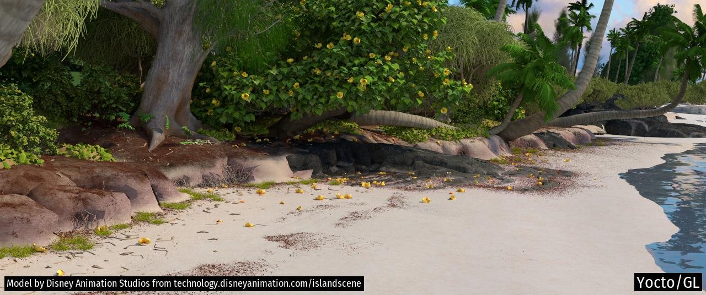

# Yocto/GL: Tiny C++ Libraries for Data-Oriented Physically-based Graphics

Yocto/GL is a collection of small C++17 libraries for building
physically-based graphics algorithms released under the MIT license.
Yocto/GL is written in a deliberately data-oriented style for ease of
development and use.

## Libraries

Yocto/GL is split into small libraries to make code navigation easier.
See each header file for documentation.

- [Yocto/Math](yocto/yocto_math.md): fixed-size vectors, matrices, rigid frames,
  transforms
- [Yocto/Color](yocto/yocto_color.md): color conversion, color adjustment,
  tone mapping functions, color grading, color maps, color spaces
- [Yocto/Geometry](yocto/yocto_geometry.md): rays, bounding boxes,
  geometry functions, ray-primitive intersection, point-primitive overlap
- [Yocto/Noise](yocto/yocto_noise.md): Perlin noise
- [Yocto/Sampling](yocto/yocto_sampling.md): random number generation,
  generation of points and directions, Monte Carlo utilities
- [Yocto/Shading](yocto/yocto_shading.md): evaluation and sampling of fresnel
  functions, bsdf lobes, transmittance lobes, phase functions
- [Yocto/Image](yocto/yocto_image.md): simple image data type, image resizing,
  tonemapping, color correction, procedural images, procedural sun-sky
- [Yocto/Shape](yocto/yocto_shape.md): utilities for manipulating
  triangle meshes, quads meshes and line sets, computation of normals and
  tangents, linear and Catmull-Clark subdivision, procedural shapes generation,
  ray intersection and closest point queries
- [Yocto/Mesh](yocto/yocto_mesh.md): computational geometry utilities for
  triangle meshes, mesh geodesic, mesh cutting
- [Yocto/Bvh](yocto/yocto_bvh.md): ray intersection and closest point queries
  of triangle meshes, quads meshes, line sets and instances scenes using a
  two-level bounding volume hierarchy
- [Yocto/Scen](yocto/yocto_scene.md): scene representation and properties
  evaluation
- [Yocto/SceneIO](yocto/yocto_sceneio.md): image serialization,
  shape serialization, scene serialization, text and binary serialization,
  path helpers
- [Yocto/Trace](yocto/yocto_trace.md): path tracing of surfaces and hairs
  supporting area and environment illumination, microfacet GGX and subsurface
  scattering, multiple importance sampling
- [Yocto/ModelIO](yocto/yocto_modelio.md): parsing and writing for Ply, Obj,
  Stl, Pbrt formats
- [Yocto/Cli](yocto/yocto_cli.md): printing utilities and command line parsing
- [Yocto/Parallel](yocto/yocto_parallel.md): concurrency utilities

## Example Applications

You can see Yocto/GL in action in the following applications written to
test the library:

- `apps/yscene.cpp`: command-line scene manipulation and rendering, and interactive viewing
- `apps/yshape.cpp`: command-line shape manipulation and rendering, and interactive viewing
- `apps/yimage.cpp`: command-line image manipulation, and interactive viewing

Here are some test images rendered with the path tracer. More images are
included in the [project site](https://xelatihy.github.io/yocto-gl/).

## Design Considerations

Yocto/GL follows a "data-oriented programming model" that makes data explicit.
Data is stored in simple structs and accessed with free functions or directly.
All data is public, so we make no attempt at encapsulation.
Most objects is Yocto/GL have value semantic, while large data structures
use reference semantic with strict ownership. This means that everything
can be trivially serialized and there is no need for memory management.

We do this since this makes Yocto/GL easier to extend and quicker to learn,
with a more explicit data flow that is easier when writing parallel code.
Since Yocto/GL is mainly used for research and teaching,
explicit data is both more hackable and easier to understand.

In terms of code style we prefer a functional approach rather than an
object oriented one, favoring free functions to class methods. All functions
and data are defined in sibling namespaces contained in the `yocto` namespace
so libraries can call all others, but have to do so explicitly.

The use of templates in Yocto was the reason for many refactoring, going
from no template to heavy template use. At this point, Yocto uses some templates
for readability. In the future, we will increase the use of templates in math
code, while keeping many APIs explicitly typed.

We do not use exception for error reporting, but only to report "programmers"
errors. For example, IO operations use boolean flags and error strings for
human readable errors, while exceptions are used when preconditions or
post conditions are violated in functions.

After several refactoring, we settled on a value-based approach, since the use
of pointers and reference semantics was hard for many of our users. While
this has the drawback of potentially introducing spurious copies, it does
have th benefit of ensuring that no memory corruption can occur, which
turned out was a major issue for novice C++ users, even in a very small
library like this one.

## Credits

Main contributors:

- Fabio Pellacini (lead developer): [web](http://pellacini.di.uniroma1.it), [github](https://github.com/xelatihy)
- Edoardo Carra: [github](https://github.com/edoardocarra)
- Giacomo Nazzaro: [github](https://github.com/giacomonazzaro)

This library includes code from the [PCG random number generator](http://www.pcg-random.org),
boost `hash_combine`, and public domain code from `github.com/sgorsten/linalg`,
`gist.github.com/badboy/6267743`.
Other external libraries are included with their own license.

## Compilation

This library requires a C++17 compiler and is know to compiled on
OsX (Xcode >= 11), Windows (MSVC 2019) and Linux (gcc >= 9, clang >= 9).

You can build the example applications using CMake with
`mkdir build; cd build; cmake ..; cmake --build`

Yocto/GL depends on `stb_image.h`, `stb_image_write.h`, `stb_image_resize.h` and
`tinyexr.h` for image loading, saving and resizing, `cgltf.h` and `json.hpp`
for glTF and JSON support, and `filesystem.hpp` to support C++17 filesystem API
when missing. All dependencies are included in the distribution.

Yocto/GL optionally supports building OpenGL demos, which are handled by including
glad, GLFW, ImGui as dependencies in apps. OpenGL support might eventually
become part of the Yocto/GL libraries. OpenGL support is enabled by defining
the cmake option `YOCTO_OPENGL` and contained in the `yocto_gui` library.

Yocto/GL optionally supports the use of Intel's Embree for ray casting.
See the main CMake file for how to link to it. Embree support is enabled by
defining the cmake option `YOCTO_EMBREE`.

Yocto/GL optionally supports the use of Intel's Open Image Denoise for denoising.
See the main CMake file for how to link to it. Open Image Denoise support
is enabled by defining the cmake option `YOCTO_DENOISE`.
