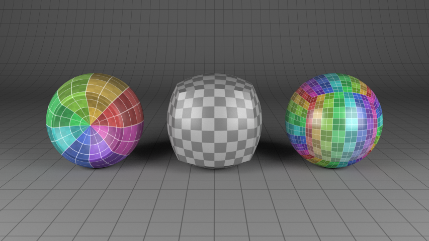

# Yocto/GL: Tiny C++ Library for Physically-based Graphics

Yocto/GL is a collection utilities for building physically-based graphics
algorithms implemented as a two-file library (`yocto_gl.h`, `yocto_gl.cpp`),
and released under the MIT license. Features include:

- convenience math functions for graphics
- static length vectors for 2, 3, 4 length of arbitrary type
- static length matrices for 2x2, 3x3, 4x4 of arbitrary type
- static length rigid transforms (frames), specialized for 2d and 3d space
- linear algebra operations and transforms
- axis aligned bounding boxes
- rays and ray-primitive intersection
- point-primitive distance and overlap tests
- normal and tangent computation for meshes and lines
- generation of tesselated meshes
- mesh refinement with linear tesselation and Catmull-Cark subdivision
- keyframed animation, skinning and morphing
- random number generation via PCG32
- simple image data structure and a few image operations
- simple scene format
- generation of image examples
- generation of scene examples
- procedural sun and sky HDR
- procedural Perlin noise
- BVH for intersection and closest point query
- Python-like string, path and container operations
- utilities to load and save entire text and binary files
- immediate mode command line parser
- simple logger
- path tracer supporting surfaces and hairs, GGX and MIS
- support for loading and saving Wavefront OBJ and Khronos glTF
- support for loading Bezier curves from SVG
- OpenGL utilities to manage textures, buffers and prograrms
- OpenGL shader for image viewing and GGX microfacet and hair rendering

The current version is 0.3.10.

## Credits

This library includes code from the PCG random number generator,
boost hash_combine, Pixar multijittered sampling,
code from "Real-Time Collision Detection" by Christer Ericson, base64
encode/decode by René Nyffenegger and public domain code from
github.com/sgorsten/linalg, gist.github.com/badboy/6267743 and
github.com/nothings/stb_perlin.h.

This library imports many symbols from std for three reasons: avoid
verbosity , ensuring better conventions when calling math functions and
allowing easy overriding of std containers if desired. Just do not
flatten this namespace into yours if this is a concern.

For most components of the library, the use should be relatively easy to
understand if you are familiar with 3d computer graphics. For more complex
components, we follow the usage below.

## Design Considerations

Yocto/GL tries to follow a simple programming model inspired by C but with
heavy use of operator overloading for math readability. We attempt to make
the code easy to use use rather than as performant as possible.
We adopt a functional style and only rarely use classes and methods.
Using a function style makes the code easier to extend, more explicit in
the function requirements, and easier to write parallel-friendly APIs.
I guess you could call this "data-driven programming".

The use of templates in Yocto was the reason for many refactorings, going
from no template to heavy templates use. At this time, templates are used
in the basic types to make the codebase shorter and reduce bugs,
at the price of accessibility for beginners. The truth is that modern C++,
a tenant of Yocto, is heavily templated anyway, so being able to read
template code is necessary no matter how Yocto does things.

We make use of exception for error reporting. This makes the code
much cleaner and more in line with the expectation of most other programming
languages.

Finally, we often import symbols from the standard library rather than
using the `std::name` pattern. We found that this improves consistency
when using math functions, and is more readable with templates. We realize
this is not standard, but the imports are hidden within the ygl namespace,
so library users do not have to be concern about it.

## Compilation

Yocto/GL is written in C++14 and compiles on OSX (clang from Xcode 9+),
Linux (gcc 6+, clang 4+) and Windows (MSVC 2015, MSVC 2017).

For image loading and saving, Yocto/GL depends on `stb_image.h`,
`stb_image_write.h`, `stb_image_resize.h` and `tinyexr.h`. These features
can be disabled by defining YGL_IMAGEIO to 0 before including this file.
If these features are useful, then the implementation files need to
included in the manner described by the respective libraries. To simplify
builds, we provide a file that builds these libraries, `stb_image.cpp`.

To support Khronos glTF, Yocto/GL depends on `json.hpp`. This feature can
be disabled by defining YGL_GLTF to 0 before including this file.

To support SVG, Yocto/GL depends on `nanosvg.h`. This feature can
be disabled by defining YGL_SVG to 0 before including this file.

OpenGL utilities include the OpenGL libraries, use GLEW on Windows/Linux,
GLFW for windows handling and Dear ImGui for UI support.
Since OpenGL is quite onerous and hard to link, its support can be disabled
by defining YGL_OPENGL to 1 before including this file. If you use any of
the OpenGL calls, make sure to properly link to the OpenGL libraries on
your system. For ImGUI, build with the libraries `imgui.cpp`,
`imgui_draw.cpp`, `imgui_impl_glfw_gl3.cpp`.

## Example Applications

You can see Yocto/GL in action in the following applications written to
test the library:

- `yview.cpp`: simple OpenGL viewer for OBJ and glTF scenes
- `ytrace.cpp`: offline path-tracer
- `yitrace.cpp.cpp`: interactive path-tracer
- `yscnproc.cpp`: scene manipulation and conversion to/from OBJ and glTF
- `ytestgen.cpp`: creates test cases for the path tracer and GL viewer
- `yimview.cpp`: HDR/PNG/JPG image viewer with exposure/gamma tone mapping
- `yimproc.cpp`: offline image manipulation.

You can build the example applications using CMake with
    `mkdir build; cd build; cmake ..; cmake --build`

Here are two images rendered with the builtin path tracer, where the
scenes are crated with the test generator.

## Usage

To use the library simply include this file and setup the compilation
option as described above.
All library features are documented at their definition and should be
relatively easy to use if you are familiar with writing graphics code.
You can find the extracted documentation at `yocto_gl.md`.
Here we give an overview of some of the main features.

### Small Vectors and Matrices, Frames, Bounding Boxes and Transforms

We provide common operations for small vectors and matrices typically used
in graphics. In particular, we support 2-4 dimensional vectors of arbitrary
`vec<T, 2>`, `vec<T, 3>`, `vec<T, 4>` with specializarion for float
(`vec2f`, `vec3f`, `vec4f`), int (`vec2i`, `vec3i`, `vec4i`) and bytes
(`vec4b`). Vector operations are templated so they work on every type, but
many of them are well-defined only for float types.

We support 2-4 dimensional generic matrices `mat<T, 2>`, `mat<T, 3>`,
`mat<T, 4>`, with matrix-matrix and matrix-vector products, transposes and
inverses. Matrices are stored in column-major ordered and are accessed and
constructed by column.

To represent transformations, most of the library facilities prefer the use
coordinate frames, aka rigid transforms, represented as `frame<T, 3>`.
The structure store three coordinate axis and the frame origin. This is
equivalent to a rigid transform written as a column-major affine
matrix. Transform operations are better behaved with this representation.

We represent coordinate bounds with axis-aligned bounding boxes in 1-4
dimensions: `bbox<T, 1>`, `bbox<T, 2>`, `bbox<T, 3>`, `bbox<T, 4>`. These
types support expansion operation, union and containment. We provide
operations to compute bounds for points, lines, triangles and quads.

For all basic types we support iteration with `begin()`/`end()` pairs,
data access with `data()`, `empty()` and `size()` and stream inout and
output.

For both matrices and frames we support transform operations for points,
vectors and directions (`trasform_point()`, `trasform_vector()`,
`trasform_direction()`). For frames we also the support inverse operations
(`transform_xxx_inverse()`). Transform matrices and frames can be
constructed from basic translation, rotation and scaling, e.g. with
`translation_mat4f()` or `translation_frame3f()` respectively, etc. For
rotation we support axis-angle and quaternions, with slerp.

### Random Number Generation, Noise, Hashing and Monte Carlo support

This library supports many facilities helpful in writing sampling
functions targeting path tracing and shape generations.

1. Random number generation with PCG32:
    1. initialize the random number generator with `init_rng()`
    2. advance the random number state with `advance_rng()`
    3. if necessary, you can reseed the rng with `seed_rng()`
    4. generate random integers in an interval with `next_rand1i()`
    5. generate random floats and double in the [0,1) range with
       `next_rand1f()`, `next_rand2f()`, `next_rand3f()`, `next_rand1d()`
    6. you can skip random numbers with `advance_rng()` and get the skipped
       length with `rng_distance()`
    7. generate random shuffled sequences with `rng_shuffle()`
2. Perlin noise: `perlin_noise()` to generate Perlin noise with optional
   wrapping, with fractal variations `perlin_ridge_noise()`,
   `perlin_fbm_noise()`, `perlin_turbulence_noise()`
3. Integer hashing: public domain hash functions for integer values as
   `hash_permute()`, `hash_uint32()`, `hash_uint64()`, `hash_uint64_32()`
   and `hash_combine()`.
4. Monte Carlo support: warp functions from [0,1)^k domains to domains
   commonly used in path tracing. In particular, use `sample_hemisphere()`,
   `sample_sphere()`, `sample_hemisphere_cosine()`,
   `sample_hemisphere_cospower()`. `sample_disk()`. `sample_cylinder()`.
   `sample_triangle()`. For each warp, you can compute the PDF with
   `sample_xxx_pdf()`.

### Shape Utilities

The library contains a few function to help with typically geometry
manipulation useful to support scene viewing and path tracing.

1. compute line tangents, and triangle and quad areas and normals
2. interpolate values over primitives with `eval_line()`,
   `eval_triangle()` and `eval_quad()`
3. evaluate Bezier curves and derivatives with `eval_bezier()` and
   `eval_bezier_derivative()`
4. compute smooth normals and tangents with `compute_normals()`
/  `compute_tangents()`
5. compute tangent frames from texture coordinates with
   `compute_tangent_space()`
6. compute skinning with `compute_skinning()` and
   `compute_matrix_skinning()`
6. create shapes with `make_points()`, `make_lines()`, `make_uvgrid()`
7. merge element with `marge_lines()`, `marge_triangles()`, `marge_quads()`
8. facet elements with `facet_lines()`, `facet_triangles()`, `facet_quads()`
9. shape sampling with `sample_points()`, `sample_lines()`,
   `sample_triangles()`; initialize the sampling CDFs with
   `sample_points_cdf()`, `sample_lines_cdf()`, `sample_triangles_cdf()`
10. samnple a could of point over a surface with `sample_triangles_points()`
11. get edges and boundaries with `get_edges()`
12. convert quads to triangles with `convert_quads_to_triangles()`
13. convert face varying to vertex shared representations with
    `convert_face_varying()`
14. subdivide elements by edge splits with `subdivide_lines()`,
    `subdivide_triangles()`, `subdivide_quads()`, `subdivide_beziers()`
15. Catmull-Clark subdivision surface with `subdivide_catmullclark()`
17. example shapes: `make_cube()`, `make_uvsphere()`, `make_uvhemisphere()`,
    `make_uvquad()`, `make_uvcube()`, `make_fvcube()`, `make_hair()`,
    `make_suzanne()`

### Animation utilities

The library contains a few function to help with typical animation
manipulation useful to support scene viewing.

1. evaluate keyframed values with step, linear and bezier interpolation with
   `eval_keyframed_step()`, `eval_keyframed_linear()`,
   `eval_keyframed_bezier()`
2. mesh skinning with `compute_matrix_skinning()`

### Image and color

Images are stored with the `image` templated structure. The two most used
image types are 4-byte per pixel sRGB images `image4b`, or 4-float per
pixel HDR images `image4f`.

1. convert between byte and float images with `srgb_to_linear()` and
   `linear_to_srgb()`
2. color conversion with `hsv_to_rgb()`, `xyz_to_rgb()` and `rgb_to_xyz()`
3. exposure-gamma tonemapping, with optional filmic curve, with
   `tonemap_image()`
4. compositing support with `image_over()`
5. example image generation with `m,ake_grid_image()`,
   `make_checker_image()`, `make_bumpdimple_image()`, `make_ramp_image()`,
   `make_gammaramp_image()`, `make_gammaramp_imagef()`, `make_uv_image()`,
   `make_uvgrid_image()`, `make_recuvgrid_image()`
6. bump to normal mapping with `bump_to_normal_map()`
7. HDR sun-sky with `m ake_sunsky_image()`
8. various noise images with `make_noise_image()`, `make_fbm_image()`,
   `make_ridge_image()`, `make_turbulence_image()`
9. image loading and saving with `load_image4b()`, `load_image4f()`,
   `save_image4b()`, `save_image4f()`
10. image resizing with `resize_image()`

### Ray Intersection and Point Overlap Queries

We support ray-scene intersection for points, lines and triangles
accelerated by a simple BVH data structure.  Our BVH is written for minimal
code and not maximum speed, but still gives reasonable results. We suggest
the use of Intel's Embree as a fast alternative.

1. use `ray3f` to represent rays
2. build the BVH with `build_points_bvh()`, `build_points_bvh()` or
  `build_points_bvh()`
3. perform ray-element intersection with `intersect_points_bvh()`,
  `intersect_lines_bvh()` and `intersect_triangles_bvh()`
4. perform point overlap queries with `overlap_points_bvh()`,
  `overlap_lines_bvh()` and `overlap_triangles_bvh()`
5. to support custom elements, use `buid_bvh()`, `intersect_bvh()` and
  `overlap_bvh()` and provide them with proper callbacks
6. we also experimentally support quads with the `xxx_quads_xxx()` functions

### Simple scene

We support a simple scene model used to quickly write demos that lets you
load/save Wavefront OBJ and Khronos glTF and perform several simple scene
manipulation including ray-scene intersection and closest point queries.

The geometry model is comprised of a set of shapes, which are indexed
collections of points, lines, triangles and quads. Each shape may contain
only one element type. Shapes are organized into a scene by creating shape
instances, each its own transform. Materials are specified like in glTF and
include emission, base-metallic and diffuse-specular parametrization,
normal, occlusion and displacement mapping. Finally, the scene containers
cameras and environment maps. Quad support in shapes is experimental and
mostly supported for loading and saving.

For low-level access to OBJ/glTF formats, you are best accessing the formats
directly with Yocto/Obj and Yocto/glTF. This components provides a
simplified high-level access to each format which is sufficient for most
applications and tuned for quick creating viewers, renderers and simulators.

1. load a scene with `load_scene()` and save it with `save_scene()`.
2. add missing data with `add_elements()`
3. use `compute_bounds()` to compute element bounds
4. can merge scene together with `merge_into()`
5. make example scenes with `make_test_scene()`

Ray-intersection and closet-point routines supporting points,
lines and triangles accelerated by a two-level bounding volume
hierarchy (BVH). Quad support is experimental.

1. build the bvh with `make_bvh()`
2. perform ray-interseciton tests with `intersect_ray()`
    - use early_exit=false if you want to know the closest hit point
    - use early_exit=false if you only need to know whether there is a hit
    - for points and lines, a radius is required
    - for triangles, the radius is ignored
2. perform point overlap tests with `overlap_point()` to check whether
   a point overlaps with an element within a maximum distance
    - use early_exit as above
    - for all primitives, a radius is used if defined, but should
      be very small compared to the size of the primitive since the radius
      overlap is approximate
3. perform instance overlap queries with `overlap_instance_bounds()`
4. use `refit_bvh()` to recompute the bvh bounds if transforms or vertices
   are changed (you should rebuild the bvh for large changes)

Notes: Quads are internally handled as a pair of two triangles v0,v1,v3 and
v2,v3,v1, with the u/v coordinates of the second triangle corrected as 1-u
and 1-v to produce a quad parametrization where u and v go from 0 to 1. This
is equivalent to Intel's Embree.

### Pathtracing

We supply a path tracer implementation with support for textured mesh
lights, GGX/Phong materials, environment mapping. The interface supports
progressive parallel execution. The path tracer takes as input a scene
and update pixels in image with traced samples. We use a straightfoward
path tracer with MIS and also a few simpler shaders for debugging or
quick image generation.

Materials are represented as sums of an emission term, a diffuse term and
a specular microfacet term (GGX or Phong). Only opaque for now. We pick
a proper material type for each shape element type (points, lines,
triangles).

Lights are defined as any shape with a material emission term. Additionally
one can also add environment maps. But even if you can, you might want to
add a large triangle mesh with inward normals instead. The latter is more
general (you can even more an arbitrary shape sun). For now only the first
env is used.

1. build the ray-tracing acceleration structure with `make_bvh()`
2. prepare lights for rendering `update_lights()`
3. define rendering params with the `trace_params` structure
4. render blocks of samples with `trace_block()`

The code can also run in fully asynchronous mode to preview images in a
window.

1. build the ray-tracing acceleration structure with `make_bvh()`
2. prepare lights for rendering `update_lights()`
3. define rendering params with the `trace_params` structure
4. initialize the progressive rendering buffers
5. start the progressive renderer with `trace_async_start()`
7. stop the progressive renderer with `trace_async_stop()`

### Wavefront OBJ

Wavefront OBJ/MTL loader and writer with support for points,
lines, triangles and general polygons and all materials properties.
Contains also a few extensions to easily create demos such as per-vertex
color and radius, cameras, environment maps and instances.
Can use either a low-level OBJ representation, from this files,
or a high level flattened representation included in Yocto/Scn.

Both in reading and writing, OBJ has no clear convention on the orientation
of textures Y axis. So in many cases textures appears flipped. To handle
that, use the option to flip textures coordinates on either saving or
loading. By default texture coordinates are flipped since this seems
the convention found on test cases collected on the web. The value Tr
has similar problems, since its relation to opacity is software specific.
Again we let the user chose the conversion and set the default to the
one found on the web.

In the high level interface, shapes are indexed meshes and are described
by arrays of vertex indices for points/lines/triangles and arrays for vertex
positions, normals, texcoords, color and radius. The latter two as
extensions. Since OBJ is a complex formats that does not match well with
current GPU rendering / path tracing algorithms, we adopt a simplification
similar to other single file libraries:
1. vertex indices are unique, as in OpenGL and al standard indexed triangle
  meshes data structures, and not OBJ triplets; YOCTO_OBJ ensures that no
  vertex duplication happens thought for same triplets
2. we split shapes on changes to groups and materials, instead of keeping
  per-face group/material data; this makes the data usable right away in
  a GPU viewer; this is not a major limitation if we accept the previous
  point that already changes shapes topology.

1. load a obj data with `load_obj()`; can load also textues
2. look at the `obj_XXX` data structures for access to individual elements
3. use obj back to disk with `save_obj()`; can also save textures
4. use get_shape() to get a flattened shape version that contains only
   triangles, lines or points

### Khronos glTF

Khronos GLTF loader and writer for Khronos glTF format. Supports
all the glTF spec and the Khronos extensions. All parsing and writing code
is autogenerated form the schema. Supports glTF version 2.0 and the
following extensions: `KHR_binary_glTF` and `KHR_specular_glossiness`.

This component depends on `json.hpp` and, for image loading and saving,
it depends on `stb_image.h`, `stb_image_write.h`, `stb_image_resize.h` and
`tinyexr.h`. This feature can be disabled as before.

The library provides a low  level interface that is a direct
C++ translation of the glTF schemas and should be used if one wants
complete control over the format or an application wants to have their
own scene code added. A higher-level interface is provided by the scene
or by `yocto_gltf.h`.

glTF is a very complex file format and was designed mainly with untyped
languages in mind. We attempt to match the glTF low-level interface
to C++ as best as it can. Since the code is generated from the schema, we
follow glTF naming conventions and typing quite well. To simplify adoption
and keep the API relatively simple we use vector as arrays and use
pointers to reference to all glTF objects. While this makes it less
efficient than it might have been, glTF heavy use of optional values makes
this necessary. At the same time, we do not keep track of set/unset values
for basic types (int, float, bool) as a compromise for efficiency.

glTF uses integer indices to access objects.
While writing code ourselves we found that we add significant problems
since we would use an index to access the wrong type of scene objects.
For this reasons, we use an explicit index `glTFid<T>` that can only access
an object of type T. Internally this is just the same old glTF index. But
this can used to access the scene data with `glTF::get<T>(index)`.

1. load a glTF model with `load_gltf()`
2. look at the `glTFXXX` data structures for access to individual elements
3. save glTF back to disk with `save_gltf()`

### OpenGL support

We include a set of utilities to draw on screen with OpenGL 3.3, manage
windows with GLFW and draw immediate-mode widgets with ImGui.

1. texture and buffer objects with `gl_texture` and `gl_buffer`
    - create textures/buffers with appropriate constructors
    - check validity with `is_valid()`
    - update textures/buffers with `update()` functions
    - delete textures/buffers with `clear()`
    - bind/unbind textures/buffers with `bind()`/`unbind()`
    - draw elements with `gl_buffer::draw_elems()`
2. program objects with `gl_program`
    - program creation with constructor
    - check validity with `is_valid()`
    - delete with `clear()`
    - uniforms with `set_program_uniform()`
    - vertex attrib with `set_program_vertattr()`
    - draw elements with `gl_buffer::draw_elems()`
3. image viewing with `gl_stdimage_program`, with support for tone mapping.
4. draw surfaces and hair with GGX/Kayjia-Kay with `gl_stdsurface_program`
    - initialize the program with constructor
    - check validity with `is_valid()`
    - start/end each frame with `begin_frame()`, `end_frame()`
    - define lights with `set_lights()`
    - start/end each shape with `begin_shape()`, `end_shape()`
    - define material Parameters with `set_material()`
    - define vertices with `set_vert()`
    - draw elements with `draw_elems()`
5. draw yocto scenes using the above shader
    - initialize the rendering state with `init_stdsurface_state()`
    - load/update meshes and textures with `update_stdsurface_state()`
    - setup draw params using a `gl_stdsurface_params` struct
    - draw scene with `draw_stdsurface_scene()`
6. also includes other utlities for quick OpenGL hacking
7. GLFW window with `gl_window`
    - create with constructor
    - delete with `clear()`
    - set callbacks with `set_callbacks()`
    - includes carious utilities to query window, mouse and keyboard
8. immediate mode widgets using ImGui
    - init with `init_widget()`
    - use the various widget calls to draw the widget and handle events

### Other Utilities

We include additional utilities for writing command line applications and
manipulating files.

1. Python-like string operations: `startswith()`, `endswith()`,
`contains()`,
   `splitlines()`, `partition()`, `split()`, `splitlines()`, `strip()`,
   `rstrip()`, `lstrip()`, `join()`, `lower()`, `upper()`, `isspace()`,
   `replace()`
2. Path-like path operations: `path_dirname()`, `path_extension()`,
   `path_basename()`, `path_filename()`, `replace_path_extension()`,
   `prepend_path_extension()`, `split_path()`
3. Python-like format strings (only support for position arguments and no
   formatting commands): `format()`, `print()`
5. load/save entire files: `load_binary()`, `load_text()`,
   `save_text()` and `save_binary()`
4. simple logger with support for console and file streams:
    1. create a `logger`
    2. add more streams with `addconsole_stream()` or `add_file_stream()`
    3. write log messages with `log_msg()` and its variants
    4. you can also use a global default logger with the free functions
       `log_XXX()`
5. timer for simple access to `std::chrono`:
    1. create a `timer`
    2. start and stop the clock with `start()` and `stop()`
    3. get time with `elapsed_time()`

### Command Line Parsing

The library includes a simple command line parser that parses commands in
immediate mode, i.e. when an option is declared. The parser supports options
and unnamed arguments with generic types parsed using C++ stream. The
parser autogenerates its own documentation. This allows to write complex
command lines with a tiny amount of implementation code on both the library
and user end.

1. create a `cmdline` parser object by passing `argc, argv, name, help`
    - an option for printing help is automatically added
2. for each option, parse it calling the functions `parse_opt()`
    - options are parsed on the fly and a comprehensive help is
      automatically generated
    - supports bool (flags), int, float, double, string, enums
    - options names are "--longname" for longname and "-s" for short
    - command line format is "--longname value", "-s v" for all but flags
    - values are parsed with `iostream <<` operators
    - for general use `opt = parse_opt<type>()`
    - for boolean flags is `parse_flag()`
    - for enums use `parse_opte()`
3. for each unnamed argument, parse it calling the functions parse_arg()
    - names are only used for help
    - supports types as above
    - for general use `arg = parse_arg<type>()`
    - to parse all remaining values use `args = parse_arga<type>(...)`
4. end cmdline parsing with `check_parsing()` to check for unused values,
   missing arguments
5. to check for error use `should_exit()` and to print the message use
   `get_message()`
6. since arguments are parsed immediately, one can easily implement
   subcommands by just branching the command line code based on a read
   argument without any need for complex syntax

## History

Here we mark only major features added to the library. Small refactorings
and bug fixes are not reported here.

- v 0.3.0: templated types, animation and objects in scene, api cleanups
- v 0.2.0: various bug fixes and improvement to OpenGL drawing and widgets
- v 0.1.0: initial release after refactoring

## API Documentation

### Basic math constants and functions

#### Typedef byte

~~~ .cpp
using byte = unsigned char;
~~~

Convenient typedef for bytes.

#### Typedef uint

~~~ .cpp
using uint = unsigned int;
~~~

Convenient typedef for unsigned ints.

#### Constant pif

~~~ .cpp
const auto pif = 3.14159265f;
~~~

Pi (float).

#### Constant pi

~~~ .cpp
const auto pi = 3.1415926535897932384626433832795;
~~~

Pi (double).

#### Constant flt_max

~~~ .cpp
const auto flt_max = std::numeric_limits<float>::max();
~~~

Shortcat for float max value.

#### Constant flt_min

~~~ .cpp
const auto flt_min = std::numeric_limits<float>::lowest();
~~~

Shortcat for float min value.

#### Constant flt_eps

~~~ .cpp
const auto flt_eps = std::numeric_limits<float>::epsilon();
~~~

Shortcat for float epsilon.

#### Constant int_max

~~~ .cpp
const auto int_max = std::numeric_limits<int>::max();
~~~

Shortcat for int max value.

#### Constant int_min

~~~ .cpp
const auto int_min = std::numeric_limits<int>::min();
~~~

Shortcat for int min value.

#### Function sqrt()

~~~ .cpp
template <typename T>
inline T sqrt(T a);
~~~

Square root.

#### Function pow()

~~~ .cpp
template <typename T, typename T1>
inline auto pow(T a, T1 b);
~~~

Power.

#### Function exp()

~~~ .cpp
template <typename T>
inline T exp(T a);
~~~

Exponential.

#### Function log()

~~~ .cpp
template <typename T>
inline T log(T a);
~~~

Logarithm.

#### Function sin()

~~~ .cpp
template <typename T>
inline T sin(T a);
~~~

Sine.

#### Function cos()

~~~ .cpp
template <typename T>
inline T cos(T a);
~~~

Cosine.

#### Function tan()

~~~ .cpp
template <typename T>
inline T tan(T a);
~~~

Tangent.

#### Function asin()

~~~ .cpp
template <typename T>
inline T asin(T a);
~~~

Arc sine.

#### Function acos()

~~~ .cpp
template <typename T>
inline T acos(T a);
~~~

Arc cosine.

#### Function atan()

~~~ .cpp
template <typename T>
inline T atan(T a);
~~~

Arc tangent.

#### Function atan2()

~~~ .cpp
template <typename T, typename T1>
inline auto atan2(T a, T1 b);
~~~

Arc tangent.

#### Function abs()

~~~ .cpp
template <typename T>
inline T abs(T a);
~~~

Absolute value.

#### Function floor()

~~~ .cpp
template <typename T>
inline T floor(T a);
~~~

Floor.

#### Function round()

~~~ .cpp
template <typename T>
inline T round(T a);
~~~

Round.

#### Function isfinite()

~~~ .cpp
template <typename T>
inline bool isfinite(T a);
~~~

Check if value is finite.

#### Function min()

~~~ .cpp
template <typename T>
inline T min(T x, T y);
~~~

Safe minimum value.

#### Function min()

~~~ .cpp
template <typename T>
inline T min(std::initializer_list<T> vs);
~~~

Safe minimum value.

#### Function max()

~~~ .cpp
template <typename T>
inline T max(T x, T y);
~~~

Safe maximum value.

#### Function max()

~~~ .cpp
template <typename T>
inline T max(std::initializer_list<T> vs);
~~~

Safe maximum value.

#### Function clamp()

~~~ .cpp
template <typename T>
inline T clamp(T x, T min_, T max_);
~~~

Clamp a value between a minimum and a maximum.

#### Function lerp()

~~~ .cpp
template <typename T, typename T1>
inline T lerp(const T& a, const T& b, T1 u);
~~~

Linear interpolation.

#### Function bilerp()

~~~ .cpp
template <typename T, typename T1>
inline float bilerp(
    const T& a, const T& b, const T& c, const T& d, T1 u, T1 v);
~~~

Bilinear interpolation. Order is specified like quads counter-clockwise,
so a,b,c,d correspond to parameters (0,0), (0,1), (1,1), (0,1).

#### Function pow2()

~~~ .cpp
inline int pow2(int x);
~~~

Integer power of two.

#### Function fastfloor()

~~~ .cpp
inline int fastfloor(float x);
~~~

Fast floor.

#### Function float_to_byte()

~~~ .cpp
inline byte float_to_byte(float x);
~~~

Safe float to byte conversion.

#### Function byte_to_float()

~~~ .cpp
inline float byte_to_float(byte x);
~~~

Safe byte to float conversion.

#### Namespace using std::string_literals;

String literals.

#### Namespace using std::string_literals;::using std::literals;

Makes literals available

### Fixed-size vectors

#### Struct vec

~~~ .cpp
template <typename T, int N>
struct vec;
~~~

Generic vector of N elements. This is used only to define template
specializations for small fixed sized vectors.

#### Struct vec<T, 1\>

~~~ .cpp
template <typename T>
struct vec<T, 1> {
    vec(); 
    vec(T x); 
    T& operator; 
    const T& operator const; 
    T x;
}
~~~

Vector of 1 element. Defined only for completeness.

- Members:
    - vec():      Default constructor. Initializes to zeros.
    - vec():      Element constructor.
    - operator:      Element access.
    - operator:      Element access.
    - x:      Element data.

#### Struct vec<T, 2\>

~~~ .cpp
template <typename T>
struct vec<T, 2> {
    vec(); 
    explicit vec(T vv); 
    vec(T x, T y); 
    T& operator; 
    const T& operator const; 
    T x;
    T y;
}
~~~

Vector of 2 elements.

- Members:
    - vec():      Default constructor. Initializes to zeros.
    - vec():      Element constructor.
    - vec():      Element constructor.
    - operator:      Element access.
    - operator:      Element access.
    - x:      Element data.
    - y:      Element data.

#### Struct vec<T, 3\>

~~~ .cpp
template <typename T>
struct vec<T, 3> {
    vec(); 
    explicit vec(T vv); 
    vec(T x, T y, T z); 
    T& operator; 
    const T& operator const; 
    T x;
    T y;
    T z;
}
~~~

Vector of 3 elements.

- Members:
    - vec():      Default constructor. Initializes to zeros.
    - vec():      Element constructor
    - vec():      Element constructor
    - operator:      Element access
    - operator:      Element access
    - x:      Element data
    - y:      Element data
    - z:      Element data

#### Struct vec<T, 4\>

~~~ .cpp
template <typename T>
struct vec<T, 4> {
    vec(); 
    explicit vec(T vv); 
    vec(T x, T y, T z, T w); 
    T& operator; 
    const T& operator const; 
    T x;
    T y;
    T z;
    T w;
}
~~~

Vector of 4 elements.

- Members:
    - vec():      Default constructor.  Initializes to zeros.
    - vec():      Element constructor.
    - vec():      Element constructor.
    - operator:      Element access.
    - operator:      Element access.
    - x:      Element data.
    - y:      Element data.
    - z:      Element data.
    - w:      Element data.

#### Typedef vec1f

~~~ .cpp
using vec1f = vec<float, 1>;
~~~

1-dimensional float vector.

#### Typedef vec2f

~~~ .cpp
using vec2f = vec<float, 2>;
~~~

2-dimensional float vector.

#### Typedef vec3f

~~~ .cpp
using vec3f = vec<float, 3>;
~~~

3-dimensional float vector

#### Typedef vec4f

~~~ .cpp
using vec4f = vec<float, 4>;
~~~

4-dimensional float vector

#### Typedef vec1i

~~~ .cpp
using vec1i = vec<int, 1>;
~~~

1-dimensional int vector.

#### Typedef vec2i

~~~ .cpp
using vec2i = vec<int, 2>;
~~~

2-dimensional int vector.

#### Typedef vec3i

~~~ .cpp
using vec3i = vec<int, 3>;
~~~

3-dimensional int vector.

#### Typedef vec4i

~~~ .cpp
using vec4i = vec<int, 4>;
~~~

4-dimensional int vector.

#### Typedef vec4b

~~~ .cpp
using vec4b = vec<byte, 4>;
~~~

4-dimensional byte vector.

#### Constant zero1f

~~~ .cpp
const auto zero1f = vec1f();
~~~

1-dimensional float zero vector.

#### Constant zero2f

~~~ .cpp
const auto zero2f = vec2f();
~~~

2-dimensional float zero vector.

#### Constant zero3f

~~~ .cpp
const auto zero3f = vec3f();
~~~

3-dimensional float zero vector.

#### Constant zero4f

~~~ .cpp
const auto zero4f = vec4f();
~~~

4-dimensional float zero vector.

#### Constant zero1i

~~~ .cpp
const auto zero1i = vec1i();
~~~

1-dimensional int zero vector.

#### Constant zero2i

~~~ .cpp
const auto zero2i = vec2i();
~~~

2-dimensional int zero vector.

#### Constant zero3i

~~~ .cpp
const auto zero3i = vec3i();
~~~

3-dimensional int zero vector.

#### Constant zero4i

~~~ .cpp
const auto zero4i = vec4i();
~~~

4-dimensional int zero vector.

#### Constant zero4b

~~~ .cpp
const auto zero4b = vec4b();
~~~

4-dimensional byte zero vector.

#### Function begin()

~~~ .cpp
template <typename T, int N>
inline T* begin(vec<T, N>& a);
~~~

Element iteration.

#### Function begin()

~~~ .cpp
template <typename T, int N>
inline const T* begin(const vec<T, N>& a);
~~~

Element iteration.

#### Function end()

~~~ .cpp
template <typename T, int N>
inline T* end(vec<T, N>& a);
~~~

Element iteration.

#### Function end()

~~~ .cpp
template <typename T, int N>
inline const T* end(const vec<T, N>& a);
~~~

Element iteration.

#### Function data()

~~~ .cpp
template <typename T, int N>
inline T* data(vec<T, N>& a);
~~~

Element access.

#### Function data()

~~~ .cpp
template <typename T, int N>
inline const T* data(const vec<T, N>& a);
~~~

Element access.

#### Function size()

~~~ .cpp
template <typename T, int N>
inline int size(vec<T, N>& a);
~~~

Number of elements.

#### Function empty()

~~~ .cpp
template <typename T, int N>
inline bool empty(vec<T, N>& a);
~~~

Empty check (always false for useful for templated code).

#### Function operator==()

~~~ .cpp
template <typename T>
inline bool operator==(const vec<T, 1>& a, const vec<T, 1>& b);
~~~

Vector equality.

#### Function operator!=()

~~~ .cpp
template <typename T>
inline bool operator!=(const vec<T, 1>& a, const vec<T, 1>& b);
~~~

Vector inequality.

#### Function operator==()

~~~ .cpp
template <typename T>
inline bool operator==(const vec<T, 2>& a, const vec<T, 2>& b);
~~~

Vector equality.

#### Function operator!=()

~~~ .cpp
template <typename T>
inline bool operator!=(const vec<T, 2>& a, const vec<T, 2>& b);
~~~

Vector inequality.

#### Function operator==()

~~~ .cpp
template <typename T>
inline bool operator==(const vec<T, 3>& a, const vec<T, 3>& b);
~~~

Vector equality.

#### Function operator!=()

~~~ .cpp
template <typename T>
inline bool operator!=(const vec<T, 3>& a, const vec<T, 3>& b);
~~~

Vector inequality.

#### Function operator==()

~~~ .cpp
template <typename T>
inline bool operator==(const vec<T, 4>& a, const vec<T, 4>& b);
~~~

Vector equality.

#### Function operator!=()

~~~ .cpp
template <typename T>
inline bool operator!=(const vec<T, 4>& a, const vec<T, 4>& b);
~~~

Vector inequality.

#### Function operator<()

~~~ .cpp
template <typename T>
inline bool operator<(const vec<T, 2>& a, const vec<T, 2>& b);
~~~

Vector comparison using lexicographic order, useful for map.

#### Function operator<()

~~~ .cpp
template <typename T>
inline bool operator<(const vec<T, 3>& a, const vec<T, 3>& b);
~~~

Vector comparison using lexicographic order, useful for map.

#### Function operator<()

~~~ .cpp
template <typename T>
inline bool operator<(const vec<T, 4>& a, const vec<T, 4>& b);
~~~

Vector comparison using lexicographic order, useful for map.

#### Function operator+()

~~~ .cpp
template <typename T>
inline vec<T, 2> operator+(const vec<T, 2>& a);
~~~

Vector unary plus (for completeness).

#### Function operator-()

~~~ .cpp
template <typename T>
inline vec<T, 2> operator-(const vec<T, 2>& a);
~~~

Vector negation.

#### Function operator+()

~~~ .cpp
template <typename T>
inline vec<T, 2> operator+(const vec<T, 2>& a, const vec<T, 2>& b);
~~~

Vector sum.

#### Function operator-()

~~~ .cpp
template <typename T>
inline vec<T, 2> operator-(const vec<T, 2>& a, const vec<T, 2>& b);
~~~

Vector difference.

#### Function operator*()

~~~ .cpp
template <typename T>
inline vec<T, 2> operator*(const vec<T, 2>& a, const vec<T, 2>& b);
~~~

Vector scalar product.

#### Function operator*()

~~~ .cpp
template <typename T, typename T1>
inline vec<T, 2> operator*(const vec<T, 2>& a, T1 b);
~~~

Vector scalar product.

#### Function operator*()

~~~ .cpp
template <typename T>
inline vec<T, 2> operator*(float a, const vec<T, 2>& b);
~~~

Vector scalar product.

#### Function operator/()

~~~ .cpp
template <typename T>
inline vec<T, 2> operator/(const vec<T, 2>& a, const vec<T, 2>& b);
~~~

Vector scalar division.

#### Function operator/()

~~~ .cpp
template <typename T, typename T1>
inline vec<T, 2> operator/(const vec<T, 2>& a, T1 b);
~~~

Vector scalar division.

#### Function operator/()

~~~ .cpp
template <typename T, typename T1>
inline vec<T, 2> operator/(T1 a, const vec<T, 2>& b);
~~~

Vector scalar division.

#### Function operator+()

~~~ .cpp
template <typename T>
inline vec<T, 3> operator+(const vec<T, 3>& a);
~~~

Vector unary plus (for completeness).

#### Function operator-()

~~~ .cpp
template <typename T>
inline vec<T, 3> operator-(const vec<T, 3>& a);
~~~

Vector negation.

#### Function operator+()

~~~ .cpp
template <typename T>
inline vec<T, 3> operator+(const vec<T, 3>& a, const vec<T, 3>& b);
~~~

Vector sum.

#### Function operator-()

~~~ .cpp
template <typename T>
inline vec<T, 3> operator-(const vec<T, 3>& a, const vec<T, 3>& b);
~~~

Vector operator -.

#### Function operator*()

~~~ .cpp
template <typename T>
inline vec<T, 3> operator*(const vec<T, 3>& a, const vec<T, 3>& b);
~~~

Vector scalar product.

#### Function operator*()

~~~ .cpp
template <typename T, typename T1>
inline vec<T, 3> operator*(const vec<T, 3>& a, T1 b);
~~~

Vector scalar product.

#### Function operator*()

~~~ .cpp
template <typename T, typename T1>
inline vec<T, 3> operator*(T1 a, const vec<T, 3>& b);
~~~

Vector scalar product.

#### Function operator/()

~~~ .cpp
template <typename T>
inline vec<T, 3> operator/(const vec<T, 3>& a, const vec<T, 3>& b);
~~~

Vector scalar division.

#### Function operator/()

~~~ .cpp
template <typename T, typename T1>
inline vec<T, 3> operator/(const vec<T, 3>& a, T1 b);
~~~

Vector scalar division.

#### Function operator/()

~~~ .cpp
template <typename T, typename T1>
inline vec<T, 3> operator/(T1 a, const vec<T, 3>& b);
~~~

Vector scalar division.

#### Function operator+()

~~~ .cpp
template <typename T>
inline vec<T, 4> operator+(const vec<T, 4>& a);
~~~

Vector unary plus (for completeness).

#### Function operator-()

~~~ .cpp
template <typename T>
inline vec<T, 4> operator-(const vec<T, 4>& a);
~~~

Vector negation.

#### Function operator+()

~~~ .cpp
template <typename T>
inline vec<T, 4> operator+(const vec<T, 4>& a, const vec<T, 4>& b);
~~~

Vector sum.

#### Function operator-()

~~~ .cpp
template <typename T>
inline vec<T, 4> operator-(const vec<T, 4>& a, const vec<T, 4>& b);
~~~

Vector difference.

#### Function operator*()

~~~ .cpp
template <typename T>
inline vec<T, 4> operator*(const vec<T, 4>& a, const vec<T, 4>& b);
~~~

Vector scalar product.

#### Function operator*()

~~~ .cpp
template <typename T>
inline vec<T, 4> operator*(const vec<T, 4>& a, float b);
~~~

Vector scalar product.

#### Function operator*()

~~~ .cpp
template <typename T>
inline vec<T, 4> operator*(float a, const vec<T, 4>& b);
~~~

Vector scalar product.

#### Function operator/()

~~~ .cpp
template <typename T>
inline vec<T, 4> operator/(const vec<T, 4>& a, const vec<T, 4>& b);
~~~

Vector scalar division.

#### Function operator/()

~~~ .cpp
template <typename T, typename T1>
inline vec<T, 4> operator/(const vec<T, 4>& a, T1 b);
~~~

Vector scalar division.

#### Function operator/()

~~~ .cpp
template <typename T, typename T1>
inline vec<T, 4> operator/(T1 a, const vec<T, 4>& b);
~~~

Vector scalar division.

#### Function operator+=()

~~~ .cpp
template <typename T, int N>
inline vec<T, N>& operator+=(vec<T, N>& a, const vec<T, N>& b);
~~~

Vector assignment.

#### Function operator-=()

~~~ .cpp
template <typename T, int N>
inline vec<T, N>& operator-=(vec<T, N>& a, const vec<T, N>& b);
~~~

Vector assignment.

#### Function operator*=()

~~~ .cpp
template <typename T, int N>
inline vec<T, N>& operator*=(vec<T, N>& a, const vec<T, N>& b);
~~~

Vector assignment.

#### Function operator*=()

~~~ .cpp
template <typename T, int N, typename T1>
inline vec<T, N>& operator*=(vec<T, N>& a, T1 b);
~~~

Vector assignment.

#### Function operator/=()

~~~ .cpp
template <typename T, int N>
inline vec<T, N>& operator/=(vec<T, N>& a, const vec<T, N>& b);
~~~

Vector assignment.

#### Function operator/=()

~~~ .cpp
template <typename T, int N, typename T1>
inline vec<T, N>& operator/=(vec<T, N>& a, T1 b);
~~~

Vector assignment.

#### Function dot()

~~~ .cpp
template <typename T>
inline T dot(const vec<T, 2>& a, const vec<T, 2>& b);
~~~

Vector dot product.

#### Function dot()

~~~ .cpp
template <typename T>
inline T dot(const vec<T, 3>& a, const vec<T, 3>& b);
~~~

Vector dot product.

#### Function dot()

~~~ .cpp
template <typename T>
inline T dot(const vec<T, 4>& a, const vec<T, 4>& b);
~~~

Vector dot product.

#### Function cross()

~~~ .cpp
template <typename T>
inline T cross(const vec<T, 2>& a, const vec<T, 2>& b);
~~~

Vector cross product.

#### Function cross()

~~~ .cpp
template <typename T>
inline vec<T, 3> cross(const vec<T, 3>& a, const vec<T, 3>& b);
~~~

Vector cross product.

#### Function length()

~~~ .cpp
template <typename T, int N>
inline T length(const vec<T, N>& a);
~~~

Vector length.

#### Function normalize()

~~~ .cpp
template <typename T, int N>
inline vec<T, N> normalize(const vec<T, N>& a);
~~~

Vector normalization.

#### Function angle()

~~~ .cpp
template <typename T, int N>
inline T angle(const vec<T, N>& a, const vec<T, N>& b);
~~~

Angle between vectors.

#### Function slerp()

~~~ .cpp
template <typename T, int N, typename T1>
inline vec<T, N> slerp(const vec<T, N>& a, const vec<T, N>& b, T1 u);
~~~

Vector spherical linear interpolation (vectors have to be normalized).

#### Function orthogonal()

~~~ .cpp
template <typename T>
inline vec<T, 3> orthogonal(const vec<T, 3>& v);
~~~

Orthogonal vector.

#### Function orthonormalize()

~~~ .cpp
template <typename T>
inline vec<T, 3> orthonormalize(const vec<T, 3>& a, const vec<T, 3>& b);
~~~

Orthonormalize two vectors.

#### Function reflect()

~~~ .cpp
template <typename T>
inline vec<T, 3> reflect(const vec<T, 3>& w, const vec<T, 3>& n);
~~~

Reflected vector.

#### Function refract()

~~~ .cpp
template <typename T>
inline vec<T, 3> refract(const vec<T, 3>& w, const vec<T, 3>& n, T eta);
~~~

Refracted vector.

#### Function clamp()

~~~ .cpp
template <typename T, typename T1>
inline vec<T, 2> clamp(const vec<T, 2>& x, T1 min, T1 max);
~~~

Component-wise clamp.

#### Function clamp()

~~~ .cpp
template <typename T, typename T1>
inline vec<T, 3> clamp(const vec<T, 3>& x, T1 min, T1 max);
~~~

Component-wise clamp.

#### Function clamp()

~~~ .cpp
template <typename T, typename T1>
inline vec<T, 4> clamp(const vec<T, 4>& x, T1 min, T1 max);
~~~

Component-wise clamp.

#### Function clamplen()

~~~ .cpp
template <typename T, int N, typename T1>
inline vec<T, N> clamplen(const vec<T, N>& x, T1 max);
~~~

Clamp a vector to a maximum length.

#### Function min_element()

~~~ .cpp
template <typename T, int N>
inline int min_element(const vec<T, N>& a);
~~~

Index of minimum element.

#### Function min_element_value()

~~~ .cpp
template <typename T, int N>
inline T min_element_value(const vec<T, N>& a);
~~~

Value of minimum element.

#### Function max_element()

~~~ .cpp
template <typename T, int N>
inline int max_element(const vec<T, N>& a);
~~~

Index of maximum element.

#### Function max_element_value()

~~~ .cpp
template <typename T, int N>
inline T max_element_value(const vec<T, N>& a);
~~~

Value of maximum element.

#### Function float_to_byte()

~~~ .cpp
inline vec4b float_to_byte(const vec4f& a);
~~~

Element-wise float to byte conversion.

#### Function byte_to_float()

~~~ .cpp
inline vec4f byte_to_float(const vec4b& a);
~~~

Element-wise byte to float conversion.

#### Function operator<<()

~~~ .cpp
template <typename T, int N>
inline std::ostream& operator<<(std::ostream& os, const vec<T, N>& a);
~~~

Stream write.

#### Function operator\>\>()

~~~ .cpp
template <typename T, int N>
inline std::istream& operator>>(std::istream& is, vec<T, N>& a);
~~~

Stream read.

#### Struct hash<ygl::vec<T, N\>\>

~~~ .cpp
template <typename T, int N>
struct hash<ygl::vec<T, N>> {
~~~

Hash functor for vector for use with unordered_map

### Fixed-size matrices

#### Struct mat

~~~ .cpp
template <typename T, int N>
struct mat;
~~~

Generic matrix of NxN elements. This is used only to define template
specializations for small fixed-sized matrices.

#### Struct mat<T, 2\>

~~~ .cpp
template <typename T>
struct mat<T, 2> {
    mat(); 
    explicit mat(T vv); 
    mat(const vec<T, 2>& x, const vec<T, 2>& y); 
    vec<T, 2>& operator; 
    const vec<T, 2>& operator const; 
    vec<T, 2> x;
    vec<T, 2> y;
}
~~~

Matrix of 2x2 elements stored in column-major format.

- Members:
    - mat():      Default constructor. Initializes to identity matrix.
    - mat():      Constructs a matrix with the given diagonal.
    - mat():      Constructs a matrix from its columns.
    - operator:      Column access.
    - operator:      Column access.
    - x:      Column data.
    - y:      Column data.

#### Struct mat<T, 3\>

~~~ .cpp
template <typename T>
struct mat<T, 3> {
    mat(); 
    explicit mat(T vv); 
    mat(const vec<T, 3>& x, const vec<T, 3>& y, const vec<T, 3>& z); 
    vec<T, 3>& operator; 
    const vec<T, 3>& operator const; 
    vec<T, 3> x;
    vec<T, 3> y;
    vec<T, 3> z;
}
~~~

Matrix of 3x3 elements stored in column major format.
Colums access via operator[].

- Members:
    - mat():      Default constructor. Initializes to identity matrix.
    - mat():      Constructs a matrix with the given diagonal.
    - mat():      Constructs a matrix from its columns.
    - operator:      Column access.
    - operator:      Column access.
    - x:      Column data.
    - y:      Column data.
    - z:      Column data.

#### Struct mat<T, 4\>

~~~ .cpp
template <typename T>
struct mat<T, 4> {
    mat(); 
    explicit mat(float vv); 
    mat(const vec<T, 4>& x, const vec<T, 4>& y, const vec<T, 4>& z, const vec<T, 4>& w); 
    vec<T, 4>& operator; 
    const vec<T, 4>& operator const; 
    vec<T, 4> x;
    vec<T, 4> y;
    vec<T, 4> z;
    vec<T, 4> w;
}
~~~

Matrix of 4x4 elements stored in column major format.
Colums access via operator[].

- Members:
    - mat():      Default constructor. Initializes to identity matrix.
    - mat():      Constructs a matrix with the given diagonal.
    - mat():      Constructs a matrix from its columns.
    - operator:      Column access.
    - operator:      Column access.
    - x:      Column data.
    - y:      Column data.
    - z:      Column data.
    - w:      Column data.

#### Typedef mat2f

~~~ .cpp
using mat2f = mat<float, 2>;
~~~

2-dimensional float matrix.

#### Typedef mat3f

~~~ .cpp
using mat3f = mat<float, 3>;
~~~

3-dimensional float matrix.

#### Typedef mat4f

~~~ .cpp
using mat4f = mat<float, 4>;
~~~

4-dimensional float matrix.

#### Constant identity_mat2f

~~~ .cpp
const auto identity_mat2f = mat2f();
~~~

2-dimensional float identity matrix.

#### Constant identity_mat3f

~~~ .cpp
const auto identity_mat3f = mat3f();
~~~

3-dimensional float identity matrix.

#### Constant identity_mat4f

~~~ .cpp
const auto identity_mat4f = mat4f();
~~~

4-dimensional float identity matrix.

#### Function begin()

~~~ .cpp
template <typename T, int N>
inline vec<T, N>* begin(mat<T, N>& m);
~~~

Column iteration.

#### Function end()

~~~ .cpp
template <typename T, int N>
inline vec<T, N>* end(mat<T, N>& m);
~~~

Column iteration.

#### Function begin()

~~~ .cpp
template <typename T, int N>
inline const vec<T, N>* begin(const mat<T, N>& m);
~~~

Column iteration.

#### Function end()

~~~ .cpp
template <typename T, int N>
inline const vec<T, N>* end(const mat<T, N>& m);
~~~

Column iteration.

#### Function data()

~~~ .cpp
template <typename T, int N>
inline vec<T, N>* data(mat<T, N>& m);
~~~

Column access.

#### Function data()

~~~ .cpp
template <typename T, int N>
inline const vec<T, N>* data(const mat<T, N>& m);
~~~

Column access.

#### Function size()

~~~ .cpp
template <typename T, int N>
inline int size(mat<T, N>& a);
~~~

Number of columns.

#### Function empty()

~~~ .cpp
template <typename T, int N>
inline bool empty(mat<T, N>& a);
~~~

Empty check (always false for useful for templated code).

#### Function operator==()

~~~ .cpp
template <typename T>
inline bool operator==(const mat<T, 2>& a, const mat<T, 2>& b);
~~~

Matrix equality.

#### Function operator!=()

~~~ .cpp
template <typename T>
inline bool operator!=(const mat<T, 2>& a, const mat<T, 2>& b);
~~~

Matrix inequality.

#### Function operator==()

~~~ .cpp
template <typename T>
inline bool operator==(const mat<T, 3>& a, const mat<T, 3>& b);
~~~

Matrix equality.

#### Function operator!=()

~~~ .cpp
template <typename T>
inline bool operator!=(const mat<T, 3>& a, const mat<T, 3>& b);
~~~

Matrix inequality.

#### Function operator==()

~~~ .cpp
template <typename T>
inline bool operator==(const mat<T, 4>& a, const mat<T, 4>& b);
~~~

Matrix equality.

#### Function operator!=()

~~~ .cpp
template <typename T>
inline bool operator!=(const mat<T, 4>& a, const mat<T, 4>& b);
~~~

Matrix inequality.

#### Function operator+()

~~~ .cpp
template <typename T>
inline mat<T, 2> operator+(const mat<T, 2>& a, const mat<T, 2>& b);
~~~

Matrix sum.

#### Function operator*()

~~~ .cpp
template <typename T, typename T1>
inline mat<T, 2> operator*(const mat<T, 2>& a, T1 b);
~~~

Matrix scalar product.

#### Function operator/()

~~~ .cpp
template <typename T, typename T1>
inline mat<T, 2> operator/(const mat<T, 2>& a, T1 b);
~~~

matrix scalar division.

#### Function operator*()

~~~ .cpp
template <typename T>
inline vec<T, 2> operator*(const mat<T, 2>& a, const vec<T, 2>& b);
~~~

Matrix-vector product.

#### Function operator*()

~~~ .cpp
template <typename T>
inline vec<T, 2> operator*(const vec<T, 2>& a, const mat<T, 2>& b);
~~~

Matrix-vector product.

#### Function operator*()

~~~ .cpp
template <typename T>
inline mat<T, 2> operator*(const mat<T, 2>& a, const mat<T, 2>& b);
~~~

Matrix-matrix product.

#### Function operator+()

~~~ .cpp
template <typename T>
inline mat<T, 3> operator+(const mat<T, 3>& a, const mat<T, 3>& b);
~~~

Matrix sum.

#### Function operator*()

~~~ .cpp
template <typename T, typename T1>
inline mat<T, 3> operator*(const mat<T, 3>& a, T1 b);
~~~

Matrix scalar product.

#### Function operator/()

~~~ .cpp
template <typename T, typename T1>
inline mat<T, 3> operator/(const mat<T, 3>& a, T1 b);
~~~

Matrix scalar division.

#### Function operator*()

~~~ .cpp
template <typename T>
inline vec<T, 3> operator*(const mat<T, 3>& a, const vec<T, 3>& b);
~~~

Matrix-vector product.

#### Function operator*()

~~~ .cpp
template <typename T>
inline vec<T, 3> operator*(const vec<T, 3>& a, const mat<T, 3>& b);
~~~

Matrix-vector product.

#### Function operator*()

~~~ .cpp
template <typename T>
inline mat<T, 3> operator*(const mat<T, 3>& a, const mat<T, 3>& b);
~~~

Matrix-matrix product.

#### Function operator+()

~~~ .cpp
template <typename T>
inline mat<T, 4> operator+(const mat<T, 4>& a, const mat<T, 4>& b);
~~~

Matrix sum.

#### Function operator*()

~~~ .cpp
template <typename T, typename T1>
inline mat<T, 4> operator*(const mat<T, 4>& a, T1 b);
~~~

Matrix scalar product.

#### Function operator/()

~~~ .cpp
template <typename T, typename T1>
inline mat<T, 4> operator/(const mat<T, 4>& a, T1 b);
~~~

Matrix scalar division.

#### Function operator*()

~~~ .cpp
template <typename T>
inline vec<T, 4> operator*(const mat<T, 4>& a, const vec<T, 4>& b);
~~~

Matrix-vector product.

#### Function operator*()

~~~ .cpp
template <typename T>
inline vec<T, 4> operator*(const vec<T, 4>& a, const mat<T, 4>& b);
~~~

Matrix-vector product.

#### Function operator*()

~~~ .cpp
template <typename T>
inline mat<T, 4> operator*(const mat<T, 4>& a, const mat<T, 4>& b);
~~~

Matrix-matrix product.

#### Function operator+=()

~~~ .cpp
template <typename T, int N>
inline mat<T, N>& operator+=(mat<T, N>& a, const mat<T, N>& b);
~~~

Matrix assignment.

#### Function operator*=()

~~~ .cpp
template <typename T, int N>
inline mat<T, N>& operator*=(mat<T, N>& a, const mat<T, N>& b);
~~~

Matrix assignment.

#### Function operator*=()

~~~ .cpp
template <typename T, int N, typename T1>
inline mat<T, N>& operator*=(mat<T, N>& a, T1 b);
~~~

Matrix assignment.

#### Function operator/=()

~~~ .cpp
template <typename T, int N, typename T1>
inline mat<T, N>& operator/=(mat<T, N>& a, T1 b);
~~~

Matrix assignment.

#### Function mat_diagonal()

~~~ .cpp
template <typename T>
inline vec<T, 2> mat_diagonal(const mat<T, 2>& a);
~~~

Matrix diagonal.

#### Function mat_diagonal()

~~~ .cpp
template <typename T>
inline vec<T, 3> mat_diagonal(const mat<T, 3>& a);
~~~

Matrix diagonal.

#### Function mat_diagonal()

~~~ .cpp
template <typename T>
inline vec<T, 4> mat_diagonal(const mat<T, 4>& a);
~~~

Matrix diagonal.

#### Function transpose()

~~~ .cpp
template <typename T>
inline mat<T, 2> transpose(const mat<T, 2>& a);
~~~

Matrix transpose.

#### Function transpose()

~~~ .cpp
template <typename T>
inline mat<T, 3> transpose(const mat<T, 3>& a);
~~~

Matrix transpose.

#### Function transpose()

~~~ .cpp
template <typename T>
inline mat<T, 4> transpose(const mat<T, 4>& a);
~~~

Matrix transpose.

#### Function adjugate()

~~~ .cpp
template <typename T>
inline mat<T, 2> adjugate(const mat<T, 2>& a);
~~~

Matrix adjugate.

#### Function adjugate()

~~~ .cpp
template <typename T>
inline mat<T, 3> adjugate(const mat<T, 3>& a);
~~~

Matrix adjugate.

#### Function adjugate()

~~~ .cpp
template <typename T>
inline mat<T, 4> adjugate(const mat<T, 4>& a);
~~~

Matrix adjugate.

#### Function determinant()

~~~ .cpp
template <typename T>
inline T determinant(const mat<T, 2>& a);
~~~

Matrix determinant.

#### Function determinant()

~~~ .cpp
template <typename T>
inline T determinant(const mat<T, 3>& a);
~~~

Matrix determinant.

#### Function determinant()

~~~ .cpp
template <typename T>
inline T determinant(const mat<T, 4>& a);
~~~

Matrix determinant.

#### Function inverse()

~~~ .cpp
template <typename T, int N>
inline mat<T, N> inverse(const mat<T, N>& a);
~~~

Matrix inverse.

#### Function operator<<()

~~~ .cpp
template <typename T, int N>
inline std::ostream& operator<<(std::ostream& os, const mat<T, N>& a);
~~~

Stream write.

#### Function operator\>\>()

~~~ .cpp
template <typename T, int N>
inline std::istream& operator>>(std::istream& is, mat<T, N>& a);
~~~

Stream read.

### Rigid-body frames

#### Struct frame

~~~ .cpp
template <typename T, int N>
struct frame;
~~~

Generic frame of N elements. This is used only to define template
specializations for small fixed sized frames.

#### Struct frame<T, 3\>

~~~ .cpp
template <typename T>
struct frame<T, 3> {
    frame(); 
    frame(const vec<T, 3>& x, const vec<T, 3>& y, const vec<T, 3>& z, const vec<T, 3>& o); 
    frame(const mat<T, 3>& m, const vec<T, 3>& t); 
    vec<T, 3>& operator; 
    const vec<T, 3>& operator const; 
    vec<T, 3> x;
    vec<T, 3> y;
    vec<T, 3> z;
    vec<T, 3> o;
}
~~~

Rigid transforms stored as a column-major affine matrix.
In memory, this representation is equivalent to storing an NxN rotation
followed by a Nx1 translation. Viewed this way, the representation allows
also to retrive the axis of the coordinate frame as the first N columns and
the translation as the (N+1)-th column. Colums access via operator[].
Access rotation and position with pos() and rot().

- Members:
    - frame():      Default constructor. Initializes to the identity frame.
    - frame():      Basic and origin constructor. Equavalent to columns of affine matrix.
    - frame():      Rotation and traslation constructor.
    - operator:      Element/column access
    - operator:      Element/column access
    - x:      Axes and origin data
    - y:      Axes and origin data
    - z:      Axes and origin data
    - o:      Axes and origin data

#### Typedef frame3f

~~~ .cpp
using frame3f = frame<float, 3>;
~~~

3-dimensional float frame.

#### Constant identity_frame3f

~~~ .cpp
const auto identity_frame3f =
    frame3f{ {1, 0, 0}, {0, 1, 0}, {0, 0, 1}, {0, 0, 0} };
~~~

Indentity frame.

#### Function begin()

~~~ .cpp
template <typename T, int N>
inline vec<T, N>* begin(frame<T, N>& a);
~~~

Element/column iteration.

#### Function begin()

~~~ .cpp
template <typename T, int N>
inline const vec<T, N>* begin(const frame<T, N>& a);
~~~

Element/column iteration.

#### Function end()

~~~ .cpp
template <typename T, int N>
inline vec<T, N>* end(frame<T, N>& a);
~~~

Element/column iteration.

#### Function end()

~~~ .cpp
template <typename T, int N>
inline const vec<T, N>* end(const frame<T, N>& a);
~~~

Element/column iteration.

#### Function data()

~~~ .cpp
template <typename T, int N>
inline vec<T, N>* data(frame<T, N>& a);
~~~

Element/column access.

#### Function data()

~~~ .cpp
template <typename T, int N>
inline const vec<T, N>* data(const frame<T, N>& a);
~~~

Element/column access.

#### Function size()

~~~ .cpp
template <typename T, int N>
inline int size(frame<T, N>& a);
~~~

Number of columns in the underlying affine matrix.

#### Function empty()

~~~ .cpp
template <typename T, int N>
inline bool empty(frame<T, N>& a);
~~~

Empty check (always false for useful for templated code).

#### Function frame_to_mat()

~~~ .cpp
template <typename T>
inline mat<T, 4> frame_to_mat(const frame<T, 3>& a);
~~~

Frame to matrix conversion.

#### Function mat_to_frame()

~~~ .cpp
template <typename T>
inline frame<T, 3> mat_to_frame(const mat<T, 4>& a);
~~~

Matrix to frame conversion.

#### Function frame_pos()

~~~ .cpp
template <typename T, int N>
vec<T, N>& frame_pos(frame<T, N>& a);
~~~

Frame origin.

#### Function frame_pos()

~~~ .cpp
template <typename T, int N>
const vec<T, N>& frame_pos(const frame<T, N>& a);
~~~

Frame origin.

#### Function frame_rot()

~~~ .cpp
template <typename T, int N>
mat<T, 3>& frame_rot(frame<T, N>& a);
~~~

Frame rotation

#### Function frame_rot()

~~~ .cpp
template <typename T, int N>
const mat<T, 3>& frame_rot(const frame<T, N>& a);
~~~

Frame rotation

#### Function operator==()

~~~ .cpp
template <typename T>
inline bool operator==(const frame<T, 3>& a, const frame<T, 3>& b);
~~~

Frame equality.

#### Function operator!=()

~~~ .cpp
template <typename T>
inline bool operator!=(const frame<T, 3>& a, const frame<T, 3>& b);
~~~

Frame inequality.

#### Function operator*()

~~~ .cpp
template <typename T>
inline frame<T, 3> operator*(const frame<T, 3>& a, const frame<T, 3>& b);
~~~

Frame composition, equivalent to affine matrix product.

#### Function inverse()

~~~ .cpp
template <typename T>
inline frame<T, 3> inverse(const frame<T, 3>& a);
~~~

Frame inverse, equivalent to rigid affine inverse.

#### Function operator<<()

~~~ .cpp
template <typename T, int N>
inline std::ostream& operator<<(std::ostream& os, const frame<T, N>& a);
~~~

Stream write.

#### Function operator\>\>()

~~~ .cpp
template <typename T, int N>
inline std::istream& operator>>(std::istream& is, frame<T, N>& a);
~~~

Stream read.

### Quaternions

#### Struct quat

~~~ .cpp
template <typename T, int N>
struct quat;
~~~

Generic quaternion of N elements. This is used only to define template
specializations for small fixed sized quaternions.

#### Struct quat<T, 4\>

~~~ .cpp
template <typename T>
struct quat<T, 4> {
    quat(); 
    explicit quat(const vec<T, 4>& vv); 
    explicit operator vec<T, 4>() const; 
    T& operator; 
    const T& operator const; 
    T x;
    T y;
    T z;
    T w;
}
~~~

Quaternions implemented as 4-dimensional vector as xi + yj + zk + w.
Element access via operator[]. The cosde here assume the use as unit
quaternions for rotations.

- Members:
    - quat():      Default constructor. Initializes to identity rotation.
    - quat():      Conversion from vec.
    - operator 4>():      Conversion to vec.
    - operator:      Element access.
    - operator:      Element access.
    - x:      Element data.
    - y:      Element data.
    - z:      Element data.
    - w:      Element data.

#### Typedef quat4f

~~~ .cpp
using quat4f = quat<float, 4>;
~~~

4-dimensional float quaternion.

#### Constant identity_quat4f

~~~ .cpp
const auto identity_quat4f = quat4f{0, 0, 0, 1};
~~~

Float identity quaternion.

#### Function begin()

~~~ .cpp
template <typename T, int N>
inline T* begin(quat<T, N>& a);
~~~

Element iteration.

#### Function begin()

~~~ .cpp
template <typename T, int N>
inline const T* begin(const quat<T, N>& a);
~~~

Element iteration.

#### Function end()

~~~ .cpp
template <typename T, int N>
inline T* end(quat<T, N>& a);
~~~

Element iteration.

#### Function end()

~~~ .cpp
template <typename T, int N>
inline const T* end(const quat<T, N>& a);
~~~

Element iteration.

#### Function data()

~~~ .cpp
template <typename T, int N>
inline T* data(quat<T, N>& a);
~~~

Element access.

#### Function data()

~~~ .cpp
template <typename T, int N>
inline const T* data(const quat<T, N>& a);
~~~

Element access.

#### Function size()

~~~ .cpp
template <typename T, int N>
inline int size(quat<T, N>& a);
~~~

Number of elements.

#### Function empty()

~~~ .cpp
template <typename T, int N>
inline bool empty(quat<T, N>& a);
~~~

Empty check (always false for useful for templated code).

#### Function operator==()

~~~ .cpp
template <typename T>
inline bool operator==(const quat<T, 4>& a, const quat<T, 4>& b);
~~~

Quaternion equality.

#### Function operator!=()

~~~ .cpp
template <typename T>
inline bool operator!=(const quat<T, 4>& a, const quat<T, 4>& b);
~~~

Quaternion inequality.

#### Function operator+()

~~~ .cpp
template <typename T>
inline quat<T, 4> operator+(const quat<T, 4>& a, const quat<T, 4>& b);
~~~

Quaternion sum.

#### Function operator*()

~~~ .cpp
template <typename T, typename T1>
inline quat<T, 4> operator*(const quat<T, 4>& a, T1 b);
~~~

Quaternion scalar product.

#### Function operator/()

~~~ .cpp
template <typename T, typename T1>
inline quat<T, 4> operator/(const quat<T, 4>& a, T1 b);
~~~

Quaternion scalar division.

#### Function operator*()

~~~ .cpp
template <typename T>
inline quat<T, 4> operator*(const quat<T, 4>& a, const quat<T, 4>& b);
~~~

Quaternion product.

#### Function conjugate()

~~~ .cpp
template <typename T>
inline quat<T, 4> conjugate(const quat<T, 4>& v);
~~~

Quaternion conjugate.

#### Function inverse()

~~~ .cpp
template <typename T>
inline quat<T, 4> inverse(const quat<T, 4>& v);
~~~

Quaternion inverse.

#### Function normalize()

~~~ .cpp
template <typename T>
inline quat<T, 4> normalize(const quat<T, 4>& v);
~~~

Quaternion normalization.

#### Function slerp()

~~~ .cpp
template <typename T, typename T1>
inline quat<T, 4> slerp(const quat<T, 4>& a, const quat<T, 4>& b, T1 t);
~~~

Quaternion spherical linear interpolation.

#### Function operator<<()

~~~ .cpp
template <typename T, int N>
inline std::ostream& operator<<(std::ostream& os, const quat<T, N>& a);
~~~

Stream write.

#### Function operator\>\>()

~~~ .cpp
template <typename T, int N>
inline std::istream& operator>>(std::istream& is, quat<T, N>& a);
~~~

Stream read.

### Axis-aligned bounding boxes

#### Struct bbox

~~~ .cpp
template <typename T, int N>
struct bbox {
    bbox(); 
    bbox(const vec<T, N>& m, const vec<T, N>& M); 
    vec<T, N>& operator; 
    const vec<T, N>& operator const; 
    vec<T, N> min;
    vec<T, N> max;
}
~~~

Axis aligned bounding box represented as a min/max vector pairs.

- Members:
    - bbox():      Initializes an invalid bbox.
    - bbox():      Element constructor with min/max values.
    - operator:      Element access.
    - operator:      Element access.
    - min:      Minimum bounds.
    - max:      Maximum bounds.

#### Typedef bbox1f

~~~ .cpp
using bbox1f = bbox<float, 1>;
~~~

1-dimensional float bounding box.

#### Typedef bbox2f

~~~ .cpp
using bbox2f = bbox<float, 2>;
~~~

2-dimensional float bounding box.

#### Typedef bbox3f

~~~ .cpp
using bbox3f = bbox<float, 3>;
~~~

3-dimensional float bounding box.

#### Typedef bbox4f

~~~ .cpp
using bbox4f = bbox<float, 4>;
~~~

4-dimensional float bounding box.

#### Constant invalid_bbox1f

~~~ .cpp
const auto invalid_bbox1f = bbox1f();
~~~

1-dimensional float empty bbox.

#### Constant invalid_bbox2f

~~~ .cpp
const auto invalid_bbox2f = bbox2f();
~~~

2-dimensional float empty bbox.

#### Constant invalid_bbox3f

~~~ .cpp
const auto invalid_bbox3f = bbox3f();
~~~

3-dimensional float empty bbox.

#### Constant invalid_bbox4f

~~~ .cpp
const auto invalid_bbox4f = bbox4f();
~~~

4-dimensional float empty bbox.

#### Function operator==()

~~~ .cpp
template <typename T, int N>
inline bool operator==(const bbox<T, N>& a, const bbox<T, N>& b);
~~~

Bounding box equality.

#### Function operator!=()

~~~ .cpp
template <typename T, int N>
inline bool operator!=(const bbox<T, N>& a, const bbox<T, N>& b);
~~~

Bounding box inequality.

#### Function bbox_center()

~~~ .cpp
template <typename T, int N>
inline vec<T, N> bbox_center(const bbox<T, N>& a);
~~~

Bounding box center.

#### Function bbox_size()

~~~ .cpp
template <typename T, int N>
inline vec<T, N> bbox_size(const bbox<T, N>& a);
~~~

Bounding box diagonal.

#### Function expand()

~~~ .cpp
template <typename T>
inline bbox<T, 1> expand(const bbox<T, 1>& a, T b);
~~~

Expands a bounding box with a point.

#### Function expand()

~~~ .cpp
template <typename T>
inline bbox<T, 1> expand(const bbox<T, 1>& a, const vec<T, 1>& b);
~~~

Expands a bounding box with a point.

#### Function expand()

~~~ .cpp
template <typename T>
inline bbox<T, 2> expand(const bbox<T, 2>& a, const vec<T, 2>& b);
~~~

Expands a bounding box with a point.

#### Function expand()

~~~ .cpp
template <typename T>
inline bbox<T, 3> expand(const bbox<T, 3>& a, const vec<T, 3>& b);
~~~

Expands a bounding box with a point.

#### Function expand()

~~~ .cpp
template <typename T>
inline bbox<T, 4> expand(const bbox<T, 4>& a, const vec<T, 4>& b);
~~~

Expands a bounding box with a point.

#### Function expand()

~~~ .cpp
template <typename T>
inline bbox<T, 1> expand(const bbox<T, 1>& a, const bbox<T, 1>& b);
~~~

Expands a bounding box with a bounding box.

#### Function expand()

~~~ .cpp
template <typename T>
inline bbox<T, 2> expand(const bbox<T, 2>& a, const bbox<T, 2>& b);
~~~

Expands a bounding box with a bounding box.

#### Function expand()

~~~ .cpp
template <typename T>
inline bbox<T, 3> expand(const bbox<T, 3>& a, const bbox<T, 3>& b);
~~~

Expands a bounding box with a bounding box.

#### Function expand()

~~~ .cpp
template <typename T>
inline bbox<T, 4> expand(const bbox<T, 4>& a, const bbox<T, 4>& b);
~~~

Expands a bounding box with a bounding box.

#### Function contains()

~~~ .cpp
template <typename T, int N>
inline bool contains(const bbox<T, N>& a, const vec<T, N>& b);
~~~

Check if a bounding box contains a point.

#### Function contains()

~~~ .cpp
template <typename T, int N>
inline bool contains(const bbox<T, 3>& a, const bbox<T, 3>& b);
~~~

Check if a bounding box contains a bounding box.

#### Function operator+=()

~~~ .cpp
template <typename T, int N>
inline bbox<T, N>& operator+=(bbox<T, N>& a, const vec<T, N>& b);
~~~

Expands a bounding box with a point.

#### Function operator+=()

~~~ .cpp
template <typename T, int N>
inline bbox<T, N>& operator+=(bbox<T, N>& a, const bbox<T, N>& b);
~~~

Expands a bounding box with a bounding box.

#### Function make_bbox()

~~~ .cpp
template <typename T, int N>
inline bbox<T, N> make_bbox(int count, const vec<T, N>* v);
~~~

Initialize a bonding box from a list of points.

#### Function make_bbox()

~~~ .cpp
template <typename T, int N>
inline bbox<T, N> make_bbox(const std::initializer_list<vec<T, N>>& v);
~~~

Initialize a bonding box from a list of points.

#### Function bbox_corners()

~~~ .cpp
template <typename T>
inline std::array<vec<T, 2>, 4> bbox_corners(const bbox<T, 2>& a);
~~~

Computes the corners of a bounding boxes.

#### Function bbox_corners()

~~~ .cpp
template <typename T>
inline std::array<vec<T, 3>, 8> bbox_corners(const bbox<T, 3>& a);
~~~

Computes the corners of a bounding boxes.

#### Function operator<<()

~~~ .cpp
template <typename T, int N>
inline std::ostream& operator<<(std::ostream& os, const bbox<T, N>& a);
~~~

Stream write.

#### Function operator\>\>()

~~~ .cpp
template <typename T, int N>
inline std::istream& operator>>(std::istream& is, bbox<T, N>& a);
~~~

Stream read.

### Primitive bounding boxes

#### Function point_bbox()

~~~ .cpp
template <typename T, typename T1>
inline bbox<T, 3> point_bbox(const vec<T, 3>& p, T1 r = 0);
~~~

Point bounds.

#### Function line_bbox()

~~~ .cpp
template <typename T, typename T1>
inline bbox<T, 3> line_bbox(
    const vec<T, 3>& v0, const vec<T, 3>& v1, T1 r0 = 0, T1 r1 = 0);
~~~

Line bounds.

#### Function triangle_bbox()

~~~ .cpp
template <typename T>
inline bbox<T, 3> triangle_bbox(
    const vec<T, 3>& v0, const vec<T, 3>& v1, const vec<T, 3>& v2);
~~~

Triangle bounds.

#### Function quad_bbox()

~~~ .cpp
template <typename T>
inline bbox<T, 3> quad_bbox(const vec<T, 3>& v0, const vec<T, 3>& v1,
    const vec<T, 3>& v2, const vec<T, 3>& v3);
~~~

Quad bounds.

#### Function tetrahedron_bbox()

~~~ .cpp
template <typename T, typename T1>
inline bbox<T, 3> tetrahedron_bbox(const vec<T, 3>& v0, const vec<T, 3>& v1,
    const vec<T, 3>& v2, const vec<T, 3>& v3);
~~~

Tetrahedron bounds.

### Rays

#### Struct ray

~~~ .cpp
template <typename T, int N>
struct ray {
    ray(); 
    ray(const vec<T, N>& o, const vec<T, N>& d, T tmin = 0, T tmax = flt_max); 
    vec<T, N> o;
    vec<T, N> d;
    T tmin;
    T tmax;
}
~~~

Rays with origin, direction and min/max t value. Origin and directions are
of N-elements.

- Members:
    - ray():      Default constructor. Initializes to an invalid ray.
    - ray():      Initializes a ray from its elements.
    - o:      origin
    - d:      direction
    - tmin:      minimum distance
    - tmax:      maximum distance

#### Typedef ray2f

~~~ .cpp
using ray2f = ray<float, 2>;
~~~

2-dimensional float ray.

#### Typedef ray3f

~~~ .cpp
using ray3f = ray<float, 3>;
~~~

3-dimensional float ray.

#### Typedef ray4f

~~~ .cpp
using ray4f = ray<float, 4>;
~~~

4-dimensional float ray.

#### Function make_ray()

~~~ .cpp
template <typename T, int N>
inline ray<T, N> make_ray(
    const vec<T, N>& o, const vec<T, N>& d, T eps = 1e-4f);
~~~

Construct a ray using a default epsilon.

#### Function make_segment()

~~~ .cpp
template <typename T, int N>
inline ray<T, N> make_segment(
    const vec<T, N>& p1, const vec<T, N>& p2, T eps = 1e-4f);
~~~

Construct a ray segment using a default epsilon.

#### Function operator<<()

~~~ .cpp
template <typename T, int N>
inline std::ostream& operator<<(std::ostream& os, const ray<T, N>& a);
~~~

Stream write.

#### Function operator\>\>()

~~~ .cpp
template <typename T, int N>
inline std::istream& operator>>(std::istream& is, ray<T, N>& a);
~~~

Stream read.

### Transforms

#### Function transform_point()

~~~ .cpp
template <typename T>
inline vec<T, 2> transform_point(const mat<T, 3>& a, const vec<T, 2>& b);
~~~

Transforms a point by a matrix.

#### Function transform_point()

~~~ .cpp
template <typename T>
inline vec<T, 3> transform_point(const mat<T, 4>& a, const vec<T, 3>& b);
~~~

Transforms a point by a matrix.

#### Function transform_vector()

~~~ .cpp
template <typename T>
inline vec<T, 2> transform_vector(const mat<T, 3>& a, const vec<T, 2>& b);
~~~

Transforms a vector by a matrix.

#### Function transform_vector()

~~~ .cpp
template <typename T>
inline vec<T, 3> transform_vector(const mat<T, 4>& a, const vec<T, 3>& b);
~~~

Transforms a vector by a matrix.

#### Function transform_direction()

~~~ .cpp
template <typename T, int N>
inline vec<T, N> transform_direction(
    const mat<T, N + 1>& a, const vec<T, N>& b);
~~~

Transforms a direction by a matrix.

#### Function transform_ray()

~~~ .cpp
template <typename T, int N>
inline ray<T, N> transform_ray(const mat<T, N + 1>& a, const ray<T, N>& b);
~~~

Transforms a ray by a matrix, leaving the direction not normalized.

#### Function transform_bbox()

~~~ .cpp
template <typename T, int N>
inline bbox<T, N> transform_bbox(const mat<T, N + 1>& a, const bbox<T, N>& b);
~~~

transforms a bbox by a matrix

#### Function transform_point()

~~~ .cpp
template <typename T>
inline vec<T, 2> transform_point(const frame<T, 2>& a, const vec<T, 2>& b);
~~~

Transforms a point by a frame, i.e. an affine transform.

#### Function transform_point()

~~~ .cpp
template <typename T>
inline vec<T, 3> transform_point(const frame<T, 3>& a, const vec<T, 3>& b);
~~~

Transforms a point by a frame, i.e. an affine transform.

#### Function transform_vector()

~~~ .cpp
template <typename T>
inline vec<T, 2> transform_vector(const frame<T, 2>& a, const vec<T, 2>& b);
~~~

Transforms a vector by a frame, i.e. an affine transform.

#### Function transform_vector()

~~~ .cpp
template <typename T>
inline vec<T, 3> transform_vector(const frame<T, 3>& a, const vec<T, 3>& b);
~~~

Transforms a vector by a frame, i.e. an affine transform.

#### Function transform_direction()

~~~ .cpp
template <typename T, int N>
inline vec<T, N> transform_direction(const frame<T, N>& a, const vec<T, N>& b);
~~~

Transforms a direction by a frame, i.e. an affine transform.

#### Function transform_frame()

~~~ .cpp
template <typename T, int N>
inline frame<T, N> transform_frame(const frame<T, N>& a, const frame<T, N>& b);
~~~

Transforms a frame by a frame, i.e. an affine transform.

#### Function transform_ray()

~~~ .cpp
template <typename T, int N>
inline ray<T, N> transform_ray(const frame<T, 3>& a, const ray<T, N>& b);
~~~

Transforms a ray by a frame, i.e. an affine transform.

#### Function transform_bbox()

~~~ .cpp
template <typename T, int N>
inline bbox<T, N> transform_bbox(const frame<T, N>& a, const bbox<T, N>& b);
~~~

Transforms a bbox by a frame, i.e. an affine transform.

#### Function transform_bbox()

~~~ .cpp
template <typename T>
inline bbox<T, 3> transform_bbox(const frame<T, 3>& a, const bbox<T, 3>& b);
~~~

Transforms a bbox by a frame, i.e. an affine transform.

#### Function transform_point_inverse()

~~~ .cpp
template <typename T>
inline vec<T, 2> transform_point_inverse(
    const frame<T, 2>& a, const vec<T, 2>& b);
~~~

Inverse transforms a point by a frame, assuming a rigid transform.

#### Function transform_point_inverse()

~~~ .cpp
template <typename T>
inline vec<T, 3> transform_point_inverse(
    const frame<T, 3>& a, const vec<T, 3>& b);
~~~

Inverse transforms a point by a frame, assuming a rigid transform.

#### Function transform_vector_inverse()

~~~ .cpp
template <typename T>
inline vec<T, 2> transform_vector_inverse(
    const frame<T, 2>& a, const vec<T, 2>& b);
~~~

Inverse transforms a vector by a frame, assuming a rigid transform.

#### Function transform_vector_inverse()

~~~ .cpp
template <typename T>
inline vec<T, 3> transform_vector_inverse(
    const frame<T, 3>& a, const vec<T, 3>& b);
~~~

Inverse transforms a vector by a frame, assuming a rigid transform.

#### Function transform_direction_inverse()

~~~ .cpp
template <typename T, int N>
inline vec<T, N> transform_direction_inverse(
    const frame<T, N>& a, const vec<T, N>& b);
~~~

Inverse transforms a direction by a frame, assuming a rigid transform.

#### Function transform_ray_inverse()

~~~ .cpp
template <typename T, int N>
inline ray<T, N> transform_ray_inverse(
    const frame<T, N>& a, const ray<T, N>& b);
~~~

Inverse transforms a direction by a frame, assuming a rigid transform.

#### Function transform_bbox_inverse()

~~~ .cpp
template <typename T, int N>
inline bbox<T, N> transform_bbox_inverse(
    const frame<T, N>& a, const bbox<T, N>& b);
~~~

Inverse transforms a bbox by a frame, assuming a rigid transform.

#### Function translation_frame()

~~~ .cpp
template <typename T>
inline frame<T, 3> translation_frame(const vec<T, 3>& a);
~~~

Translation affine transform.

#### Function scaling_frame()

~~~ .cpp
template <typename T>
inline frame<T, 3> scaling_frame(const vec<T, 3>& a);
~~~

Scaling affine transform; this is not rigid and here for symmatry of API.

#### Function rotation_frame()

~~~ .cpp
template <typename T, typename T1>
inline frame<T, 3> rotation_frame(const vec<T, 3>& axis, T1 angle);
~~~

Rotation affine transform.

#### Function rotation_frame()

~~~ .cpp
template <typename T>
inline frame<T, 3> rotation_frame(const quat<T, 4>& v);
~~~

Rotation affine transform.

#### Function lookat_frame()

~~~ .cpp
template <typename T>
inline frame<T, 3> lookat_frame(const vec<T, 3>& eye, const vec<T, 3>& center,
    const vec<T, 3>& up, bool inv_xz = false);
~~~

OpenGL lookat frame. Z-axis can be inverted with inv_xz.

#### Function frustum_mat()

~~~ .cpp
template <typename T>
inline mat<T, 4> frustum_mat(T l, T r, T b, T t, T n, T f);
~~~

OpenGL frustum matrix.

#### Function ortho_mat()

~~~ .cpp
template <typename T>
inline mat<T, 4> ortho_mat(T l, T r, T b, T t, T n, T f);
~~~

OpenGL orthographic matrix.

#### Function ortho2d_mat()

~~~ .cpp
template <typename T>
inline mat<T, 4> ortho2d_mat(T left, T right, T bottom, T top);
~~~

OpenGL orthographic 2D matrix.

#### Function ortho_mat()

~~~ .cpp
template <typename T>
inline mat<T, 4> ortho_mat(T xmag, T ymag, T near, T far);
~~~

OpenGL orthographic matrix.

#### Function perspective_mat()

~~~ .cpp
template <typename T>
inline mat<T, 4> perspective_mat(T fovy, T aspect, T near, T far);
~~~

OpenGL perspective matrix.

#### Function perspective_mat()

~~~ .cpp
template <typename T>
inline mat<T, 4> perspective_mat(T fovy, T aspect, T near);
~~~

OpenGL infinite perspective matrix.

#### Function rotation_axisangle()

~~~ .cpp
template <typename T>
inline std::pair<vec<T, 4>, T> rotation_axisangle(const quat<T, 4>& a);
~~~

Rotation affine transform.

#### Function rotation_quat()

~~~ .cpp
template <typename T>
inline quat<T, 4> rotation_quat(const vec<T, 3>& axis, T angle);
~~~

Axis-angle to quaternion conversion.

#### Function rotation_quat()

~~~ .cpp
template <typename T>
inline quat<T, 4> rotation_quat(const mat<T, 3>& m_);
~~~

Rotation matrix to quaternion conversion.

#### Function decompose_frame()

~~~ .cpp
template <typename T>
inline std::tuple<vec<T, 3>, mat<T, 3>, vec<T, 3>> decompose_frame(
    const frame<T, 3>& m);
~~~

Decompose an affine matrix into translation, rotation, scale.
Assumes there is no shear.

#### Function decompose_frame()

~~~ .cpp
template <typename T>
inline std::tuple<vec<T, 3>, quat<T, 4>, vec<T, 3>> decompose_frame(
    const frame<T, 3>& m);
~~~

Decompose an affine matrix into translation, rotation, scale.
Assumes there is no shear and the matrix is affine.

#### Function compose_frame()

~~~ .cpp
template <typename T>
inline frame<T, 4> compose_frame(const vec<T, 3>& translation,
    const mat<T, 3>& rotation, const vec<T, 3>& scale);
~~~

Decompose an affine matrix into translation, rotation, scale.
Assumes there is no shear and the matrix is affine.

#### Function compose_frame()

~~~ .cpp
template <typename T>
inline frame<T, 4> compose_frame(const vec<T, 3>& translation,
    const quat<T, 4>& rotation, const vec<T, 3>& scale);
~~~

Decompose an affine matrix into translation, rotation, scale.
Assumes there is no shear and the matrix is affine.

### User interface utilities

#### Function camera_turntable()

~~~ .cpp
void camera_turntable(vec3f& from, vec3f& to, vec3f& up, const vec2f& rotate,
    float dolly, const vec2f& pan);
~~~

Turntable for UI navigation.

#### Function camera_turntable()

~~~ .cpp
void camera_turntable(frame3f& frame, float& focus, const vec2f& rotate,
    float dolly, const vec2f& pan);
~~~

Turntable for UI navigation.

#### Function camera_fps()

~~~ .cpp
void camera_fps(frame3f& frame, const vec3f& transl, const vec2f& rotate);
~~~

FPS camera for UI navigation.

### Random number generation

#### Struct rng_pcg32

~~~ .cpp
struct rng_pcg32 {
    uint64_t state = 0x853c49e6748fea9bULL;
    uint64_t inc = 0xda3e39cb94b95bdbULL;
}
~~~

PCG random numbers. A family of random number generators that supports
multiple sequences. From http://www.pcg-random.org/

- Members:
    - state:      RNG state.
    - inc:      RNG sequence. Must be odd.

#### Function advance_rng()

~~~ .cpp
inline uint32_t advance_rng(rng_pcg32& rng);
~~~

Next random number.

#### Function advance_rng()

~~~ .cpp
inline void advance_rng(rng_pcg32& rng, uint64_t delta);
~~~

Multi-step advance function (jump-ahead, jump-back).

#### Function advance_rng()

~~~ .cpp
inline void advance_rng(rng_pcg32& rng, int64_t delta);
~~~

Multi-step advance function (jump-ahead, jump-back).

#### Function seed_rng()

~~~ .cpp
inline void seed_rng(rng_pcg32& rng, uint64_t state, uint64_t seq = 1);
~~~

Seeds a random number generator with a state state from the sequence seq.

#### Function init_rng()

~~~ .cpp
inline rng_pcg32 init_rng(uint64_t state, uint64_t seq = 1);
~~~

Init a random number generator with a state state from the sequence seq.

#### Function next_rand1i()

~~~ .cpp
inline uint32_t next_rand1i(rng_pcg32& rng, uint32_t n);
~~~

Next random uint in [0,n) range with proper weighting

#### Function next_rand1f()

~~~ .cpp
inline float next_rand1f(rng_pcg32& rng);
~~~

Next random float in [0,1).

#### Function next_rand1f()

~~~ .cpp
inline float next_rand1f(rng_pcg32& rng, float a, float b);
~~~

Next random float in [a,b).

#### Function next_rand2f()

~~~ .cpp
inline vec2f next_rand2f(rng_pcg32& rng);
~~~

Next random float2 in [0,1)x[0,1).

#### Function next_rand2f()

~~~ .cpp
inline vec2f next_rand2f(rng_pcg32& rng, const vec2f& a, const vec2f& b);
~~~

Next random float in [a.x,b.x)x[a.y,b.y).

#### Function next_rand3f()

~~~ .cpp
inline vec3f next_rand3f(rng_pcg32& rng);
~~~

Next random float3 in [0,1)x[0,1)x[0,1).

#### Function next_rand2f()

~~~ .cpp
inline vec3f next_rand2f(rng_pcg32& rng, const vec3f& a, const vec3f& b);
~~~

Next random float in [a.x,b.x)x[a.y,b.y)x[a.z,b.z).

#### Function next_rand1d()

~~~ .cpp
inline double next_rand1d(rng_pcg32& rng);
~~~

Next random double in [0, 1). Only 32 mantissa bits are filled, but still
better than float that uses 23.

#### Function rng_distance()

~~~ .cpp
inline int64_t rng_distance(const rng_pcg32& a, const rng_pcg32& b);
~~~

Distance between random number generators.

#### Function rng_shuffle()

~~~ .cpp
template <typename Iterator>
inline void rng_shuffle(rng_pcg32& rng, Iterator begin, Iterator end);
~~~

Random shuffle of a sequence.

#### Function rng_shuffle()

~~~ .cpp
template <typename T>
inline void rng_shuffle(rng_pcg32& rng, T* vals, int num);
~~~

Random shuffle of a sequence.

#### Function rng_shuffle()

~~~ .cpp
template <typename T>
inline void rng_shuffle(rng_pcg32& rng, std::vector<T>& vals);
~~~

Random shuffle of a sequence.

#### Function operator==()

~~~ .cpp
inline bool operator==(const rng_pcg32& a, const rng_pcg32& b);
~~~

Random number generator equality.

#### Function operator!=()

~~~ .cpp
inline bool operator!=(const rng_pcg32& a, const rng_pcg32& b);
~~~

Random number generator inequality.

### Monte Carlo sampling

#### Function sample_hemisphere()

~~~ .cpp
inline vec3f sample_hemisphere(const vec2f& ruv);
~~~

Sample an hemispherical direction with uniform distribution.

#### Function sample_hemisphere_pdf()

~~~ .cpp
inline float sample_hemisphere_pdf(const vec3f& w);
~~~

Pdf for uniform hemispherical direction.

#### Function sample_sphere()

~~~ .cpp
inline vec3f sample_sphere(const vec2f& ruv);
~~~

Sample a spherical direction with uniform distribution.

#### Function sample_sphere_pdf()

~~~ .cpp
inline float sample_sphere_pdf(const vec3f& w);
~~~

Pdf for uniform spherical direction.

#### Function sample_hemisphere_cosine()

~~~ .cpp
inline vec3f sample_hemisphere_cosine(const vec2f& ruv);
~~~

Sample an hemispherical direction with cosine distribution.

#### Function sample_hemisphere_cosine_pdf()

~~~ .cpp
inline float sample_hemisphere_cosine_pdf(const vec3f& w);
~~~

Pdf for cosine hemispherical direction.

#### Function sample_hemisphere_cospower()

~~~ .cpp
inline vec3f sample_hemisphere_cospower(float n, const vec2f& ruv);
~~~

Sample an hemispherical direction with cosine power distribution.

#### Function sample_hemisphere_cospower_pdf()

~~~ .cpp
inline float sample_hemisphere_cospower_pdf(float n, const vec3f& w);
~~~

Pdf for cosine power hemispherical direction.

#### Function sample_disk()

~~~ .cpp
inline vec3f sample_disk(const vec2f& ruv);
~~~

Sample a point uniformly on a disk.

#### Function sample_disk_pdf()

~~~ .cpp
inline float sample_disk_pdf();
~~~

Pdf for uniform disk sampling.

#### Function sample_cylinder()

~~~ .cpp
inline vec3f sample_cylinder(const vec2f& ruv);
~~~

Sample a point uniformly on a cylinder, without caps.

#### Function sample_cylinder_pdf()

~~~ .cpp
inline float sample_cylinder_pdf();
~~~

Pdf for uniform cylinder sampling.

#### Function sample_triangle()

~~~ .cpp
inline vec2f sample_triangle(const vec2f& ruv);
~~~

Sample a point uniformly on a triangle.

#### Function sample_triangle()

~~~ .cpp
inline vec3f sample_triangle(
    const vec3f& v0, const vec3f& v1, const vec3f& v2, const vec2f& ruv);
~~~

Sample a point uniformly on a triangle.

#### Function sample_triangle_pdf()

~~~ .cpp
inline float sample_triangle_pdf(
    const vec3f& v0, const vec3f& v1, const vec3f& v2);
~~~

Pdf for uniform triangle sampling, i.e. triangle area.

#### Function sample_index()

~~~ .cpp
inline int sample_index(int size, float r);
~~~

Sample an index with uniform distribution.

#### Function sample_index_pdf()

~~~ .cpp
inline float sample_index_pdf(int size);
~~~

Pdf for uniform index sampling.

#### Function sample_discrete()

~~~ .cpp
inline int sample_discrete(const std::vector<float>& cdf, float r);
~~~

Sample a discrete distribution represented by its cdf.

#### Function sample_discrete_pdf()

~~~ .cpp
inline float sample_discrete_pdf(const std::vector<float>& cdf, int idx);
~~~

Pdf for uniform discrete distribution sampling.

### Hashing

#### Function cmjs_permute()

~~~ .cpp
inline uint32_t cmjs_permute(uint32_t i, uint32_t n, uint32_t key);
~~~

Computes the i-th term of a permutation of l values keyed by p.
From Correlated Multi-Jittered Sampling by Kensler @ Pixar

#### Function cmjs_randfloat()

~~~ .cpp
inline float cmjs_randfloat(uint32_t i, uint32_t key);
~~~

Computes a float value by hashing i with a key p.
From Correlated Multi-Jittered Sampling by Kensler @ Pixar

#### Function hash_uint32()

~~~ .cpp
inline uint32_t hash_uint32(uint64_t a);
~~~

32 bit integer hash. Public domain code.

#### Function hash_uint64()

~~~ .cpp
inline uint64_t hash_uint64(uint64_t a);
~~~

64 bit integer hash. Public domain code.

#### Function hash_uint64_32()

~~~ .cpp
inline uint32_t hash_uint64_32(uint64_t a);
~~~

64-to-32 bit integer hash. Public domain code.

#### Function hash_combine()

~~~ .cpp
inline size_t hash_combine(size_t a, size_t b);
~~~

Combines two 64 bit hashes as in boost::hash_combine.

### Perlin noise

#### Function perlin_noise()

~~~ .cpp
float perlin_noise(const vec3f& p, const vec3i& wrap = zero3i);
~~~

Compute the revised Pelin noise function. Wrap provides a wrapping noise
but must be power of two (wraps at 256 anyway). For octave based noise,
good values are obtained with octaves=6 (numerber of noise calls),
lacunarity=~2.0 (spacing between successive octaves: 2.0 for warpping
output), gain=0.5 (relative weighting applied to each successive octave),
offset=1.0 (used to invert the ridges).

#### Function perlin_ridge_noise()

~~~ .cpp
float perlin_ridge_noise(const vec3f& p, float lacunarity = 2.0f,
    float gain = 0.5f, float offset = 1.0f, int octaves = 6,
    const vec3i& wrap = zero3i);
~~~

Ridge noise function. See perlin_noise() for params.

#### Function perlin_fbm_noise()

~~~ .cpp
float perlin_fbm_noise(const vec3f& p, float lacunarity = 2.0f,
    float gain = 0.5f, int octaves = 6, const vec3i& wrap = zero3i);
~~~

Fractal brownian motion noise. See perlin_noise() for params.

#### Function perlin_turbulence_noise()

~~~ .cpp
float perlin_turbulence_noise(const vec3f& p, float lacunarity = 2.0f,
    float gain = 0.5f, int octaves = 6, const vec3i& wrap = zero3i);
~~~

Fractal turbulence noise. See perlin_noise() for params.

### Python-like iterators

#### Struct range_generator

~~~ .cpp
struct range_generator {
~~~

Implementation of Python-like range generator. Create it with the the
`range()` functions to use argument deduction.

#### Function range()

~~~ .cpp
inline range_generator range(int max);
~~~

Python-like range ierator.

#### Function range()

~~~ .cpp
inline range_generator range(int min, int max, int step = 1);
~~~

Python-like range ierator.

#### Struct enumerate_generator

~~~ .cpp
template <typename T>
struct enumerate_generator {
~~~

Implemenetation of Python-like enumerate. Create it with the function
`enumerate()` to use argument deduction.

#### Function enumerate()

~~~ .cpp
template <typename T>
inline enumerate_generator<const T> enumerate(const std::vector<T>& vv);
~~~

Python-like enumerate.

#### Function enumerate()

~~~ .cpp
template <typename T>
inline enumerate_generator<T> enumerate(std::vector<T>& vv);
~~~

Python-like enumerate.

### Container operations

#### Struct optional

~~~ .cpp
template <typename T>
struct optional {
    optional(); 
    optional(const T& v); 
    explicit operator bool() const; 
    bool has_value() const; 
    T* operator->(); 
    const T* operator->() const; 
    T& operator*(); 
    const T& operator*() const; 
}
~~~

Optional value with an API similar to C++17 std::optional. This is a
placeholder used until we switch to the new API.

- Members:
    - optional():      Construct to an empty optional.
    - optional():      Construct to a valid optional.
    - operator bool():      Check if the optional is valid.
    - has_value():      Check if the optional is valid.
    - operator->():      Data access.
    - operator->():      Data access.
    - operator*():      Data access.
    - operator*():      Data access.

#### Function append()

~~~ .cpp
template <typename T>
inline void append(std::vector<T>& v, const std::vector<T>& vv);
~~~

Append a vector to a vector.

#### Function join()

~~~ .cpp
template <typename T>
inline std::vector<T> join(const std::vector<T>& a, const std::vector<T>& b);
~~~

Append two vectors.

#### Function get_key()

~~~ .cpp
template <typename K, typename V>
inline K get_key(const std::vector<std::pair<K, V>>& kvs, const V& v);
~~~

Get a key from a list of key-value pairs and its value.

#### Function get_value()

~~~ .cpp
template <typename K, typename V>
inline V get_value(const std::vector<std::pair<K, V>>& kvs, const K& k);
~~~

Get a value from a list of key-value pairs and its key.

#### Function find()

~~~ .cpp
template <typename T>
inline int find(const std::vector<T>& v, const T& vv);
~~~

Find the position of a value in an array. Returns -1 if not found.
Wrapper for std::find().

#### Function upper_bound()

~~~ .cpp
template <typename T>
inline int upper_bound(const std::vector<T>& v, const T& vv);
~~~

Find the first array value that is greater than the argument.
Assumes that the array is sorted. Wrapper for std::upper_bound().

#### Function lower_bound()

~~~ .cpp
template <typename T>
inline int lower_bound(const std::vector<T>& v, const T& vv);
~~~

Find the first array value smaller that is greater or equal to the argument.
Assumes that the array is sorted. Wrapper for std::lower_bound().

#### Function contains()

~~~ .cpp
template <typename T>
inline bool contains(const std::vector<T>& v, const T& vv);
~~~

Checks if a containers contains a value.

#### Function contains()

~~~ .cpp
template <typename K, typename V>
inline bool contains(const std::map<K, V>& v, const K& vv);
~~~

Checks if a containers contains a value.

#### Function contains()

~~~ .cpp
template <typename K, typename V>
inline bool contains(const std::unordered_map<K, V>& v, const K& vv);
~~~

Checks if a containers contains a value.

#### Function contains()

~~~ .cpp
template <typename K, typename V>
inline bool contains(const std::set<K, V>& v, const K& vv);
~~~

Checks if a containers contains a value.

#### Function contains()

~~~ .cpp
template <typename K, typename V>
inline bool contains(const std::unordered_set<K, V>& v, const K& vv);
~~~

Checks if a containers contains a value.

#### Function contains()

~~~ .cpp
template <typename K, typename V, typename K1>
inline bool contains(const std::unordered_map<K, V>& v, const K1& vv);
~~~

Checks if a containers contains a value.

#### Function contains()

~~~ .cpp
template <typename K, typename V, typename K1>
inline bool contains(const std::unordered_set<K, V>& v, const K1& vv);
~~~

Checks if a containers contains a value.

#### Function enum_names()

~~~ .cpp
template <typename T>
inline const std::vector<std::pair<std::string, T>>& enum_names();
~~~

Names of enum values. Specialized by enums that support reflection.

#### Function enum_names()

~~~ .cpp
template <typename T>
inline const std::vector<std::pair<std::string, T>>& enum_names(T v);
~~~

Names of enum values.

#### Function operator<<()

~~~ .cpp
template <typename T,
    typename std::enable_if_t<std::is_enum<T>::value, int> = 0>
inline std::ostream& operator<<(std::ostream& os, const T& a);
~~~

Stream write.

#### Function operator\>\>()

~~~ .cpp
template <typename T,
    typename std::enable_if_t<std::is_enum<T>::value, int> = 0>
inline std::istream& operator>>(std::istream& is, T& a);
~~~

Stream read.

#### Enum visit_var_type

~~~ .cpp
enum struct visit_var_type {
    value = 0,
    name = 1,
    path = 2,
    object = 3,
    reference = 4,
    color = 5,
    noneditable = 6,
}
~~~

Types of variable semantic for `visit()`.

- Values:
    - value:      Generic value.
    - name:      Name.
    - path:      Path.
    - object:      Object.
    - reference:      Reference.
    - color:      Color.
    - noneditable:      Generic value not editable.

#### Struct visit_var

~~~ .cpp
struct visit_var {
    const std::string name = "";
    visit_var_type type = visit_var_type::value;
    const std::string help = "";
    float min = 0;
    float max = 0;
    std::string short_name = "";
}
~~~

Variable description for reflected values in `visit()`.

- Members:
    - name:      Name.
    - type:      Type.
    - help:      Help.
    - min:      Minimum value for numeric types.
    - max:      Maximum value for numeric types.
    - short_name:      Short name

#### Struct has_visitor

~~~ .cpp
template <class T>
struct has_visitor : std::false_type {};
~~~

Type trait to enable visitors.

#### Function visit()

~~~ .cpp
template <typename T, typename Visitor>
inline void visit(T& val, Visitor&& visitor);
~~~

Visit struct elements. Calls `visitor(name,val.var,sem)` for each variable
of a structure, where `name` is the name of the variable, `var` is the
variable and `sem` is one a `visit_sem` value.
Implemented by structures that support reflection.

#### Function visit()

~~~ .cpp
template <typename T, typename Visitor>
inline void visit(T*& val, Visitor&& visitor);
~~~

Visit pointer elements.

#### Function visit()

~~~ .cpp
template <typename T, typename Visitor>
inline void visit(const std::shared_ptr<T>& val, Visitor&& visitor);
~~~

Visit pointer elements.

#### Function visit()

~~~ .cpp
template <typename T, typename Visitor>
inline void visit(std::shared_ptr<T>& val, Visitor&& visitor);
~~~

Visit pointer elements.

#### Function operator<<()

~~~ .cpp
template <typename T, typename std::enable_if_t<has_visitor<T>::value, int> = 0>
inline std::ostream& operator<<(std::ostream& os, const T& a);
~~~

Stream write.

### Geometry utilities

#### Function line_tangent()

~~~ .cpp
inline vec3f line_tangent(const vec3f& v0, const vec3f& v1);
~~~

Line tangent.

#### Function line_length()

~~~ .cpp
inline float line_length(const vec3f& v0, const vec3f& v1);
~~~

Line length.

#### Function triangle_normal()

~~~ .cpp
inline vec3f triangle_normal(
    const vec3f& v0, const vec3f& v1, const vec3f& v2);
~~~

Triangle normal.

#### Function triangle_area()

~~~ .cpp
inline float triangle_area(const vec3f& v0, const vec3f& v1, const vec3f& v2);
~~~

Triangle area.

#### Function quad_normal()

~~~ .cpp
inline vec3f quad_normal(
    const vec3f& v0, const vec3f& v1, const vec3f& v2, const vec3f& v3);
~~~

Quad normal.

#### Function quad_area()

~~~ .cpp
inline float quad_area(
    const vec3f& v0, const vec3f& v1, const vec3f& v2, const vec3f& v3);
~~~

Quad area.

#### Function tetrahedron_volume()

~~~ .cpp
inline float tetrahedron_volume(
    const vec3f& v0, const vec3f& v1, const vec3f& v2, const vec3f& v3);
~~~

tetrahedron volume

#### Function triangle_tangents_fromuv()

~~~ .cpp
inline std::pair<vec3f, vec3f> triangle_tangents_fromuv(const vec3f& v0,
    const vec3f& v1, const vec3f& v2, const vec2f& uv0, const vec2f& uv1,
    const vec2f& uv2);
~~~

Triangle tangent and bitangent from uv (not othornormalized with themselfves
not the normal). Follows the definition in
http://www.terathon.com/code/tangent.html and
https://gist.github.com/aras-p/2843984

#### Function interpolate_point()

~~~ .cpp
template <typename T>
inline T interpolate_point(const std::vector<T>& vals, int p);
~~~

Copies of point value. Here only for completeness.

#### Function interpolate_line()

~~~ .cpp
template <typename T, typename T1>
inline T interpolate_line(const T& v0, const T& v1, const T1 u);
~~~

Interpolates values over a line parametrized from a to b by u. Same as lerp.

#### Function interpolate_line()

~~~ .cpp
template <typename T, typename T1>
inline T interpolate_line(const std::vector<T>& vals, const vec2i& l, T1 u);
~~~

Interpolates values over lines parametrized from a to b by u. Same as lerp.

#### Function interpolate_triangle()

~~~ .cpp
template <typename T, typename T1>
inline T interpolate_triangle(
    const T& v0, const T& v1, const T& v2, const vec<T1, 2>& uv);
~~~

Interpolates values over a triangle parametrized by u and v along the
(v1-v0) and (v2-v0) directions. Same as barycentric interpolation.

#### Function interpolate_triangle()

~~~ .cpp
template <typename T, typename T1>
inline T interpolate_triangle(
    const std::vector<T>& vals, const vec3i& t, const vec<T1, 2>& uv);
~~~

Interpolates values over triangles parametrized by u and v along the
(v1-v0) and (v2-v0) directions. Same as barycentric interpolation.

#### Function interpolate_triangle()

~~~ .cpp
template <typename T, typename T1>
inline T interpolate_triangle(
    const T& v0, const T& v1, const T& v2, const T& v3, const vec<T1, 2>& uv);
~~~

Interpolates values over a quad parametrized by u and v along the
(v1-v0) and (v2-v1) directions. Same as bilear interpolation.

#### Function interpolate_quad()

~~~ .cpp
template <typename T, typename T1>
inline T interpolate_quad(
    const std::vector<T>& vals, const vec4i& t, const vec<T1, 2>& uv);
~~~

Interpolates values over quads parametrized by u and v along the
(v1-v0) and (v2-v1) direction. Same as bilear interpolation.

#### Function eval_bernstein()

~~~ .cpp
template <typename T>
inline T eval_bernstein(T u, int i, int degree);
~~~

Evaluates the i-th Bernstein polynomial of degree degree at u.

#### Function eval_bernstein_derivative()

~~~ .cpp
template <typename T>
inline T eval_bernstein_derivative(T u, int i, int degree);
~~~

Evaluates the derivative of i-th Bernstein polynomial of degree degree at u.

#### Function interpolate_bezier()

~~~ .cpp
template <typename T, typename T1>
inline T interpolate_bezier(
    const T& v0, const T& v1, const T& v2, const T& v3, T1 u);
~~~

Interpolates values along a cubic Bezier segment parametrized by u.

#### Function interpolate_bezier()

~~~ .cpp
template <typename T, typename T1>
inline T interpolate_bezier(const std::vector<T>& vals, const vec4i& b, T1 u);
~~~

Interpolates values along cubic Bezier segments parametrized by u.

#### Function interpolate_bezier_derivative()

~~~ .cpp
template <typename T, typename T1>
inline T interpolate_bezier_derivative(
    const T& v0, const T& v1, const T& v2, const T& v3, T1 u);
~~~

Computes the derivative of a cubic Bezier segment parametrized by u.

#### Function interpolate_bezier_derivative()

~~~ .cpp
template <typename T, typename T1>
inline T interpolate_bezier_derivative(
    const std::vector<T>& vals, const vec4i& b, T1 u);
~~~

Computes the derivative of a cubic Bezier segments parametrized by u.

### Animation utilities

#### Function eval_keyframed_step()

~~~ .cpp
template <typename T>
inline T eval_keyframed_step(
    const std::vector<float>& times, const std::vector<T>& vals, float time);
~~~

Evalautes a keyframed value using step interpolation.

#### Function eval_keyframed_linear()

~~~ .cpp
template <typename T>
inline T eval_keyframed_linear(
    const std::vector<float>& times, const std::vector<T>& vals, float time);
~~~

Evalautes a keyframed value using linear interpolation.

#### Function eval_keyframed_bezier()

~~~ .cpp
template <typename T>
inline T eval_keyframed_bezier(
    const std::vector<float>& times, const std::vector<T>& vals, float time);
~~~

Evalautes a keyframed value using Bezier interpolation.

### Shape utilities

#### Function compute_tangents()

~~~ .cpp
void compute_tangents(const std::vector<vec2i>& lines,
    const std::vector<vec3f>& pos, std::vector<vec3f>& tang,
    bool weighted = true);
~~~

Compute per-vertex tangents for lines.

#### Function compute_normals()

~~~ .cpp
void compute_normals(const std::vector<vec3i>& triangles,
    const std::vector<vec3f>& pos, std::vector<vec3f>& norm,
    bool weighted = true);
~~~

Compute per-vertex normals for triangles.

#### Function compute_normals()

~~~ .cpp
void compute_normals(const std::vector<vec4i>& quads,
    const std::vector<vec3f>& pos, std::vector<vec3f>& norm,
    bool weighted = true);
~~~

Compute per-vertex normals for quads.

#### Function compute_tangent_frames()

~~~ .cpp
void compute_tangent_frames(const std::vector<vec3i>& triangles,
    const std::vector<vec3f>& pos, const std::vector<vec3f>& norm,
    const std::vector<vec2f>& texcoord, std::vector<vec4f>& tangsp,
    bool weighted = true);
~~~

Compute per-vertex tangent frames for triangle meshes.
Tangent space is defined by a four component vector.
The first three components are the tangent with respect to the u texcoord.
The fourth component is the sign of the tangent wrt the v texcoord.
Tangent frame is useful in normal mapping.

#### Function compute_skinning()

~~~ .cpp
void compute_skinning(const std::vector<vec3f>& pos,
    const std::vector<vec3f>& norm, const std::vector<vec4f>& weights,
    const std::vector<vec4i>& joints, const std::vector<mat4f>& xforms,
    std::vector<vec3f>& skinned_pos, std::vector<vec3f>& skinned_norm);
~~~

Apply skinning to vertex position and normals.

#### Function compute_skinning()

~~~ .cpp
void compute_skinning(const std::vector<vec3f>& pos,
    const std::vector<vec3f>& norm, const std::vector<vec4f>& weights,
    const std::vector<vec4i>& joints, const std::vector<frame3f>& xforms,
    std::vector<vec3f>& skinned_pos, std::vector<vec3f>& skinned_norm);
~~~

Apply skinning.

#### Function compute_matrix_skinning()

~~~ .cpp
void compute_matrix_skinning(const std::vector<vec3f>& pos,
    const std::vector<vec3f>& norm, const std::vector<vec4f>& weights,
    const std::vector<vec4i>& joints, const std::vector<mat4f>& xforms,
    std::vector<vec3f>& skinned_pos, std::vector<vec3f>& skinned_norm);
~~~

Apply skinning as specified in Khronos glTF.

#### Function get_edges()

~~~ .cpp
std::vector<vec2i> get_edges(const std::vector<vec2i>& lines,
    const std::vector<vec3i>& triangles, const std::vector<vec4i>& quads);
~~~

Create an array of edges.

#### Function convert_quads_to_triangles()

~~~ .cpp
std::vector<vec3i> convert_quads_to_triangles(const std::vector<vec4i>& quads);
~~~

Convert quads to triangles

#### Function convert_quads_to_triangles()

~~~ .cpp
std::vector<vec3i> convert_quads_to_triangles(
    const std::vector<vec4i>& quads, int row_length);
~~~

Convert quads to triangles with a diamond-like topology.
Quads have to be consecutive one row after another.

#### Function convert_bezier_to_lines()

~~~ .cpp
std::vector<vec2i> convert_bezier_to_lines(const std::vector<vec4i>& beziers);
~~~

Convert beziers to lines using 3 lines for each bezier.

#### Function convert_face_varying()

~~~ .cpp
std::tuple<std::vector<vec4i>, std::vector<vec3f>, std::vector<vec3f>,
    std::vector<vec2f>>
convert_face_varying(const std::vector<vec4i>& quads_pos,
    const std::vector<vec4i>& quads_norm,
    const std::vector<vec4i>& quads_texcoord, const std::vector<vec3f>& pos,
    const std::vector<vec3f>& norm, const std::vector<vec2f>& texcoord);
~~~

Convert face-varying data to single primitives. Returns the quads indices
and filled vectors for pos, norm and texcoord.

#### Function subdivide_lines()

~~~ .cpp
template <typename T>
void subdivide_lines(
    std::vector<vec2i>& lines, std::vector<T>& vert, bool update_lines = true);
~~~

Subdivide lines by splitting each line in half.

#### Function subdivide_lines()

~~~ .cpp
void subdivide_lines(std::vector<vec2i>& lines, std::vector<vec3f>& pos,
    std::vector<vec3f>& tang, std::vector<vec2f>& texcoord,
    std::vector<vec4f>& color, std::vector<float>& radius);
~~~

Subdivide lines by splitting each line in half.

#### Function subdivide_triangles()

~~~ .cpp
template <typename T>
void subdivide_triangles(std::vector<vec3i>& triangles, std::vector<T>& vert,
    bool update_triangles = true);
~~~

Subdivide triangle by splitting each triangle in four, creating new
vertices for each edge.

#### Function subdivide_triangles()

~~~ .cpp
void subdivide_triangles(std::vector<vec3i>& triangles, std::vector<vec3f>& pos,
    std::vector<vec3f>& norm, std::vector<vec2f>& texcoord,
    std::vector<vec4f>& color, std::vector<float>& radius);
~~~

Subdivide triangle by splitting each triangle in four, creating new
vertices for each edge.

#### Function subdivide_quads()

~~~ .cpp
template <typename T>
void subdivide_quads(
    std::vector<vec4i>& quads, std::vector<T>& vert, bool update_quads = true);
~~~

Subdivide quads by splitting each quads in four, creating new
vertices for each edge and for each face.

#### Function subdivide_quads()

~~~ .cpp
void subdivide_quads(std::vector<vec4i>& quads, std::vector<vec3f>& pos,
    std::vector<vec3f>& norm, std::vector<vec2f>& texcoord,
    std::vector<vec4f>& color, std::vector<float>& radius);
~~~

Subdivide quads by splitting each quads in four, creating new
vertices for each edge and for each face.

#### Function subdivide_beziers()

~~~ .cpp
template <typename T>
void subdivide_beziers(std::vector<vec4i>& beziers, std::vector<T>& vert,
    bool update_beziers = true);
~~~

Subdivide beziers by splitting each segment in two.

#### Function subdivide_beziers()

~~~ .cpp
void subdivide_beziers(std::vector<vec4i>& beziers, std::vector<vec3f>& pos,
    std::vector<vec3f>& tang, std::vector<vec2f>& texcoord,
    std::vector<vec4f>& color, std::vector<float>& radius);
~~~

Subdivide beziers by splitting each segment in two.

#### Function subdivide_catmullclark()

~~~ .cpp
template <typename T>
void subdivide_catmullclark(std::vector<vec4i>& beziers, std::vector<T>& vert,
    bool update_quads = true);
~~~

Subdivide quads using Carmull-Clark subdivision rules.

#### Function subdivide_catmullclark()

~~~ .cpp
void subdivide_catmullclark(std::vector<vec4i>& quads, std::vector<vec3f>& pos,
    std::vector<vec3f>& tang, std::vector<vec2f>& texcoord,
    std::vector<vec4f>& color, std::vector<float>& radius);
~~~

Subdivide quads using Carmull-Clark subdivision rules.

#### Function make_quads_uv()

~~~ .cpp
void make_quads_uv(std::vector<vec4i>& quads, std::vector<vec2f>& uvs,
    int usteps, int vsteps, bool uwrap = false, bool vwrap = false,
    bool vpole0 = false, bool vpole1 = false);
~~~

Generate a rectangular grid of usteps x vsteps uv values for parametric
surface generation. Values cam wrap and have poles.points

#### Function make_lines_uv()

~~~ .cpp
void make_lines_uv(
    std::vector<vec2i>& lines, std::vector<vec2f>& uvs, int num, int usteps);
~~~

Generate parametric num lines of usteps segments.

#### Function make_points_uv()

~~~ .cpp
void make_points_uv(std::vector<int>& points, std::vector<vec2f>& uvs, int num);
~~~

Generate a parametric point set. Mostly here for completeness.

#### Function make_quads()

~~~ .cpp
template <typename T, typename F>
inline void make_quads(std::vector<vec4i>& quads, std::vector<T>& vert,
    int usteps, int vsteps, F&& vert_cb, bool uwrap = false, bool vwrap = false,
    bool vpole0 = false, bool vpole1 = false);
~~~

Generate a rectangular grid of usteps x vsteps uv values for parametric
surface generation. Values cam wrap and have poles.

#### Function make_lines()

~~~ .cpp
template <typename T, typename F>
inline void make_lines(std::vector<vec2i>& lines, std::vector<T>& vert, int num,
    int usteps, F&& vert_cb);
~~~

Generate parametric num lines of usteps segments.

#### Function make_points()

~~~ .cpp
template <typename T, typename F>
inline void make_points(
    std::vector<int>& points, std::vector<T>& vert, int num, F&& vert_cb);
~~~

Generate a parametric point set. Mostly here for completeness.

#### Function make_quads()

~~~ .cpp
template <typename F>
inline void make_quads(std::vector<vec4i>& quads, std::vector<vec3f>& pos,
    std::vector<vec3f>& norm, std::vector<vec2f>& texcoord, int usteps,
    int vsteps, F&& vert_cb);
~~~

Generate a rectangular grid of usteps x vsteps uv with callbacks for
position, normal and texcoord.

#### Function make_lines()

~~~ .cpp
template <typename F>
inline void make_lines(std::vector<vec2i>& lines, std::vector<vec3f>& pos,
    std::vector<vec3f>& norm, std::vector<vec2f>& texcoord,
    std::vector<float>& radius, int num, int usteps, F&& vert_cb);
~~~

Generate parametric num lines of usteps segments with callbacks for
position, tangent, texcoord, and radius.

#### Function make_points()

~~~ .cpp
template <typename F>
inline void make_points(std::vector<int>& points, std::vector<vec3f>& pos,
    std::vector<vec3f>& norm, std::vector<vec2f>& texcoord,
    std::vector<float>& radius, int num, F&& vert_cb);
~~~

Generate a parametric point set with callbacks for position, tangent,
texcoord, and radius.

#### Function merge_lines()

~~~ .cpp
void merge_lines(std::vector<vec2i>& lines, const std::vector<vec2i>& lines1);
~~~

Merge lines between shapes. The elements are merged by increasing the
array size of the second array by the number of vertices of the first.
Vertex data can then be concatenated successfully.

#### Function merge_triangles()

~~~ .cpp
void merge_triangles(
    std::vector<vec3i>& triangles, const std::vector<vec3i>& triangles1);
~~~

Merge triangles between shapes. The elements are merged by increasing the
array size of the second array by the number of vertices of the first.
Vertex data can then be concatenated successfully.

#### Function merge_quads()

~~~ .cpp
void merge_quads(std::vector<vec4i>& quads, const std::vector<vec4i>& quads1);
~~~

Merge quads between shapes. The elements are merged by increasing the
array size of the second array by the number of vertices of the first.
Vertex data can then be concatenated successfully.

#### Function merge_quads()

~~~ .cpp
inline void merge_quads(std::vector<vec4i>& quads, std::vector<vec3f>& pos,
    std::vector<vec3f>& norm, std::vector<vec2f>& texcoord,
    const std::vector<vec4i>& quads1, const std::vector<vec3f>& pos1,
    const std::vector<vec3f>& norm1, const std::vector<vec2f>& texcoord1);
~~~

Merge quads between shapes.

#### Function facet_lines()

~~~ .cpp
template <typename T>
void facet_lines(
    std::vector<vec2i>& lines, std::vector<T>& vert, bool upgrade_lines = true);
~~~

Duplicate vertex data for each line index, giving a faceted look.

#### Function facet_lines()

~~~ .cpp
void facet_lines(std::vector<vec2i>& lines, std::vector<vec3f>& pos,
    std::vector<vec3f>& norm, std::vector<vec2f>& texcoord,
    std::vector<vec4f>& color, std::vector<float>& radius);
~~~

Duplicate vertex data for each line index, giving a faceted look.

#### Function facet_triangles()

~~~ .cpp
template <typename T>
void facet_triangles(std::vector<vec3i>& triangles, std::vector<T>& vert,
    bool upgrade_triangles = true);
~~~

Duplicate vertex data for each triangle index, giving a faceted look.

#### Function facet_triangles()

~~~ .cpp
void facet_triangles(std::vector<vec3i>& triangles, std::vector<vec3f>& pos,
    std::vector<vec3f>& norm, std::vector<vec2f>& texcoord,
    std::vector<vec4f>& color, std::vector<float>& radius);
~~~

Duplicate vertex data for each triangle index, giving a faceted look.

#### Function facet_quads()

~~~ .cpp
template <typename T>
void facet_quads(
    std::vector<vec4i>& quads, std::vector<T>& vert, bool upgrade_quads = true);
~~~

Duplicate vertex data for each quad index, giving a faceted look.

#### Function facet_quads()

~~~ .cpp
void facet_quads(std::vector<vec4i>& quads, std::vector<vec3f>& pos,
    std::vector<vec3f>& norm, std::vector<vec2f>& texcoord,
    std::vector<vec4f>& color, std::vector<float>& radius);
~~~

Duplicate vertex data for each quad index, giving a faceted look.

### Shape sampling

#### Function sample_points()

~~~ .cpp
inline int sample_points(int npoints, float re);
~~~

Pick a point.

#### Function sample_points_cdf()

~~~ .cpp
std::vector<float> sample_points_cdf(int npoints);
~~~

Compute a distribution for sampling points uniformly.

#### Function sample_points()

~~~ .cpp
inline int sample_points(const std::vector<float>& cdf, float re);
~~~

Pick a point uniformly.

#### Function sample_lines_cdf()

~~~ .cpp
std::vector<float> sample_lines_cdf(
    const std::vector<vec2i>& lines, const std::vector<vec3f>& pos);
~~~

Compute a distribution for sampling lines uniformly.

#### Function sample_lines()

~~~ .cpp
inline std::pair<int, float> sample_lines(
    const std::vector<float>& cdf, float re, float ru);
~~~

Pick a point on lines uniformly.

#### Function sample_triangles_cdf()

~~~ .cpp
std::vector<float> sample_triangles_cdf(
    const std::vector<vec3i>& triangles, const std::vector<vec3f>& pos);
~~~

Compute a distribution for sampling triangle meshes uniformly.

#### Function sample_triangles()

~~~ .cpp
inline std::pair<int, vec2f> sample_triangles(
    const std::vector<float>& cdf, float re, const vec2f& ruv);
~~~

Pick a point on a triangle mesh uniformly.

#### Function sample_quads_cdf()

~~~ .cpp
std::vector<float> sample_quads_cdf(
    const std::vector<vec4i>& quads, const std::vector<vec3f>& pos);
~~~

Compute a distribution for sampling quad meshes uniformly.

#### Function sample_quads()

~~~ .cpp
inline std::pair<int, vec2f> sample_quads(
    const std::vector<float>& cdf, float re, const vec2f& ruv);
~~~

Pick a point on a quad mesh uniformly.

#### Function sample_triangles_points()

~~~ .cpp
std::tuple<std::vector<vec3f>, std::vector<vec3f>, std::vector<vec2f>>
sample_triangles_points(const std::vector<vec3i>& triangles,
    const std::vector<vec3f>& pos, const std::vector<vec3f>& norm,
    const std::vector<vec2f>& texcoord, int npoints, uint64_t seed = 0);
~~~

Samples a set of points over a triangle mesh uniformly. Returns pos, norm
and tecoord of the sampled points.

### Example shapes

#### Function make_sphere()

~~~ .cpp
void make_sphere(
    std::vector<vec4i>& quads, std::vector<vec3f>& pos, int tesselation);
~~~

Make a sphere.

#### Function make_geodesicsphere()

~~~ .cpp
void make_geodesicsphere(
    std::vector<vec3i>& triangles, std::vector<vec3f>& pos, int tesselation);
~~~

Make a geodesic sphere.

#### Function make_cube()

~~~ .cpp
void make_cube(
    std::vector<vec4i>& quads, std::vector<vec3f>& pos, int tesselation);
~~~

Make a cube with unique vertices. This is watertight but has no
texture coordinates or normals.

#### Function make_uvsphere()

~~~ .cpp
void make_uvsphere(std::vector<vec4i>& quads, std::vector<vec3f>& pos,
    std::vector<vec3f>& norm, std::vector<vec2f>& texcoord, int tesselation,
    bool flipped = false);
~~~

Make a sphere. This is not watertight.

#### Function make_uvhemisphere()

~~~ .cpp
void make_uvhemisphere(std::vector<vec4i>& quads, std::vector<vec3f>& pos,
    std::vector<vec3f>& norm, std::vector<vec2f>& texcoord, int tesselation,
    bool flipped = false);
~~~

Make a sphere. This is not watertight.

#### Function make_uvquad()

~~~ .cpp
void make_uvquad(std::vector<vec4i>& quads, std::vector<vec3f>& pos,
    std::vector<vec3f>& norm, std::vector<vec2f>& texcoord, int tesselation);
~~~

Make a quad.

#### Function make_fvsphere()

~~~ .cpp
void make_fvsphere(std::vector<vec4i>& quads_pos, std::vector<vec3f>& pos,
    std::vector<vec4i>& quads_norm, std::vector<vec3f>& norm,
    std::vector<vec4i>& quads_texcoord, std::vector<vec2f>& texcoord,
    int tesselation);
~~~

Make a facevarying sphere with unique vertices but different texture
coordinates.

#### Function make_fvcube()

~~~ .cpp
void make_fvcube(std::vector<vec4i>& quads_pos, std::vector<vec3f>& pos,
    std::vector<vec4i>& quads_norm, std::vector<vec3f>& norm,
    std::vector<vec4i>& quads_texcoord, std::vector<vec2f>& texcoord,
    int tesselation);
~~~

Make a facevarying cube with unique vertices but different texture
coordinates.

#### Function make_suzanne()

~~~ .cpp
void make_suzanne(
    std::vector<vec4i>& quads, std::vector<vec3f>& pos, int tesselation);
~~~

Make a suzanne monkey model for testing. Note that some quads are
degenerate. Returns quads, pos.

#### Function make_uvcube()

~~~ .cpp
void make_uvcube(std::vector<vec4i>& quads, std::vector<vec3f>& pos,
    std::vector<vec3f>& norm, std::vector<vec2f>& texcoord, int tesselation);
~~~

Make a cube. This is not watertight.

#### Function make_uvspherecube()

~~~ .cpp
void make_uvspherecube(std::vector<vec4i>& quads, std::vector<vec3f>& pos,
    std::vector<vec3f>& norm, std::vector<vec2f>& texcoord, int tesselation);
~~~

Make a sphere from a cube. This is not watertight.

#### Function make_uvspherizedcube()

~~~ .cpp
void make_uvspherizedcube(std::vector<vec4i>& quads, std::vector<vec3f>& pos,
    std::vector<vec3f>& norm, std::vector<vec2f>& texcoord, int tesselation,
    float radius);
~~~

Make a cube than stretch it towards a sphere. This is not watertight.

#### Function make_uvflipcapsphere()

~~~ .cpp
void make_uvflipcapsphere(std::vector<vec4i>& quads, std::vector<vec3f>& pos,
    std::vector<vec3f>& norm, std::vector<vec2f>& texcoord, int tesselation,
    float z, bool flipped = false);
~~~

Make a sphere with caps flipped. This is not watertight.

#### Function make_uvcutsphere()

~~~ .cpp
void make_uvcutsphere(std::vector<vec4i>& quads, std::vector<vec3f>& pos,
    std::vector<vec3f>& norm, std::vector<vec2f>& texcoord, int tesselation,
    float z, bool flipped = false);
~~~

Make a cutout sphere. This is not watertight.

#### Struct make_seashell_params

~~~ .cpp
struct make_seashell_params {
    float spiral_revolutions = 2;
    float spiral_angle = 83 * pif / 180;
    float enlarging_angle = 42 * pif / 180;
    float spiral_aperture = 0.25f;
    vec2f ellipse_axis = {0.12f, 0.20f};
    vec3f curve_rotation = {70 * pif / 180, 30 * pif / 180, 10 * pif / 180};
    float nodules_num = 0;
    vec2f nodule_length = {0, 0};
    float nodule_height = 0;
    float nodule_pos = 0;
}
~~~

Make seashell params

- Members:
    - spiral_revolutions:      Spiral revolutions.
    - spiral_angle:      Spiral angle (alpha) in [0,pi].
    - enlarging_angle:      Enlarging revolutions (beta) in [0,2pi].
    - spiral_aperture:      Spiral aperture (A) in [0,inf].
    - ellipse_axis:      Ellipse axis (a,b) in [0,inf].
    - curve_rotation:      Curve rotatation (psi, Omega, mu) in [0,2pi].
    - nodules_num:      Number of nodules (N) in [0,ing].
    - nodule_length:      Length of nodules along curve and spiral (W1,W2) in [0,inf].
    - nodule_height:      Height of nodules (L) in [0,inf].
    - nodule_pos:      Position of nodules (P) in [0,inf].

#### Function make_uvseashell()

~~~ .cpp
void make_uvseashell(std::vector<vec4i>& quads, std::vector<vec3f>& pos,
    std::vector<vec3f>& norm, std::vector<vec2f>& texcoord, int tesselation,
    const make_seashell_params& params);
~~~

Make a seashell. This is not watertight. Returns quads, pos, norm, texcoord.

#### Function make_bezier_circle()

~~~ .cpp
void make_bezier_circle(std::vector<vec4i>& beziers, std::vector<vec3f>& pos);
~~~

Make a bezier circle. Returns bezier, pos.

#### Struct make_hair_params

~~~ .cpp
struct make_hair_params {
    vec2f length = {0.1f, 0.1f};
    vec2f radius = {0.005f, 0.001f};
    vec2f noise = zero2f;
    vec2f clump = zero2f;
    vec2f rotation = zero2f;
    uint32_t seed = 0;
}
~~~

Parameters for the make hair function

- Members:
    - length:      minimum and maximum length
    - radius:      minimum and maximum radius from base to tip
    - noise:      noise added to hair (strength/scale)
    - clump:      clump added to hair (number/strength)
    - rotation:      rotation
    - seed:      random seed

#### Function make_hair()

~~~ .cpp
void make_hair(std::vector<vec2i>& lines, std::vector<vec3f>& pos,
    std::vector<vec3f>& tang, std::vector<vec2f>& texcoord,
    std::vector<float>& radius, int num, int tesselation,
    const std::vector<vec3i>& striangles, const std::vector<vec4i>& squads,
    const std::vector<vec3f>& spos, const std::vector<vec3f>& snorm,
    const std::vector<vec2f>& stexcoord, const make_hair_params& params);
~~~

Make a hair ball around a shape.

#### Function visit()

~~~ .cpp
template <typename Visitor>
inline void visit(make_hair_params& val, Visitor&& visitor);
~~~

Visit struct elements.

### Image containers

#### Struct image

~~~ .cpp
template <typename T>
struct image {
    image(); 
    image(int width, int height, const T& val =; 
    int width() const; 
    int height() const; 
    bool empty() const; 
    T& at(int i, int j); 
    const T& at(int i, int j) const; 
    int w, h;
    std::vector<T> pixels;
}
~~~

Generic image container. Access pixels with at() or operator [].

- Members:
    - image():      empty image constructor
    - image():      image constructor
    - width():      width
    - height():      height
    - empty():      check for empty
    - at():      Element access
    - at():      Element access
    - h:      Width and height [private].
    - pixels:      Pixels [private].

#### Typedef image4f

~~~ .cpp
using image4f = image<vec4f>;
~~~

HDR image

#### Typedef image4b

~~~ .cpp
using image4b = image<vec4b>;
~~~

LDR image

#### Function begin()

~~~ .cpp
template <typename T>
inline T* begin(image<T>& a);
~~~

Pixel iteration.

#### Function begin()

~~~ .cpp
template <typename T>
inline const T* begin(const image<T>& a);
~~~

Pixel iteration.

#### Function end()

~~~ .cpp
template <typename T>
inline T* end(image<T>& a);
~~~

Pixel iteration.

#### Function end()

~~~ .cpp
template <typename T>
inline const T* end(const image<T>& a);
~~~

Pixel iteration.

#### Function data()

~~~ .cpp
template <typename T>
inline T* data(image<T>& a);
~~~

Pixel access.

#### Function data()

~~~ .cpp
template <typename T>
inline const T* data(const image<T>& a);
~~~

Pixel access.

#### Function size()

~~~ .cpp
template <typename T>
inline int size(image<T>& a);
~~~

Number of pixels.

#### Function empty()

~~~ .cpp
template <typename T>
inline bool empty(image<T>& a);
~~~

Chech if an image is empty.

#### Function make_image()

~~~ .cpp
template <typename T>
inline image<T> make_image(int width, int height, T* vals);
~~~

Create an image with values stored in an array in scanliine order.

#### Function make_image()

~~~ .cpp
template <typename T>
inline image<vec<T, 4>> make_image(
    int w, int h, int nc, const T* vals, const vec<T, 4>& def);
~~~

Create a 4 channel image with the given number of channels

### Image operations

#### Function srgb_to_linear()

~~~ .cpp
inline vec4f srgb_to_linear(const vec4b& srgb);
~~~

Approximate conversion from srgb.

#### Function linear_to_srgb()

~~~ .cpp
inline vec4b linear_to_srgb(const vec4f& lin);
~~~

Approximate conversion to srgb.

#### Function xyz_to_xyY()

~~~ .cpp
inline vec3f xyz_to_xyY(const vec3f& xyz);
~~~

Convert between CIE XYZ and xyY

#### Function xyY_to_xyz()

~~~ .cpp
inline vec3f xyY_to_xyz(const vec3f& xyY);
~~~

Convert between CIE XYZ and xyY

#### Function xyz_to_rgb()

~~~ .cpp
inline vec3f xyz_to_rgb(const vec3f& xyz);
~~~

Convert between CIE XYZ and RGB

#### Function rgb_to_xyz()

~~~ .cpp
inline vec3f rgb_to_xyz(const vec3f& rgb);
~~~

Convert between CIE XYZ and RGB

#### Function image_over()

~~~ .cpp
void image_over(vec4f* img, int width, int height, int nlayers, vec4f** layers);
~~~

Image over operator.

#### Function image_over()

~~~ .cpp
void image_over(vec4b* img, int width, int height, int nlayers, vec4b** layers);
~~~

Image over operator.

#### Function hsv_to_rgb()

~~~ .cpp
vec4b hsv_to_rgb(const vec4b& hsv);
~~~

Converts HSV to RGB.

#### Struct tonemap_params

~~~ .cpp
struct tonemap_params {
    float exposure = 0;
    float gamma = 2.2f;
    bool filmic = false;
}
~~~

Tone mapping parameters

- Members:
    - exposure:      Hdr exposure.  
    - gamma:      Hdr gamma.  
    - filmic:      Hdr filmic tonemapping. 

#### Function tonemap_image()

~~~ .cpp
image4b tonemap_image(const image4f& hdr, const tonemap_params& params);
~~~

Tone mapping HDR to LDR images.

#### Function visit()

~~~ .cpp
template <typename Visitor>
inline void visit(tonemap_params& val, Visitor&& visitor);
~~~

Visit struct elements.

### Example images

#### Function make_grid_image()

~~~ .cpp
image4b make_grid_image(int width, int height, int tile = 64,
    const vec4b& c0 =;
~~~

Make a grid image.

#### Function make_checker_image()

~~~ .cpp
image4b make_checker_image(int width, int height, int tile = 64,
    const vec4b& c0 =;
~~~

Make a checkerboard image.

#### Function make_bumpdimple_image()

~~~ .cpp
image4b make_bumpdimple_image(int width, int height, int tile = 64);
~~~

Make an image with bumps and dimples.

#### Function make_ramp_image()

~~~ .cpp
image4b make_ramp_image(
    int width, int height, const vec4b& c0, const vec4b& c1, bool srgb = false);
~~~

Make a uv colored grid.

#### Function make_gammaramp_image()

~~~ .cpp
image4b make_gammaramp_image(int width, int height);
~~~

Make a gamma ramp image.

#### Function make_gammaramp_imagef()

~~~ .cpp
image4f make_gammaramp_imagef(int width, int height);
~~~

Make a gamma ramp image.

#### Function make_uv_image()

~~~ .cpp
image4b make_uv_image(int width, int height);
~~~

Make an image color with red/green in the [0,1] range. Helpful to visualize
uv texture coordinate application.

#### Function make_uvgrid_image()

~~~ .cpp
image4b make_uvgrid_image(
    int width, int height, int tile = 64, bool colored = true);
~~~

Make a uv colored grid.

#### Function make_recuvgrid_image()

~~~ .cpp
image4b make_recuvgrid_image(
    int width, int height, int tile = 64, bool colored = true);
~~~

Make a uv recusive colored grid.

#### Function bump_to_normal_map()

~~~ .cpp
image4b bump_to_normal_map(const image4b& img, float scale = 1);
~~~

Comvert a bump map to a normal map.

#### Function make_sunsky_image()

~~~ .cpp
image4f make_sunsky_image(int res, float thetaSun, float turbidity = 3,
    bool has_sun = false, bool has_ground = true);
~~~

Make a sunsky HDR model with sun at theta elevation in [0,pi/2], turbidity
in [1.7,10] with or without sun.

#### Function make_noise_image()

~~~ .cpp
image4b make_noise_image(int resx, int resy, float scale = 1, bool wrap = true);
~~~

Make a noise image. Wrap works only if both resx and resy are powers of two.

#### Function make_fbm_image()

~~~ .cpp
image4b make_fbm_image(int resx, int resy, float scale = 1,
    float lacunarity = 2, float gain = 0.5f, int octaves = 6, bool wrap = true);
~~~

Make a noise image. Wrap works only if both resx and resy are powers of two.

#### Function make_ridge_image()

~~~ .cpp
image4b make_ridge_image(int resx, int resy, float scale = 1,
    float lacunarity = 2, float gain = 0.5f, float offset = 1.0f,
    int octaves = 6, bool wrap = true);
~~~

Make a noise image. Wrap works only if both resx and resy are powers of two.

#### Function make_turbulence_image()

~~~ .cpp
image4b make_turbulence_image(int resx, int resy, float scale = 1,
    float lacunarity = 2, float gain = 0.5f, int octaves = 6, bool wrap = true);
~~~

Make a noise image. Wrap works only if both resx and resy are powers of two.

### Image loading and saving

#### Function is_hdr_filename()

~~~ .cpp
bool is_hdr_filename(const std::string& filename);
~~~

Check if an image is HDR based on filename.

#### Function load_image4b()

~~~ .cpp
image4b load_image4b(const std::string& filename);
~~~

Loads a 4 channel ldr image.

#### Function load_image4f()

~~~ .cpp
image4f load_image4f(const std::string& filename);
~~~

Loads a 4 channel hdr image.

#### Function save_image4b()

~~~ .cpp
bool save_image4b(const std::string& filename, const image4b& img);
~~~

Saves a 4 channel ldr image.

#### Function save_image4f()

~~~ .cpp
bool save_image4f(const std::string& filename, const image4f& img);
~~~

Saves a 4 channel hdr image.

#### Function load_imagef()

~~~ .cpp
std::vector<float> load_imagef(
    const std::string& filename, int& width, int& height, int& ncomp);
~~~

Loads an image with variable number of channels.

#### Function load_image()

~~~ .cpp
std::vector<byte> load_image(
    const std::string& filename, int& width, int& height, int& ncomp);
~~~

Loads an image with variable number of channels.

#### Function load_imagef_from_memory()

~~~ .cpp
std::vector<float> load_imagef_from_memory(const std::string& filename,
    const byte* data, int length, int& width, int& height, int& ncomp);
~~~

Loads an image from memory with variable number of channels.

#### Function load_image_from_memory()

~~~ .cpp
std::vector<byte> load_image_from_memory(const std::string& filename,
    const byte* data, int length, int& width, int& height, int& ncomp);
~~~

Loads an image from memory with variable number of channels.

#### Function save_imagef()

~~~ .cpp
bool save_imagef(const std::string& filename, int width, int height, int ncomp,
    const float* hdr);
~~~

Saves an image with variable number of channels.

#### Function save_image()

~~~ .cpp
bool save_image(const std::string& filename, int width, int height, int ncomp,
    const byte* ldr);
~~~

Saves an image with variable number of channels.

#### Function save_image()

~~~ .cpp
bool save_image(const std::string& filename, const image4f& hdr,
    const tonemap_params& params);
~~~

Save a 4 channel HDR or LDR image with tonemapping based on filename.

#### Enum resize_filter

~~~ .cpp
enum struct resize_filter {
    def = 0,
    box = 1,
    triangle = 2,
    cubic_spline = 3,
    catmull_rom = 4,
    mitchell = 5

}
~~~

Filter type for resizing.

- Values:
    - def:      default
    - box:      box filter
    - triangle:      triangle filter
    - cubic_spline:      cubic spline
    - catmull_rom:      Catmull-Rom interpolating sline
    - mitchell:      Mitchel-Netrevalli filter with B=1/3, C=1/3

#### Enum resize_edge

~~~ .cpp
enum struct resize_edge {
    def = 0,
    clamp = 1,
    reflect = 2,
    wrap = 3,
    zero = 4

}
~~~

Edge mode for resizing.

- Values:
    - def:      default
    - clamp:      clamp
    - reflect:      reflect
    - wrap:      wrap
    - zero:      zero

#### Function resize_image()

~~~ .cpp
void resize_image(const image4f& img, image4f& res_img,
    resize_filter filter = resize_filter::def,
    resize_edge edge = resize_edge::def, bool premultiplied_alpha = false);
~~~

Resize an image.

#### Function resize_image()

~~~ .cpp
void resize_image(const image4b& img, image4b& res_img,
    resize_filter filter = resize_filter::def,
    resize_edge edge = resize_edge::def, bool premultiplied_alpha = false);
~~~

Resize an image.

### Ray-primitive intersection

#### Function intersect_point()

~~~ .cpp
bool intersect_point(const ray3f& ray, const vec3f& p, float r, float& ray_t);
~~~

Intersect a ray with a point (approximate).
Based on http://geomalgorithms.com/a02-lines.html.

#### Function intersect_line()

~~~ .cpp
bool intersect_line(const ray3f& ray, const vec3f& v0, const vec3f& v1,
    float r0, float r1, float& ray_t, vec2f& euv);
~~~

Intersect a ray with a line (approximate).
Based on http://geomalgorithms.com/a05-intersect-1.html and
http://geomalgorithms.com/a07-distance.html#
    dist3D_Segment_to_Segment

#### Function intersect_triangle()

~~~ .cpp
bool intersect_triangle(const ray3f& ray, const vec3f& v0, const vec3f& v1,
    const vec3f& v2, float& ray_t, vec2f& euv);
~~~

Intersect a ray with a triangle.

#### Function intersect_quad()

~~~ .cpp
bool intersect_quad(const ray3f& ray, const vec3f& v0, const vec3f& v1,
    const vec3f& v2, const vec3f& v3, float& ray_t, vec2f& euv);
~~~

Intersect a ray with a quad represented as two triangles (0,1,3) and
(2,3,1), with the uv coordinates of the second triangle corrected by u =
1-u' and v = 1-v' to produce a quad parametrization where u and v go from 0
to 1. This is equivalent to Intel's Embree.

#### Function intersect_bbox()

~~~ .cpp
bool intersect_bbox(const ray3f& ray, const bbox3f& bbox);
~~~

Intersect a ray with a axis-aligned bounding box.

#### Function intersect_bbox()

~~~ .cpp
bool intersect_bbox(const ray3f& ray, const vec3f& ray_dinv,
    const vec3i& ray_dsign, const bbox3f& bbox);
~~~

Intersect a ray with a axis-aligned bounding box, implemented as
"Robust BVH Ray Traversal" by T. Ize published at
http://jcgt.org/published/0002/02/02/paper.pdf

### Point-primitive overlap

#### Function overlap_point()

~~~ .cpp
bool overlap_point(
    const vec3f& pos, float dist_max, const vec3f& v0, float r0, float& dist);
~~~

Check if a point overlaps a position within a max distance.

#### Function closestuv_line()

~~~ .cpp
float closestuv_line(const vec3f& pos, const vec3f& v0, const vec3f& v1);
~~~

Find closest line point to a position.

#### Function overlap_line()

~~~ .cpp
bool overlap_line(const vec3f& pos, float dist_max, const vec3f& v0,
    const vec3f& v1, float r0, float r1, float& dist, vec2f& euv);
~~~

Check if a line overlaps a position within a max distance.

#### Function closestuv_triangle()

~~~ .cpp
vec2f closestuv_triangle(
    const vec3f& pos, const vec3f& v0, const vec3f& v1, const vec3f& v2);
~~~

Find closest triangle point to a position.

#### Function overlap_triangle()

~~~ .cpp
bool overlap_triangle(const vec3f& pos, float dist_max, const vec3f& v0,
    const vec3f& v1, const vec3f& v2, float r0, float r1, float r2, float& dist,
    vec2f& euv);
~~~

Check if a triangle overlaps a position within a max distance.

#### Function overlap_quad()

~~~ .cpp
bool overlap_quad(const vec3f& pos, float dist_max, const vec3f& v0,
    const vec3f& v1, const vec3f& v2, const vec3f& v3, float r0, float r1,
    float r2, float r3, float& dist, vec2f& euv);
~~~

Check if a quad overlaps a position within a max distance.

#### Function overlap_bbox()

~~~ .cpp
bool overlap_bbox(const vec3f& pos, float dist_max, const bbox3f& bbox);
~~~

Check if a bouning box overlaps a position within a max distance.

#### Function overlap_bbox()

~~~ .cpp
bool overlap_bbox(const bbox3f& bbox1, const bbox3f& bbox2);
~~~

Check if two bouning boxes overlap.

### Bounding volume hierarchy

#### Enum bvh_node_type : uint32_t

~~~ .cpp
enum struct bvh_node_type : uint32_t {
    internal = 0,
    point = 1,
    line = 2,
    triangle = 3,
    quad = 4,
    vertex = 8,
    instance = 16,
}
~~~

Type of BVH node.

- Values:
    - internal:      Internal.
    - point:      Points.
    - line:      Lines.
    - triangle:      Triangles.
    - quad:      Quads.
    - vertex:      Vertices.
    - instance:      Instances.

#### Struct bvh_node

~~~ .cpp
struct bvh_node {
    bbox3f bbox;
    uint32_t start;
    uint16_t count;
    bvh_node_type type;
    uint8_t axis;
}
~~~

BVH tree node containing its bounds, indices to the BVH arrays of either
sorted primitives or internal nodes, the node element type,
and the split axis. Leaf and internal nodes are identical, except that
indices refer to primitives for leaf nodes or other nodes for internal
nodes. See bvh_tree for more details.
This is an internal data structure.

- Members:
    - bbox:      Bounding box.
    - start:      Index to the first sorted primitive/node.
    - count:      Number of primitives/nodes.
    - type:      Type of node.
    - axis:      Slit axis for internal nodes.

#### Struct bvh_instance

~~~ .cpp
struct bvh_instance {
    frame3f frame = identity_frame3f;
    frame3f frame_inv = identity_frame3f;
    int iid = 0;
    int sid = 0;
    std::shared_ptr<bvh_tree> bvh = nullptr;
}
~~~

Shape instance for two-level BVH.
This is an internal data structure.

- Members:
    - frame:      Frame.
    - frame_inv:      Frame inverse.
    - iid:      Instance id to be returned.
    - sid:      Shape id to be returned.
    - bvh:      Shape bvh.

#### Struct bvh_tree

~~~ .cpp
struct bvh_tree {
    std::vector<bvh_node> nodes;
    std::vector<int> sorted_prim;
    bvh_node_type type = bvh_node_type::internal;
    std::vector<vec3f> pos;
    std::vector<float> radius;
    std::vector<int> points;
    std::vector<vec2i> lines;
    std::vector<vec3i> triangles;
    std::vector<vec4i> quads;
    std::vector<bvh_instance> instances;
    std::vector<std::shared_ptr<bvh_tree>> shape_bvhs;
}
~~~

BVH tree, stored as a node array. The tree structure is encoded using array
indices instead of pointers, both for speed but also to simplify code.
BVH nodes indices refer to either the node array, for internal nodes,
or a primitive array, for leaf nodes. BVH trees may contain only one type
of geometric primitive, like points, lines, triangle or instances of other
BVHs. To handle multiple primitive types and transformed primitives, build
a two-level hierarchy with the outer BVH, the scene BVH, containing inner
BVHs, shape BVHs, each of which of a uniform primitive type.
This is an internal data structure.

- Members:
    - nodes:      Sorted array of internal nodes.
    - sorted_prim:      Sorted array of elements.
    - type:      Leaf element type.
    - pos:      Positions for shape BVHs.
    - radius:      Radius for shape BVHs.
    - points:      Points for shape BVHs.
    - lines:      Lines for shape BVHs.
    - triangles:      Triangles for shape BVHs.
    - quads:      Quads for shape BVHs.
    - instances:      Instance ids (iid, sid, shape bvh index).
    - shape_bvhs:      Shape BVHs.

#### Function make_bvh()

~~~ .cpp
std::shared_ptr<bvh_tree> make_bvh(const std::vector<int>& points,
    const std::vector<vec2i>& lines, const std::vector<vec3i>& triangles,
    const std::vector<vec4i>& quads, const std::vector<vec3f>& pos,
    const std::vector<float>& radius, float def_radius, bool equalsize);
~~~

Build a shape BVH from a set of primitives.

#### Function make_bvh()

~~~ .cpp
std::shared_ptr<bvh_tree> make_bvh(const std::vector<bvh_instance>& instances,
    const std::vector<std::shared_ptr<bvh_tree>>& shape_bvhs, bool equal_size);
~~~

Build a scene BVH from a set of shape instances.

#### Function get_shape_bvhs()

~~~ .cpp
inline const std::vector<std::shared_ptr<bvh_tree>>& get_shape_bvhs(
    const std::shared_ptr<bvh_tree>& bvh);
~~~

Grab the shape BVHs

#### Function refit_bvh()

~~~ .cpp
void refit_bvh(const std::shared_ptr<bvh_tree>& bvh,
    const std::vector<vec3f>& pos, const std::vector<float>& radius,
    float def_radius);
~~~

Update the node bounds for a shape bvh.

#### Function refit_bvh()

~~~ .cpp
void refit_bvh(const std::shared_ptr<bvh_tree>& bvh,
    const std::vector<frame3f>& frames, const std::vector<frame3f>& frames_inv);
~~~

Update the node bounds for a scene bvh

#### Function intersect_bvh()

~~~ .cpp
bool intersect_bvh(const std::shared_ptr<bvh_tree>& bvh, const ray3f& ray,
    bool find_any, float& ray_t, int& iid, int& sid, int& eid, vec2f& euv);
~~~

Intersect ray with a bvh returning either the first or any intersection
depending on `find_any`. Returns the ray distance `ray_t`, the instance
id `iid`, the shape id `sid`, the shape element index `eid` and the
shape barycentric coordinates `euv`.

#### Function overlap_bvh()

~~~ .cpp
bool overlap_bvh(const std::shared_ptr<bvh_tree>& bvh, const vec3f& pos,
    float max_dist, bool find_any, float& dist, int& iid, int& sid, int& eid,
    vec2f& euv);
~~~

Find a shape element that overlaps a point within a given distance
`max_dist`, returning either the closest or any overlap depending on
`find_any`. Returns the point distance `dist`, the instance id `iid`, the
shape id `sid`, the shape element index `eid` and the shape barycentric
coordinates `euv`.

#### Struct intersection_point

~~~ .cpp
struct intersection_point {
    float dist = 0;
    int iid = -1;
    int sid = -1;
    int eid = -1;
    vec2f euv = zero2f;
    operator bool() const; 
}
~~~

Intersection point.

- Members:
    - dist:      Distance of the hit along the ray or from the point.
    - iid:      Instance index.
    - sid:      Shape index.
    - eid:      Shape element index.
    - euv:      Shape barycentric coordinates.
    - operator bool():      Check if intersection is valid.

#### Function intersect_bvh()

~~~ .cpp
intersection_point intersect_bvh(
    const std::shared_ptr<bvh_tree>& bvh, const ray3f& ray, bool early_exit);
~~~

Intersect a ray with a bvh (convenience wrapper).

#### Function overlap_bvh()

~~~ .cpp
intersection_point overlap_bvh(const std::shared_ptr<bvh_tree>& bvh,
    const vec3f& pos, float max_dist, bool early_exit);
~~~

Finds the closest element with a bvh (convenience wrapper).

### Simple scene

#### Struct camera

~~~ .cpp
struct camera {
    std::string name = "";
    frame3f frame = identity_frame3f;
    bool ortho = false;
    float yfov = 2;
    float aspect = 16.0f / 9.0f;
    float focus = 1;
    float aperture = 0;
    float near = 0.01f;
    float far = 10000;
}
~~~

Camera.

- Members:
    - name:      Name.
    - frame:      Transform frame.
    - ortho:      Orthographic camera.
    - yfov:      Vertical field of view. 
    - aspect:      Aspect ratio. 
    - focus:      Focus distance. 
    - aperture:      Lens aperture. 
    - near:      Near plane distance. 
    - far:      Far plane distance. 

#### Struct texture

~~~ .cpp
struct texture {
    std::string name = "";
    std::string path = "";
    image4b ldr = {};
    image4f hdr = {};
}
~~~

Texture containing either an LDR or HDR image.

- Members:
    - name:      Name.
    - path:      Path.
    - ldr:      Ldr image.
    - hdr:      Hdr image.

#### Struct texture_info

~~~ .cpp
struct texture_info {
    bool wrap_s = true;
    bool wrap_t = true;
    bool linear = true;
    bool mipmap = true;
    float scale = 1;
}
~~~

Texture information to use for lookup.

- Members:
    - wrap_s:      Wrap s coordinate.
    - wrap_t:      Wrap t coordinate.
    - linear:      Linear interpolation.
    - mipmap:      Mipmaping.
    - scale:      Texture strength (occlusion and normal). 

#### Enum material_type

~~~ .cpp
enum struct material_type {
    specular_roughness = 0,
    metallic_roughness = 1,
    specular_glossiness = 2,
}
~~~

Material type.

- Values:
    - specular_roughness:      Microfacet material type (OBJ).
    - metallic_roughness:      Base and metallic material (metallic-roughness in glTF).
    - specular_glossiness:      Diffuse and specular material (specular-glossness in glTF).

#### Struct material

~~~ .cpp
struct material {
    std::string name = "";
    bool double_sided = false;
    material_type type = material_type::specular_roughness;
    vec3f ke = {0, 0, 0};
    vec3f kd = {0, 0, 0};
    vec3f ks = {0, 0, 0};
    vec3f kr = {0, 0, 0};
    vec3f kt = {0, 0, 0};
    float rs = 0.0001;
    float op = 1;
    std::shared_ptr<texture> ke_txt = nullptr;
    std::shared_ptr<texture> kd_txt = nullptr;
    std::shared_ptr<texture> ks_txt = nullptr;
    std::shared_ptr<texture> kr_txt = nullptr;
    std::shared_ptr<texture> kt_txt = nullptr;
    std::shared_ptr<texture> rs_txt = nullptr;
    std::shared_ptr<texture> bump_txt = nullptr;
    std::shared_ptr<texture> disp_txt = nullptr;
    std::shared_ptr<texture> norm_txt = nullptr;
    std::shared_ptr<texture> occ_txt = nullptr;
    optional<texture_info> ke_txt_info = {};
    optional<texture_info> kd_txt_info = {};
    optional<texture_info> ks_txt_info = {};
    optional<texture_info> kr_txt_info = {};
    optional<texture_info> kt_txt_info = {};
    optional<texture_info> rs_txt_info = {};
    optional<texture_info> bump_txt_info = {};
    optional<texture_info> disp_txt_info = {};
    optional<texture_info> norm_txt_info = {};
    optional<texture_info> occ_txt_info = {};
}
~~~

Material for surfaces, lines and triangles.

- Members:
    - name:      Name.
    - double_sided:      Double-sided rendering.
    - type:      Material type.
    - ke:      Emission color.  refl_uilimits(0,10000)
    - kd:      Diffuse color / base color. 
    - ks:      Specular color / metallic factor. 
    - kr:      Clear coat reflection. 
    - kt:      Transmission color. 
    - rs:      Roughness.
    - op:      Opacity.
    - ke_txt:      Emission texture. 
    - kd_txt:      Diffuse texture. 
    - ks_txt:      Specular texture. 
    - kr_txt:      Clear coat reflection texture. 
    - kt_txt:      Transmission texture. 
    - rs_txt:      Roughness texture. 
    - bump_txt:      Bump map texture (heighfield). 
    - disp_txt:      Displacement map texture (heighfield). 
    - norm_txt:      Normal texture. 
    - occ_txt:      Occlusion texture. 
    - ke_txt_info:      Emission texture info.
    - kd_txt_info:      Diffuse texture info.
    - ks_txt_info:      Specular texture info.
    - kr_txt_info:      Clear coat reflection texture info.
    - kt_txt_info:      Transmission texture info.
    - rs_txt_info:      Roughness texture info.
    - bump_txt_info:      Bump map texture (heighfield) info.
    - disp_txt_info:      Displacement map texture (heighfield) info.
    - norm_txt_info:      Normal texture info.
    - occ_txt_info:      Occlusion texture info.

#### Struct shape

~~~ .cpp
struct shape {
    std::string name = "";
    std::shared_ptr<material> mat = nullptr;
    std::vector<int> points;
    std::vector<vec2i> lines;
    std::vector<vec3i> triangles;
    std::vector<vec4i> quads;
    std::vector<vec4i> quads_pos;
    std::vector<vec4i> quads_norm;
    std::vector<vec4i> quads_texcoord;
    std::vector<vec4i> beziers;
    std::vector<vec3f> pos;
    std::vector<vec3f> norm;
    std::vector<vec2f> texcoord;
    std::vector<vec2f> texcoord1;
    std::vector<vec4f> color;
    std::vector<float> radius;
    std::vector<vec4f> tangsp;
    bool faceted = false;
    int subdivision = 0;
    bool catmullclark = false;
}
~~~

Shape data represented as an indexed array. May contain only one of the
points/lines/triangles/quads.

- Members:
    - name:      Name.
    - mat:      Material. 
    - points:      Points.
    - lines:      Lines.
    - triangles:      Triangles.
    - quads:      Quads.
    - quads_pos:      Face-varying indices for position.
    - quads_norm:      Face-varying indices for normal.
    - quads_texcoord:      Face-varying indices for texcoord.
    - beziers:      Bezier.
    - pos:      Vertex position.
    - norm:      Vertex normals.
    - texcoord:      Vertex texcoord.
    - texcoord1:      Vertex second texcoord.
    - color:      Vertex color.
    - radius:      per-vertex radius.
    - tangsp:      Vertex tangent space.
    - faceted:      Whether normal smoothing or faceting is used
    - subdivision:      Number of times to subdivide.
    - catmullclark:      Whether to use Catmull-Clark subdivision.

#### Struct shape_group

~~~ .cpp
struct shape_group {
    std::string name = "";
    std::string path = "";
    std::vector<std::shared_ptr<shape>> shapes;
}
~~~

Group of shapes.

- Members:
    - name:      Name.
    - path:      Path used for saving in glTF.
    - shapes:      Shapes.

#### Struct instance

~~~ .cpp
struct instance {
    std::string name = "";
    frame3f frame = identity_frame3f;
    std::shared_ptr<shape_group> shp = nullptr;
}
~~~

Shape instance.

- Members:
    - name:      Name.
    - frame:      Transform frame.
    - shp:      Shape instance. 

#### Struct environment

~~~ .cpp
struct environment {
    std::string name = "";
    frame3f frame = identity_frame3f;
    vec3f ke = {0, 0, 0};
    std::shared_ptr<texture> ke_txt = nullptr;
    optional<texture_info> ke_txt_info = {};
}
~~~

Envinonment map.

- Members:
    - name:      Name.
    - frame:      Transform frame.
    - ke:      Emission coefficient. 
    - ke_txt:      Emission texture. 
    - ke_txt_info:      Emission texture info.

#### Struct node

~~~ .cpp
struct node {
    std::string name = "";
    std::shared_ptr<node> parent = nullptr;
    frame3f frame = identity_frame3f;
    vec3f translation = zero3f;
    quat4f rotation = {0, 0, 0, 1};
    vec3f scaling = {1, 1, 1};
    std::vector<float> weights = {};
    std::shared_ptr<camera> cam = nullptr;
    std::shared_ptr<instance> ist = nullptr;
    std::shared_ptr<environment> env = nullptr;
    std::vector<std::weak_ptr<node>> children_ = {};
}
~~~

Node in a transform hierarchy.

- Members:
    - name:      Name.
    - parent:      Parent node. 
    - frame:      Transform frame.
    - translation:      Translation.
    - rotation:      Rotation.
    - scaling:      Scaling. 
    - weights:      Weights for morphing.
    - cam:      Camera the node points to. 
    - ist:      Instance the node points to. 
    - env:      Environment the node points to. 
    - children_:      Child nodes. This is a computed value only stored for convenience.

#### Enum keyframe_type

~~~ .cpp
enum struct keyframe_type {
    linear = 0,
    step = 1,
    catmull_rom = 2,
    bezier = 3,
}
~~~

Keyframe type.

- Values:
    - linear:      Linear interpolation.
    - step:      Step function.
    - catmull_rom:      Catmull-Rom interpolation.
    - bezier:      Cubic Bezier interpolation.

#### Struct animation

~~~ .cpp
struct animation {
    std::string name;
    keyframe_type type = keyframe_type::linear;
    std::vector<float> times;
    std::vector<vec3f> translation;
    std::vector<quat4f> rotation;
    std::vector<vec3f> scaling;
    std::vector<std::vector<float>> weights;
}
~~~

Keyframe data.

- Members:
    - name:      Name.
    - type:      Interpolation.
    - times:      Times.
    - translation:      Translation.
    - rotation:      Rotation.
    - scaling:      Scaling. 
    - weights:      Weights for morphing.

#### Struct animation_group

~~~ .cpp
struct animation_group {
    std::string name;
    std::string path = "";
    std::vector<std::shared_ptr<animation>> animations;
    std::vector<std::pair<std::shared_ptr<animation>, std::shared_ptr<node>>>
        targets;
}
~~~

Animation made of multiple keyframed values.

- Members:
    - name:      Name.
    - path:      Path  used when writing files on disk with glTF.
    - animations:      Keyframed values.
    - targets:      Binds keyframe values to nodes. 

#### Struct scene

~~~ .cpp
struct scene {
    std::vector<std::shared_ptr<shape_group>> shapes = {};
    std::vector<std::shared_ptr<instance>> instances = {};
    std::vector<std::shared_ptr<material>> materials = {};
    std::vector<std::shared_ptr<texture>> textures = {};
    std::vector<std::shared_ptr<camera>> cameras = {};
    std::vector<std::shared_ptr<environment>> environments = {};
    std::vector<std::shared_ptr<node>> nodes = {};
    std::vector<std::shared_ptr<animation_group>> animations = {};
}
~~~

Scene comprised an array of objects whose memory is owened by the scene.
All members are optional, but different algorithm might require different
data to be laoded. Scene objects (camera, instances, environments) have
transforms defined internally. A scene can optionally contain a
node hierarchy where each node might point to a camera, instance or
environment. In that case, the element transforms are computed from
the hierarchy. Animation is also optional, with keyframe data that
updates node transformations only if defined.

- Members:
    - shapes:      Shapes.
    - instances:      Shape instances.
    - materials:      Materials.
    - textures:      Textures.
    - cameras:      Cameras.
    - environments:      Environments.
    - nodes:      Node hierarchy.
    - animations:      Node animations.

#### Function eval_pos()

~~~ .cpp
vec3f eval_pos(const std::shared_ptr<shape>& shp, int eid, const vec2f& euv);
~~~

Shape position interpolated using barycentric coordinates.

#### Function eval_norm()

~~~ .cpp
vec3f eval_norm(const std::shared_ptr<shape>& shp, int eid, const vec2f& euv);
~~~

Shape normal interpolated using barycentric coordinates.

#### Function eval_texcoord()

~~~ .cpp
vec2f eval_texcoord(
    const std::shared_ptr<shape>& shp, int eid, const vec2f& euv);
~~~

Shape texcoord interpolated using barycentric coordinates.

#### Function eval_color()

~~~ .cpp
vec4f eval_color(const std::shared_ptr<shape>& shp, int eid, const vec2f& euv);
~~~

Shape color interpolated using barycentric coordinates.

#### Function eval_radius()

~~~ .cpp
float eval_radius(const std::shared_ptr<shape>& shp, int eid, const vec2f& euv);
~~~

Shape radius interpolated using barycentric coordinates.

#### Function eval_tangsp()

~~~ .cpp
vec4f eval_tangsp(const std::shared_ptr<shape>& shp, int eid, const vec2f& euv);
~~~

Shape tangent space interpolated using barycentric coordinates.

#### Function eval_pos()

~~~ .cpp
vec3f eval_pos(
    const std::shared_ptr<instance>& ist, int sid, int eid, const vec2f& euv);
~~~

Instance position interpolated using barycentric coordinates.

#### Function eval_norm()

~~~ .cpp
vec3f eval_norm(
    const std::shared_ptr<instance>& ist, int sid, int eid, const vec2f& euv);
~~~

Instance normal interpolated using barycentric coordinates.

#### Function eval_texture()

~~~ .cpp
vec4f eval_texture(const std::shared_ptr<texture>& txt,
    const texture_info& info, const vec2f& texcoord, bool srgb = true,
    const vec4f& def =;
~~~

Evaluate a texture.

#### Function eval_texture()

~~~ .cpp
inline vec4f eval_texture(const std::shared_ptr<texture>& txt,
    const optional<texture_info> info, const vec2f& texcoord, bool srgb = true,
    const vec4f& def =;
~~~

Evaluate a texture.

#### Function eval_camera_ray()

~~~ .cpp
ray3f eval_camera_ray(
    const std::shared_ptr<camera>& cam, const vec2f& uv, const vec2f& luv);
~~~

Generates a ray from a camera for image plane coordinate `uv` and the
lens coordinates `luv`.

#### Function eval_camera_ray()

~~~ .cpp
ray3f eval_camera_ray(const std::shared_ptr<camera>& cam, const vec2i& ij,
    int res, const vec2f& puv, const vec2f& luv);
~~~

Generates a ray from a camera for pixel coordinates `ij`, the resolution
`res`, the sub-pixel coordinates `puv` and the lens coordinates `luv` and
the image resolution `res`.

#### Function sync_camera_aspect()

~~~ .cpp
void sync_camera_aspect(
    const std::shared_ptr<camera>& cam, int& width, int& height);
~~~

Synchronizes a camera aspect with image width and height. Set image
values any one is 0 or less. Set camera aspect otherwise.

#### Function find_named_elem()

~~~ .cpp
template <typename T>
inline std::shared_ptr<T> find_named_elem(
    const std::vector<std::shared_ptr<T>>& elems, const std::string& name);
~~~

Finds an element by name.

#### Function compute_normals()

~~~ .cpp
void compute_normals(const std::shared_ptr<shape>& shp);
~~~

Update the normals of a shape.  Supports only non-facevarying shapes.

#### Function subdivide_shape_once()

~~~ .cpp
void subdivide_shape_once(
    const std::shared_ptr<shape>& shp, bool subdiv = false);
~~~

Subdivides shape elements. Apply subdivision surface rules if subdivide
is true.

#### Function facet_shape()

~~~ .cpp
void facet_shape(
    const std::shared_ptr<shape>& shp, bool recompute_normals = true);
~~~

Facet a shape elements by duplicating vertices. Supports only
non-facevarying shapes.

#### Function tesselate_shape()

~~~ .cpp
void tesselate_shape(const std::shared_ptr<shape>& shp, bool subdivide,
    bool facevarying_to_sharedvertex, bool quads_to_triangles,
    bool bezier_to_lines);
~~~

Tesselate a shape into basic primitives.

#### Function tesselate_shapes()

~~~ .cpp
void tesselate_shapes(const std::shared_ptr<scene>& scn, bool subdivide,
    bool facevarying_to_sharedvertex, bool quads_to_triangles,
    bool bezier_to_lines);
~~~

Tesselate scene shapes.

#### Function update_transforms()

~~~ .cpp
void update_transforms(const std::shared_ptr<scene>& scn, float time = 0);
~~~

Update node transforms.

#### Function compute_animation_range()

~~~ .cpp
vec2f compute_animation_range(const std::shared_ptr<scene>& scn);
~~~

Compute animation range.

#### Function make_view_camera()

~~~ .cpp
std::shared_ptr<camera> make_view_camera(
    const std::shared_ptr<scene>& scn, int camera_id);
~~~

Make a view camera either copying a given one or building a default one.

#### Function compute_bounds()

~~~ .cpp
bbox3f compute_bounds(const std::shared_ptr<shape>& shp);
~~~

Computes a shape bounding box using a quick computation that ignores radius.

#### Function compute_bounds()

~~~ .cpp
bbox3f compute_bounds(
    const std::shared_ptr<scene>& scn, bool skip_emitting = false);
~~~

Compute a scene bounding box.

#### Function flatten_instances()

~~~ .cpp
void flatten_instances(const std::shared_ptr<scene>& scn);
~~~

Flatten scene instances into separate shapes.

#### Function make_bvh()

~~~ .cpp
std::shared_ptr<bvh_tree> make_bvh(const std::shared_ptr<shape>& shp,
    float def_radius = 0.001f, bool equalsize = true);
~~~

Build a shape BVH.

#### Function make_bvh()

~~~ .cpp
std::shared_ptr<bvh_tree> make_bvh(const std::shared_ptr<scene>& scn,
    float def_radius = 0.001f, bool equalsize = true);
~~~

Build a scene BVH.

#### Function refit_bvh()

~~~ .cpp
void refit_bvh(const std::shared_ptr<bvh_tree>& bvh,
    const std::shared_ptr<shape>& shp, float def_radius = 0.001f);
~~~

Refits a scene BVH.

#### Function refit_bvh()

~~~ .cpp
void refit_bvh(const std::shared_ptr<bvh_tree>& bvh,
    const std::shared_ptr<scene>& scn, bool do_shapes,
    float def_radius = 0.001f);
~~~

Refits a scene BVH.

#### Struct add_elements_options

~~~ .cpp
struct add_elements_options {
    bool smooth_normals = true;
    bool tangent_space = true;
    bool texture_data = true;
    bool shape_instances = true;
    bool default_names = true;
    bool default_paths = true;
    static add_elements_options none(); 
}
~~~

Add elements options.

- Members:
    - smooth_normals:      Add missing normal.
    - tangent_space:      Add missing trangent space.
    - texture_data:      Add empty texture data.
    - shape_instances:      Add instances.
    - default_names:      Add default names.
    - default_paths:      Add default paths.
    - none():      Initialize to no elements.

#### Function add_elements()

~~~ .cpp
void add_elements(
    const std::shared_ptr<scene>& scn, const add_elements_options& opts =;
~~~

Add elements

#### Function merge_into()

~~~ .cpp
void merge_into(const std::shared_ptr<scene>& merge_into,
    const std::shared_ptr<scene>& merge_from);
~~~

Merge scene into one another. Note that the objects are _moved_ from
merge_from to merged_into, so merge_from will be empty after this function.

#### Struct load_options

~~~ .cpp
struct load_options {
    bool load_textures = true;
    bool skip_missing = true;
    bool obj_flip_texcoord = true;
    bool obj_flip_tr = true;
    bool preserve_quads = false;
    bool preserve_facevarying = false;
    bool preserve_hierarchy = false;
}
~~~

Loading options.

- Members:
    - load_textures:      Whether to load textures.
    - skip_missing:      Skip missing files without giving and error.
    - obj_flip_texcoord:      Whether to flip the v coordinate in OBJ.
    - obj_flip_tr:      Whether to flip tr in OBJ.
    - preserve_quads:      Whether to preserve quads.
    - preserve_facevarying:      Whether to preserve face-varying faces.
    - preserve_hierarchy:      Whether to preserve node hierarchy.

#### Function load_scene()

~~~ .cpp
std::shared_ptr<scene> load_scene(
    const std::string& filename, const load_options& opts =;
~~~

Loads a scene. For now OBJ or glTF are supported.
Throws an exception if an error occurs.

#### Struct save_options

~~~ .cpp
struct save_options {
    bool save_textures = true;
    bool skip_missing = true;
    bool obj_flip_texcoord = true;
    bool obj_flip_tr = true;
    bool gltf_separate_buffers = false;
}
~~~

Save options.

- Members:
    - save_textures:      Whether to save textures.
    - skip_missing:      Skip missing files without giving and error.
    - obj_flip_texcoord:      Whether to flip the v coordinate in OBJ.
    - obj_flip_tr:      Whether to flip tr in OBJ.
    - gltf_separate_buffers:      Whether to use separate buffers in gltf.

#### Function save_scene()

~~~ .cpp
void save_scene(const std::string& filename, const std::shared_ptr<scene>& scn,
    const save_options& opts);
~~~

Saves a scene. For now OBJ and glTF are supported.

#### Struct scene_stats

~~~ .cpp
struct scene_stats {
    uint64_t num_cameras = 0;
    uint64_t num_shape_groups = 0;
    uint64_t num_shapes = 0;
    uint64_t num_instances = 0;
    uint64_t num_materials = 0;
    uint64_t num_textures = 0;
    uint64_t num_environments = 0;
    uint64_t num_nodes = 0;
    uint64_t num_animation_groups = 0;
    uint64_t num_animations = 0;
    uint64_t elem_points = 0;
    uint64_t elem_lines = 0;
    uint64_t elem_triangles = 0;
    uint64_t elem_quads = 0;
    uint64_t vert_pos = 0;
    uint64_t vert_norm = 0;
    uint64_t vert_texcoord = 0;
    uint64_t vert_color = 0;
    uint64_t vert_radius = 0;
    uint64_t vert_tangsp = 0;
    uint64_t texel_ldrs = 0;
    uint64_t texel_hdrs = 0;
    uint64_t memory_ldrs = 0;
    uint64_t memory_hdrs = 0;
    uint64_t memory_elems = 0;
    uint64_t memory_verts = 0;
    bbox3f bbox_scn = invalid_bbox3f;
    bbox3f bbox_nolights = invalid_bbox3f;
}
~~~

Scene statistics

- Members:
    - num_cameras:      Number of cameras.
    - num_shape_groups:      Number of shape groups.
    - num_shapes:      Number of shapes.
    - num_instances:      Number of instances.
    - num_materials:      Number of materials.
    - num_textures:      Number of textures.
    - num_environments:      Number of environments.
    - num_nodes:      Number of nodes.
    - num_animation_groups:      Number of animation groups.
    - num_animations:      Number of animations.
    - elem_points:      Number of points.
    - elem_lines:      Number of lines.
    - elem_triangles:      Number of triangles.
    - elem_quads:      Number of quads.
    - vert_pos:      Number of verts.
    - vert_norm:      Number of norms.
    - vert_texcoord:      Number of texcoords.
    - vert_color:      Number of color.
    - vert_radius:      Number of radius.
    - vert_tangsp:      Number of tangent space.
    - texel_ldrs:      Number of ldr texels
    - texel_hdrs:      Number of hdr texels
    - memory_ldrs:      Number of ldr texels
    - memory_hdrs:      Number of hdr texels
    - memory_elems:      Shape elements memory in bytes
    - memory_verts:      Shape vertex memory in bytes
    - bbox_scn:      Scene bounding bbox
    - bbox_nolights:      Scene bounding box without emitting objects

#### Function compute_stats()

~~~ .cpp
scene_stats compute_stats(const std::shared_ptr<scene>& scn);
~~~

Get scene statistics.

#### Function operator<<()

~~~ .cpp
std::ostream& operator<<(std::ostream& os, const scene_stats& stats);
~~~

Stream write.

#### Function enum_names<material_type\>()

~~~ .cpp
template <>
inline const std::vector<std::pair<std::string, material_type>>&
enum_names<material_type>();
~~~

Names of enum values.

#### Function enum_names<keyframe_type\>()

~~~ .cpp
template <>
inline const std::vector<std::pair<std::string, keyframe_type>>&
enum_names<keyframe_type>();
~~~

Names of enum values.

#### Function visit()

~~~ .cpp
template <typename Visitor>
inline void visit(camera& val, Visitor&& visitor);
~~~

Visit struct elements.

#### Function visit()

~~~ .cpp
template <typename Visitor>
inline void visit(texture& val, Visitor&& visitor);
~~~

Visit struct elements.

#### Function visit()

~~~ .cpp
template <typename Visitor>
inline void visit(texture_info& val, Visitor&& visitor);
~~~

Visit struct elements.

#### Function visit()

~~~ .cpp
template <typename Visitor>
inline void visit(material& val, Visitor&& visitor);
~~~

Visit struct elements.

#### Function visit()

~~~ .cpp
template <typename Visitor>
inline void visit(shape& val, Visitor&& visitor);
~~~

Visit struct elements.

#### Function visit()

~~~ .cpp
template <typename Visitor>
inline void visit(shape_group& val, Visitor&& visitor);
~~~

Visit struct elements.

#### Function visit()

~~~ .cpp
template <typename Visitor>
inline void visit(instance& val, Visitor&& visitor);
~~~

Visit struct elements.

#### Function visit()

~~~ .cpp
template <typename Visitor>
inline void visit(environment& val, Visitor&& visitor);
~~~

Visit struct elements.

#### Function visit()

~~~ .cpp
template <typename Visitor>
inline void visit(node& val, Visitor&& visitor);
~~~

Visit struct elements.

#### Function visit()

~~~ .cpp
template <typename Visitor>
inline void visit(animation& val, Visitor&& visitor);
~~~

Visit struct elements.

#### Function visit()

~~~ .cpp
template <typename Visitor>
inline void visit(animation_group& val, Visitor&& visitor);
~~~

Visit struct elements.

#### Function visit()

~~~ .cpp
template <typename Visitor>
inline void visit(scene& val, Visitor&& visitor);
~~~

Visit struct elements.

### Example scenes

#### Struct proc_camera

~~~ .cpp
struct proc_camera {
    std::string name = "";
    vec3f from = {0, 0, -1};
    vec3f to = zero3f;
    float yfov = 45 * pif / 180;
    float aspect = 1;
}
~~~

Procedural camera parameters.

- Members:
    - name:      Name.
    - from:      From point. 
    - to:      To point. 
    - yfov:      Field of view. 
    - aspect:      Aspect ratio. 

#### Enum proc_texture_type

~~~ .cpp
enum struct proc_texture_type {
    none,
    grid,
    checker,
    colored,
    rcolored,
    bump,
    uv,
    gamma,
    noise,
    ridge,
    fbm,
    turbulence,
    gammaf,
    sky,
}
~~~

Procedural texture type.

- Values:
    - none:      None (empty texture).
    - grid:      Grid image.
    - checker:      Checker image.
    - colored:      Colored checker image.
    - rcolored:      Detailed colored checker image.
    - bump:      Bump and dimple imahe.
    - uv:      Uv debug image.
    - gamma:      Gamma ramp.
    - noise:      Perlin noise image.
    - ridge:      Perlin ridge image.
    - fbm:      Perlin fbm image.
    - turbulence:      Perlin turbulence image.
    - gammaf:      Gamma ramp (HDR).
    - sky:      Sky (HDR).

#### Struct proc_texture

~~~ .cpp
struct proc_texture {
    std::string name = "";
    proc_texture_type type = proc_texture_type::none;
    int resolution = 512;
    int tile_size = 64;
    int noise_scale = 8;
    float sky_sunangle = pif / 4;
    bool bump_to_normal = false;
    float bump_scale = 4;
}
~~~

Procedural texture parameters.

- Members:
    - name:      Name.
    - type:      Type.
    - resolution:      Resolution. 
    - tile_size:      Tile size for grid-like textures. 
    - noise_scale:      Noise scale for noise-like textures. 
    - sky_sunangle:      Sun angle for sunsky-like textures. 
    - bump_to_normal:      Convert to normal map.
    - bump_scale:      Bump to normal scale. 

#### Enum proc_material_type

~~~ .cpp
enum struct proc_material_type {
    none,
    emission,
    matte,
    plastic,
    metal,
    transparent,
}
~~~

Procedural material type.

- Values:
    - none:      None (empty material).
    - emission:      Emission.
    - matte:      Matte (diffuse).
    - plastic:      Plastic.
    - metal:      Matetal.
    - transparent:      Transparent (diffuse with opacity).

#### Struct proc_material

~~~ .cpp
struct proc_material {
    std::string name = "";
    proc_material_type type = proc_material_type::matte;
    float emission = 1;
    vec3f color = {0.2, 0.2, 0.2};
    float opacity = 1;
    float roughness = 0.1;
    std::string texture = "";
    std::string normal = "";
}
~~~

Procedural material parameters.

- Members:
    - name:      Name.
    - type:      Type.
    - emission:      Emission strenght. 
    - color:      Base color. 
    - opacity:      Opacity (only for supported materials).
    - roughness:      Roughness.
    - texture:      Base texture.
    - normal:      Normal map.

#### Enum proc_shape_type

~~~ .cpp
enum struct proc_shape_type {
    floor,
    quad,
    cube,
    sphere,
    spherecube,
    spherizedcube,
    geosphere,
    flipcapsphere,
    suzanne,
    cubep,
    fvcube,
    fvsphere,
    matball,
    point,
    pointscube,
    hairball,
    beziercircle,
}
~~~

Procedural shape type.

- Values:
    - floor:      Floor (shared vertex, 20x20 size).
    - quad:      Quad (shared vertex).
    - cube:      Cube (shared vertex, not watertight).
    - sphere:      Sphere (shared vertex, not watertight).
    - spherecube:      Sphere with cube uvs (shared vertex, not watertight).
    - spherizedcube:      Spherized cube (shared vertex, not watertight).
    - geosphere:      Geodesic sphere (shared vertex, watertight, no texcoord).
    - flipcapsphere:      Sphere with flipped cap (shared vertex, not watertight).
    - suzanne:      Suzanne (shared vertex, no texcoord).
    - cubep:      Position-only cube (shared vertex).
    - fvcube:      Face-varying cube (shared vertex).
    - fvsphere:      Face-varying sphere (shared vertex).
    - matball:      Matball (shared vertex, not watertight).
    - point:      Single point.
    - pointscube:      Random points in a cube.
    - hairball:      Random lines on a sphere.
    - beziercircle:      Bezier circle.

#### Struct proc_shape

~~~ .cpp
struct proc_shape {
    std::string name = "";
    proc_shape_type type = proc_shape_type::sphere;
    std::string material = "";
    std::string interior = "";
    int tesselation = -1;
    int subdivision = 0;
    float scale = 1;
    float radius = -1;
    bool faceted = false;
    int num = -1;
    optional<make_hair_params> hair_params = {};
}
~~~

Procedural shape parameters.

- Members:
    - name:      Shape name (if not filled, assign a default based on type).
    - type:      Shape type.
    - material:      Material name.
    - interior:      Interior material name.
    - tesselation:      Level of shape tesselatation (-1 for default). 
    - subdivision:      Level of shape tesselation for subdivision surfaces.
     
    - scale:      Shape scale. 
    - radius:      Radius for points and lines. 
    - faceted:      Faceted shape.
    - num:      Number of elements for points and lines (-1 for default).
     
    - hair_params:      Hair generation params.

#### Struct proc_instance

~~~ .cpp
struct proc_instance {
    std::string name = "";
    std::string shape = "";
    frame3f frame = identity_frame3f;
    vec3f rotation = zero3f;
}
~~~

Procedural instance parameters.

- Members:
    - name:      Name (if not filled, assign a default one).
    - shape:      Shape name.
    - frame:      Base frame.
    - rotation:      Rotation in Euler angles.

#### Struct proc_environment

~~~ .cpp
struct proc_environment {
    std::string name = "";
    float emission = 1;
    vec3f color = {1, 1, 1};
    std::string texture = "";
    frame3f frame = identity_frame3f;
    float rotation = 0;
}
~~~

Procedural environment parameters.

- Members:
    - name:      Name.
    - emission:      Emission strenght. 
    - color:      Emission color. 
    - texture:      Emission texture.
    - frame:      Frame.
    - rotation:      Rotation around y axis. 

#### Struct proc_node

~~~ .cpp
struct proc_node {
    std::string name = "";
    std::string parent = "";
    std::string camera = "";
    std::string instance = "";
    std::string environment = "";
    frame3f frame = identity_frame3f;
    vec3f translation = {0, 0, 0};
    quat4f rotation = {0, 0, 0, 1};
    vec3f scaling = {1, 1, 1};
}
~~~

Procedural node parameters.

- Members:
    - name:      Name.
    - parent:      Parent node.
    - camera:      Camera.
    - instance:      Instance.
    - environment:      Environment.
    - frame:      Frame.
    - translation:      Translation. 
    - rotation:      Roation.
    - scaling:      Scaling. 

#### Struct proc_animation

~~~ .cpp
struct proc_animation {
    std::string name = "";
    bool bezier = false;
    float speed = 1;
    float scale = 1;
    std::vector<float> times = {};
    std::vector<vec3f> translation = {};
    std::vector<quat4f> rotation = {};
    std::vector<vec3f> scaling = {};
    std::vector<std::string> nodes = {};
}
~~~

Procedural animation parameters.

- Members:
    - name:      Name.
    - bezier:      Linear or bezier.
    - speed:      Animation speed. 
    - scale:      Animation scale. 
    - times:      Keyframes times.
    - translation:      Translation keyframes. 
    - rotation:      Rotation keyframes.
    - scaling:      Scale keyframes. 
    - nodes:      Environment.

#### Struct proc_scene

~~~ .cpp
struct proc_scene {
    std::string name;
    std::vector<std::shared_ptr<proc_camera>> cameras;
    std::vector<std::shared_ptr<proc_texture>> textures;
    std::vector<std::shared_ptr<proc_material>> materials;
    std::vector<std::shared_ptr<proc_shape>> shapes;
    std::vector<std::shared_ptr<proc_instance>> instances;
    std::vector<std::shared_ptr<proc_environment>> environments;
    std::vector<std::shared_ptr<proc_node>> nodes;
    std::vector<std::shared_ptr<proc_animation>> animations;
}
~~~

Procedural scene.

- Members:
    - name:      Name.
    - cameras:      Cameras.
    - textures:      Textures.
    - materials:      Materials.
    - shapes:      Shapes.
    - instances:      Instances.
    - environments:      Environmennts.
    - nodes:      Nodes.
    - animations:      Animations.

#### Function make_cornell_box_scene()

~~~ .cpp
std::shared_ptr<scene> make_cornell_box_scene();
~~~

Makes the Cornell Box scene.

#### Function update_proc_elem()

~~~ .cpp
void update_proc_elem(const std::shared_ptr<scene>& scn,
    const std::shared_ptr<camera>& cam,
    const std::shared_ptr<proc_camera>& tcam);
~~~

Updates a procesural camera.

#### Function update_proc_elem()

~~~ .cpp
void update_proc_elem(const std::shared_ptr<scene>& scn,
    const std::shared_ptr<texture>& txt,
    const std::shared_ptr<proc_texture>& ttxt);
~~~

Updates a procedural texture.

#### Function update_proc_elem()

~~~ .cpp
void update_proc_elem(const std::shared_ptr<scene>& scn,
    const std::shared_ptr<material>& mat,
    const std::shared_ptr<proc_material>& tmat);
~~~

Updates a procedural material.

#### Function update_proc_elem()

~~~ .cpp
void update_proc_elem(const std::shared_ptr<scene>& scn,
    const std::shared_ptr<shape>& shp, const std::shared_ptr<proc_shape>& tshp);
~~~

Updates a procedural shape, adding it to the scene if missing.

#### Function update_proc_elem()

~~~ .cpp
void update_proc_elem(const std::shared_ptr<scene>& scn,
    const std::shared_ptr<instance>& ist,
    const std::shared_ptr<proc_instance>& tist);
~~~

Updates a procedural instance.

#### Function update_proc_elem()

~~~ .cpp
void update_proc_elem(const std::shared_ptr<scene>& scn,
    const std::shared_ptr<environment>& env,
    const std::shared_ptr<proc_environment>& tenv);
~~~

Updates a procedural instance.

#### Function update_proc_elem()

~~~ .cpp
void update_proc_elem(const std::shared_ptr<scene>& scn,
    const std::shared_ptr<node>& nde, const std::shared_ptr<proc_node>& tndr);
~~~

Updates a procedural node.

#### Function update_proc_elem()

~~~ .cpp
void update_proc_elem(const std::shared_ptr<scene>& scn,
    const std::shared_ptr<animation_group>& anm,
    const std::shared_ptr<proc_animation>& tndr);
~~~

Updates a procedural animation.

#### Function update_proc_elems()

~~~ .cpp
void update_proc_elems(const std::shared_ptr<scene>& scn,
    const std::shared_ptr<proc_scene>& tscn,
    const std::unordered_set<std::shared_ptr<void>>& refresh =;
~~~

Updates a procedural scene, adding missing objects. Objects are only added
and never removed.

#### Function make_proc_elems()

~~~ .cpp
inline std::shared_ptr<scene> make_proc_elems(
    const std::shared_ptr<proc_scene>& tscn);
~~~

Makes a test scene. Convenience wrapper around `update_test_scene()`.

#### Function proc_camera_presets()

~~~ .cpp
std::vector<std::shared_ptr<proc_camera>>& proc_camera_presets();
~~~

Procedural camera presets.

#### Function proc_texture_presets()

~~~ .cpp
std::vector<std::shared_ptr<proc_texture>>& proc_texture_presets();
~~~

Procedural texture presets.

#### Function proc_material_presets()

~~~ .cpp
std::vector<std::shared_ptr<proc_material>>& proc_material_presets();
~~~

Procedural material presets.

#### Function proc_shape_presets()

~~~ .cpp
std::vector<std::shared_ptr<proc_shape>>& proc_shape_presets();
~~~

Procedural shape presets.

#### Function proc_instance_presets()

~~~ .cpp
std::vector<std::shared_ptr<proc_instance>>& proc_instance_presets();
~~~

Procedural instance presets.

#### Function proc_environment_presets()

~~~ .cpp
std::vector<std::shared_ptr<proc_environment>>& proc_environment_presets();
~~~

Procedural environment presets.

#### Function proc_node_presets()

~~~ .cpp
std::vector<std::shared_ptr<proc_node>>& proc_node_presets();
~~~

Procedural nodes presets.

#### Function proc_animation_presets()

~~~ .cpp
std::vector<std::shared_ptr<proc_animation>>& proc_animation_presets();
~~~

Procedural animation presets.

#### Function proc_scene_presets()

~~~ .cpp
std::vector<std::shared_ptr<proc_scene>>& proc_scene_presets();
~~~

Test scene presets.

#### Function proc_split_scene_presets()

~~~ .cpp
std::vector<std::pair<std::shared_ptr<proc_scene>,
    std::vector<std::shared_ptr<proc_scene>>>>&
proc_split_scene_presets();
~~~

Test scene presets split into objects and lighting and cameras.

#### Function remove_duplicates()

~~~ .cpp
void remove_duplicates(const std::shared_ptr<proc_scene>& tscn);
~~~

Remove duplicates based on name.

#### Function load_proc_scene()

~~~ .cpp
std::shared_ptr<proc_scene> load_proc_scene(const std::string& filename);
~~~

Load test scene.

#### Function save_proc_scene()

~~~ .cpp
void save_proc_scene(
    const std::string& filename, const std::shared_ptr<proc_scene>& scn);
~~~

Save test scene.

#### Function enum_names<proc_texture_type\>()

~~~ .cpp
template <>
inline const std::vector<std::pair<std::string, proc_texture_type>>&
enum_names<proc_texture_type>();
~~~

Names of enum values.

#### Function enum_names<proc_material_type\>()

~~~ .cpp
template <>
inline const std::vector<std::pair<std::string, proc_material_type>>&
enum_names<proc_material_type>();
~~~

Names of enum values.

#### Function enum_names<proc_shape_type\>()

~~~ .cpp
template <>
inline const std::vector<std::pair<std::string, proc_shape_type>>&
enum_names<proc_shape_type>();
~~~

Names of enum values.

#### Function visit()

~~~ .cpp
template <typename Visitor>
inline void visit(proc_camera& val, Visitor&& visitor);
~~~

Visit struct elements.

#### Function visit()

~~~ .cpp
template <typename Visitor>
inline void visit(proc_texture& val, Visitor&& visitor);
~~~

Visit struct elements.

#### Function visit()

~~~ .cpp
template <typename Visitor>
inline void visit(proc_material& val, Visitor&& visitor);
~~~

Visit struct elements.

#### Function visit()

~~~ .cpp
template <typename Visitor>
inline void visit(proc_shape& val, Visitor&& visitor);
~~~

Visit struct elements.

#### Function visit()

~~~ .cpp
template <typename Visitor>
inline void visit(proc_instance& val, Visitor&& visitor);
~~~

Visit struct elements.

#### Function visit()

~~~ .cpp
template <typename Visitor>
inline void visit(proc_environment& val, Visitor&& visitor);
~~~

Visit struct elements.

#### Function visit()

~~~ .cpp
template <typename Visitor>
inline void visit(proc_node& val, Visitor&& visitor);
~~~

Visit struct elements.

#### Function visit()

~~~ .cpp
template <typename Visitor>
inline void visit(proc_animation& val, Visitor&& visitor);
~~~

Visit struct elements.

#### Function visit()

~~~ .cpp
template <typename Visitor>
inline void visit(proc_scene& val, Visitor&& visitor);
~~~

Visit struct elements.

### Path-tracing support

#### Function specular_exponent_to_roughness()

~~~ .cpp
float specular_exponent_to_roughness(float n);
~~~

Phong exponent to roughness.

#### Function specular_fresnel_from_ks()

~~~ .cpp
void specular_fresnel_from_ks(const vec3f& ks, vec3f& es, vec3f& esk);
~~~

Specular to fresnel eta.

#### Function fresnel_dielectric()

~~~ .cpp
vec3f fresnel_dielectric(float cosw, const vec3f& eta_);
~~~

Compute the fresnel term for dielectrics. Implementation from
https://seblagarde.wordpress.com/2013/04/29/memo-on-fresnel-equations/

#### Function fresnel_metal()

~~~ .cpp
vec3f fresnel_metal(float cosw, const vec3f& eta, const vec3f& etak);
~~~

Compute the fresnel term for metals. Implementation from
https://seblagarde.wordpress.com/2013/04/29/memo-on-fresnel-equations/

#### Function fresnel_schlick()

~~~ .cpp
vec3f fresnel_schlick(const vec3f& ks, float cosw);
~~~

Schlick approximation of Fresnel term.

#### Function fresnel_schlick()

~~~ .cpp
vec3f fresnel_schlick(const vec3f& ks, float cosw, float rs);
~~~

Schlick approximation of Fresnel term weighted by roughness.
This is a hack, but works better than not doing it.

#### Function eval_ggx()

~~~ .cpp
float eval_ggx(float rs, float ndh, float ndi, float ndo);
~~~

Evaluates the GGX distribution and geometric term.

#### Function sample_ggx()

~~~ .cpp
vec3f sample_ggx(float rs, const vec2f& rn);
~~~

Sample the GGX distribution.

#### Function sample_ggx_pdf()

~~~ .cpp
float sample_ggx_pdf(float rs, float ndh);
~~~

Evaluates the GGX pdf.

#### Function filter_triangle()

~~~ .cpp
inline float filter_triangle(float x);
~~~

Triangle filter. Ppublic domain from stb_image_resize.

#### Function filter_cubic()

~~~ .cpp
inline float filter_cubic(float x);
~~~

Cubic filter. Ppublic domain from stb_image_resize.

#### Function filter_catmullrom()

~~~ .cpp
inline float filter_catmullrom(float x);
~~~

Catmull-rom filter. Ppublic domain from stb_image_resize.

#### Function filter_mitchell()

~~~ .cpp
inline float filter_mitchell(float x);
~~~

Mitchell filter. Ppublic domain from stb_image_resize.

### Path tracing

#### Enum trace_shader_type

~~~ .cpp
enum struct trace_shader_type {
    pathtrace = 0,
    eyelight,
    direct,
    pathtrace_nomis,
    debug_normal,
    debug_albedo,
    debug_texcoord,
}
~~~

Type of rendering algorithm.

- Values:
    - pathtrace:      Pathtrace.
    - eyelight:      Eye light for previews.
    - direct:      Direct illumination.
    - pathtrace_nomis:      Pathtrace without MIS.
    - debug_normal:      Debug normal.
    - debug_albedo:      Debug albedo.
    - debug_texcoord:      Debug texcoord.

#### Enum trace_rng_type

~~~ .cpp
enum struct trace_rng_type {
    uniform = 0,
    stratified,
}
~~~

Random number generator type.

- Values:
    - uniform:      Uniform random numbers.
    - stratified:      Stratified random numbers.

#### Enum trace_filter_type

~~~ .cpp
enum struct trace_filter_type {
    box = 1,
    triangle = 2,
    cubic = 3,
    catmull_rom = 4,
    mitchell = 5

}
~~~

Filter type.

- Values:
    - box:      Box filter.
    - triangle:      Hat filter.
    - cubic:      Cubic spline.
    - catmull_rom:      Catmull-Rom spline.
    - mitchell:      Mitchell-Netrevalli.

#### Struct trace_params

~~~ .cpp
struct trace_params {
    int resolution = 512;
    int nsamples = 256;
    trace_shader_type shader = trace_shader_type::pathtrace;
    trace_rng_type rng = trace_rng_type::stratified;
    trace_filter_type filter = trace_filter_type::box;
    bool notransmission = false;
    vec3f ambient = {0, 0, 0};
    bool envmap_invisible = false;
    int min_depth = 3;
    int max_depth = 8;
    float pixel_clamp = 10;
    float ray_eps = 1e-4f;
    bool parallel = true;
    uint32_t seed = 0;
}
~~~

Rendering params.

- Members:
    - resolution:      Image vertical resolution.  
    - nsamples:      Number of samples.  
    - shader:      Sampler type. 
    - rng:      Random number generation type. 
    - filter:      Filter type.
    - notransmission:      Whether to test transmission in shadows.
    - ambient:      Ambient lighting. 
    - envmap_invisible:      View environment map.
    - min_depth:      Minimum ray depth. 
    - max_depth:      Maximum ray depth. 
    - pixel_clamp:      Final pixel clamping. 
    - ray_eps:      Ray intersection epsilon. 
    - parallel:      Parallel execution.
    - seed:      Seed for the random number generators. 

#### Struct trace_pixel

~~~ .cpp
struct trace_pixel {
    vec3f col = zero3f;
    float alpha = 1;
    rng_pcg32 rng = rng_pcg32();
    int i = 0, j = 0;
    int sample = 0;
    int dimension = 0;
    float weight = 0;
}
~~~

Trace pixel state. Handles image accumulation and random number generation
for uniform and stratified sequences. The members are not part of the
the public API.

- Members:
    - col:      Accumulated radiance.
    - alpha:      Accumulated coverage.
    - rng:      Random number state.
    - i:      Pixel coordinates.
    - sample:      Number of samples computed.
    - dimension:      Current dimension.
    - weight:      Pixel weight for filtering.

#### Struct trace_light

~~~ .cpp
struct trace_light {
    std::shared_ptr<instance> ist = nullptr;
    int sid = 0;
    std::shared_ptr<environment> env = nullptr;
}
~~~

Trace light as either instances or environments. The members are not part of
the the public API.

- Members:
    - ist:      Instance pointer for instance lights.
    - sid:      Shape index for instance lights
    - env:      Environment pointer for environment lights.

#### Struct trace_lights

~~~ .cpp
struct trace_lights {
    std::vector<trace_light> lights;
    std::unordered_map<std::shared_ptr<shape>, std::vector<float>> shape_cdfs;
    std::unordered_map<std::shared_ptr<shape>, float> shape_areas;
    bool empty() const; 
    int size() const; 
}
~~~

Trace lights. Handles sampling of illumination. The members are not part of
the the public API.

- Members:
    - lights:      Shape instances.
    - shape_cdfs:      Shape cdfs.
    - shape_areas:      Shape areas.
    - empty():      Check whether there are any lights.
    - size():      Number of lights.

#### Function make_trace_pixels()

~~~ .cpp
image<trace_pixel> make_trace_pixels(
    const image4f& img, const trace_params& params);
~~~

Initialize trace pixels.

#### Function make_trace_lights()

~~~ .cpp
trace_lights make_trace_lights(const std::shared_ptr<scene>& scn);
~~~

Initialize trace lights.

#### Function trace_samples()

~~~ .cpp
void trace_samples(const std::shared_ptr<scene>& scn,
    const std::shared_ptr<camera>& cam, const std::shared_ptr<bvh_tree>& bvh,
    const trace_lights& lights, image4f& img, image<trace_pixel>& pixels,
    int nsamples, const trace_params& params);
~~~

Trace the next `nsamples` samples.

#### Function trace_samples_filtered()

~~~ .cpp
void trace_samples_filtered(const std::shared_ptr<scene>& scn,
    const std::shared_ptr<camera>& cam, const std::shared_ptr<bvh_tree>& bvh,
    const trace_lights& lights, image4f& img, image<trace_pixel>& pixels,
    int nsamples, const trace_params& params);
~~~

Trace the next `nsamples` samples with image filtering.

#### Function trace_image()

~~~ .cpp
inline image4f trace_image(const std::shared_ptr<scene>& scn,
    const std::shared_ptr<camera>& cam, const std::shared_ptr<bvh_tree>& bvh,
    const trace_params& params);
~~~

Trace the whole image.

#### Function trace_async_start()

~~~ .cpp
void trace_async_start(const std::shared_ptr<scene>& scn,
    const std::shared_ptr<camera>& cam, const std::shared_ptr<bvh_tree>& bvh,
    const trace_lights& lights, image4f& img, image<trace_pixel>& pixels,
    std::vector<std::thread>& threads, bool& stop_flag,
    const trace_params& params);
~~~

Starts an anyncrhounous renderer.

#### Function trace_async_stop()

~~~ .cpp
void trace_async_stop(std::vector<std::thread>& threads, bool& stop_flag);
~~~

Stop the asynchronous renderer.

#### Function enum_names<trace_shader_type\>()

~~~ .cpp
template <>
inline const std::vector<std::pair<std::string, trace_shader_type>>&
enum_names<trace_shader_type>();
~~~

Names of enum values.

#### Function enum_names<trace_rng_type\>()

~~~ .cpp
template <>
inline const std::vector<std::pair<std::string, trace_rng_type>>&
enum_names<trace_rng_type>();
~~~

Names of enum values.

#### Function enum_names<trace_filter_type\>()

~~~ .cpp
template <>
inline const std::vector<std::pair<std::string, trace_filter_type>>&
enum_names<trace_filter_type>();
~~~

Names of enum values.

#### Function visit()

~~~ .cpp
template <typename Visitor>
inline void visit(trace_params& val, Visitor&& visitor);
~~~

Visit struct elements.

### Wavefront OBJ

#### Struct obj_vertex

~~~ .cpp
struct obj_vertex {
    int pos;
    int texcoord;
    int norm;
    int color;
    int radius;
    obj_vertex(int pos = -1, int texcoord = -1, int norm = -1, int color = -1, int radius = -1); 
}
~~~

Obj face vertex.

- Members:
    - pos:      Position.
    - texcoord:      Texcoord.
    - norm:      Normal.
    - color:      Color [extension].
    - radius:      Radius [extension].
    - obj_vertex():      Element constructor. Initializes all non-specified members as -1.

#### Enum obj_element_type : uint16_t

~~~ .cpp
enum struct obj_element_type : uint16_t {
    point = 1,
    line = 2,
    face = 3,
    bezier = 4,
}
~~~

Obj element type.

- Values:
    - point:      List of points.
    - line:      Polyline.
    - face:      Polygon face.
    - bezier:      Bezier segments.

#### Struct obj_element

~~~ .cpp
struct obj_element {
    uint32_t start;
    obj_element_type type;
    uint16_t size;
}
~~~

Obj element vertex indices.

- Members:
    - start:      Starting vertex index.
    - type:      Element type.
    - size:      Number of vertices.

#### Struct obj_group

~~~ .cpp
struct obj_group {
    std::string matname;
    std::string groupname;
    bool smoothing = true;
    std::vector<obj_vertex> verts;
    std::vector<obj_element> elems;
    std::unordered_map<std::string, std::vector<std::string>> props;
}
~~~

Obj element group.

- Members:
    - matname:      Material name.
    - groupname:      Group name.
    - smoothing:      Smoothing.
    - verts:      Element vertices.
    - elems:      Element faces.
    - props:      Properties not explicitly handled [extension].

#### Struct obj_object

~~~ .cpp
struct obj_object {
    std::string name;
    std::vector<std::shared_ptr<obj_group>> groups;
    std::unordered_map<std::string, std::vector<std::string>> props;
}
~~~

Obj object.

- Members:
    - name:      Name.
    - groups:      Element groups.
    - props:      Properties not explicitly handled [extension].

#### Struct obj_texture_info

~~~ .cpp
struct obj_texture_info {
    std::string path = "";
    bool clamp = false;
    float scale = 1;
    std::unordered_map<std::string, std::vector<std::string>> props;
}
~~~

Obj texture information.

- Members:
    - path:      File path.
    - clamp:      Whether to clamp to the edge.
    - scale:      Scale for bump and displacement.
    - props:      Properties not explicitly handled.

#### Struct obj_texture

~~~ .cpp
struct obj_texture {
    std::string path;
    int width = 0;
    int height = 0;
    int ncomp = 0;
    std::vector<uint8_t> datab;
    std::vector<float> dataf;
}
~~~

Obj texture. Texture data is loaded only if desired.

- Members:
    - path:      File path.
    - width:      Width.
    - height:      Height.
    - ncomp:      Number of Channels.
    - datab:      Buffer data for LDR images.
    - dataf:      Buffer data for HDR images.

#### Struct obj_material

~~~ .cpp
struct obj_material {
    std::string name;
    int illum = 0;
    vec3f ke = {0, 0, 0};
    vec3f ka = {0, 0, 0};
    vec3f kd = {0, 0, 0};
    vec3f ks = {0, 0, 0};
    vec3f kr = {0, 0, 0};
    vec3f kt = {0, 0, 0};
    float ns = 1;
    float ior = 1;
    float op = 1;
    obj_texture_info ke_txt;
    obj_texture_info ka_txt;
    obj_texture_info kd_txt;
    obj_texture_info ks_txt;
    obj_texture_info kr_txt;
    obj_texture_info kt_txt;
    obj_texture_info ns_txt;
    obj_texture_info op_txt;
    obj_texture_info ior_txt;
    obj_texture_info bump_txt;
    obj_texture_info disp_txt;
    obj_texture_info norm_txt;
    std::unordered_map<std::string, std::vector<std::string>> props;
}
~~~

Obj material.

- Members:
    - name:      Name.
    - illum:      MTL illum mode.
    - ke:      Emission color.
    - ka:      Ambient color.
    - kd:      Diffuse color.
    - ks:      Specular color.
    - kr:      Reflection color.
    - kt:      Transmision color.
    - ns:      Phong exponent for ks.
    - ior:      Index of refraction.
    - op:      Opacity.
    - ke_txt:      Emission texture.
    - ka_txt:      Ambient texture.
    - kd_txt:      Diffuse texture.
    - ks_txt:      Specular texture.
    - kr_txt:      Reflection texture.
    - kt_txt:      Transmission texture.
    - ns_txt:      Specular exponent texture.
    - op_txt:      Opacity texture.
    - ior_txt:      Index of refraction.
    - bump_txt:      Bump map texture (heighfield).
    - disp_txt:      Displacement map texture (heighfield).
    - norm_txt:      Normal map texture.
    - props:      Properties not explicitly handled.

#### Struct obj_camera

~~~ .cpp
struct obj_camera {
    std::string name;
    frame3f frame = identity_frame3f;
    bool ortho = false;
    float yfov = 2 * atan(0.5f);
    float aspect = 16.0f / 9.0f;
    float aperture = 0;
    float focus = 1;
}
~~~

Obj camera [extension].

- Members:
    - name:      Camera name.
    - frame:      Transform frame (affine matrix).
    - ortho:      Orthografic camera.
    - yfov:      Vertical field of view.
    - aspect:      Aspect ratio.
    - aperture:      Lens aperture.
    - focus:      Focus distance.

#### Struct obj_environment

~~~ .cpp
struct obj_environment {
    std::string name;
    frame3f frame = identity_frame3f;
    std::string matname;
}
~~~

Obj environment [extension].

- Members:
    - name:      Environment name.
    - frame:      Transform frame (affine matrix).
    - matname:      Material name.

#### Struct obj_node

~~~ .cpp
struct obj_node {
    std::string name;
    std::string parent;
    std::string camname;
    std::string objname;
    std::string envname;
    frame3f frame = identity_frame3f;
    vec3f translation = zero3f;
    quat4f rotation = {0, 0, 0, 1};
    vec3f scaling = {1, 1, 1};
}
~~~

Obj node [extension].

- Members:
    - name:      Node name.
    - parent:      Node parent.
    - camname:      Camera name.
    - objname:      Instance name.
    - envname:      Environment name.
    - frame:      Transform frame (affine matrix).
    - translation:      Translation.
    - rotation:      Rotation.
    - scaling:      Scaling.

#### Struct obj_scene

~~~ .cpp
struct obj_scene {
    std::vector<vec3f> pos;
    std::vector<vec3f> norm;
    std::vector<vec2f> texcoord;
    std::vector<vec4f> color;
    std::vector<float> radius;
    std::vector<std::shared_ptr<obj_object>> objects;
    std::vector<std::shared_ptr<obj_material>> materials;
    std::vector<std::shared_ptr<obj_texture>> textures;
    std::vector<std::shared_ptr<obj_camera>> cameras;
    std::vector<std::shared_ptr<obj_environment>> environments;
    std::vector<std::shared_ptr<obj_node>> nodes;
}
~~~

Obj scene.

- Members:
    - pos:      Vertex positions.
    - norm:      Vertex normals.
    - texcoord:      Vertex texcoord.
    - color:      Vertex color [extension].
    - radius:      Vertex radius [extension].
    - objects:      Objects.
    - materials:      Materials.
    - textures:      Textures.
    - cameras:      Cameras [extension].
    - environments:      Environments [extension].
    - nodes:      Nodes [extension].

#### Function load_obj()

~~~ .cpp
std::shared_ptr<obj_scene> load_obj(const std::string& filename,
    bool load_textures = false, bool skip_missing = false,
    bool flip_texcoord = true, bool flip_tr = true);
~~~

Load an OBJ from file `filename`. Load textures if `load_textures` is true,
and report errors only if `skip_missing` is false.
Texture coordinates and material Tr are flipped if `flip_texcoord` and
`flip_tp` are respectively true.

#### Function save_obj()

~~~ .cpp
void save_obj(const std::string& filename,
    const std::shared_ptr<obj_scene>& model, bool save_textures = false,
    bool skip_missing = false, bool flip_texcoord = true, bool flip_tr = true);
~~~

Save an OBJ to file `filename`. Save textures if `save_textures` is true,
and report errors only if `skip_missing` is false.
Texture coordinates and material Tr are flipped if `flip_texcoord` and
`flip_tp` are respectively true.

### Khronos glTF

#### Typedef buffer_data

~~~ .cpp
using buffer_data = std::vector<unsigned char>;
~~~

Generic buffer data.

#### Struct image_data

~~~ .cpp
struct image_data {
    int width = 0;
    int height = 0;
    int ncomp = 0;
    std::vector<uint8_t> datab;
    std::vector<float> dataf;
}
~~~

Generic image data.

- Members:
    - width:      Width.
    - height:      Height.
    - ncomp:      Number of Channels.
    - datab:      Buffer data for 8-bit images.
    - dataf:      Buffer data for float images.

#### Struct glTFid

~~~ .cpp
template <typename T>
struct glTFid {
    glTFid(); 
    explicit glTFid(int id); 
    explicit operator int() const; 
    bool is_valid() const; 
    explicit operator bool() const; 
}
~~~

Id for glTF references.

- Members:
    - glTFid():      Defaoult constructor to an invalid id.
    - glTFid():      Explicit conversion from integer.
    - operator int():      Explicit convcersion to integer.
    - is_valid():      Check if it is valid.
    - operator bool():      Check if it is valid.

#### Struct glTFProperty

~~~ .cpp
struct glTFProperty {
    map<string, nlohmann::json> extensions = {};
    nlohmann::json extras = {};
}
~~~

Generic glTF object.

- Members:
    - extensions:      Extensions.
    - extras:      Extra data.

#### Struct glTFChildOfRootProperty

~~~ .cpp
struct glTFChildOfRootProperty : glTFProperty {
    std::string name = "";
}
~~~

Generic glTF named object

- Members:
    - name:      The user-defined name of this object.

#### Enum class glTFAccessorSparseIndicesComponentType

~~~ .cpp
enum class glTFAccessorSparseIndicesComponentType {
    NotSet = -1,
}
~~~

Values for glTFAccessorSparseIndices::componentType

- Values:
    - NotSet:      Not set

#### Struct glTFAccessorSparseIndices

~~~ .cpp
struct glTFAccessorSparseIndices : glTFProperty {
    glTFid<glTFBufferView> bufferView = {};
    int byteOffset = 0;
    glTFAccessorSparseIndicesComponentType componentType =
        glTFAccessorSparseIndicesComponentType::NotSet;
}
~~~

Indices of those attributes that deviate from their initialization value.

- Members:
    - bufferView:      The index of the bufferView with sparse indices. Referenced bufferView
     can't have ARRAY_BUFFER or ELEMENT_ARRAY_BUFFER target. [required]
    - byteOffset:      The offset relative to the start of the bufferView in bytes. Must be
     aligned.
    - componentType:      The indices data type. [required]

#### Struct glTFAccessorSparseValues

~~~ .cpp
struct glTFAccessorSparseValues : glTFProperty {
    glTFid<glTFBufferView> bufferView = {};
    int byteOffset = 0;
}
~~~

Array of size `accessor.sparse.count` times number of components storing the
displaced accessor attributes pointed by `accessor.sparse.indices`.

- Members:
    - bufferView:      The index of the bufferView with sparse values. Referenced bufferView
     can't have ARRAY_BUFFER or ELEMENT_ARRAY_BUFFER target. [required]
    - byteOffset:      The offset relative to the start of the bufferView in bytes. Must be
     aligned.

#### Struct glTFAccessorSparse

~~~ .cpp
struct glTFAccessorSparse : glTFProperty {
    int count = 0;
    std::shared_ptr<glTFAccessorSparseIndices> indices = {};
    std::shared_ptr<glTFAccessorSparseValues> values = {};
}
~~~

Sparse storage of attributes that deviate from their initialization value.

- Members:
    - count:      Number of entries stored in the sparse array. [required]
    - indices:      Index array of size `count` that points to those accessor attributes
     that deviate from their initialization value. Indices must strictly
     increase. [required]
    - values:      Array of size `count` times number of components, storing the displaced
     accessor attributes pointed by `indices`. Substituted values must have
     the same `componentType` and number of components as the base accessor.
     [required]

#### Enum class glTFAccessorComponentType

~~~ .cpp
enum class glTFAccessorComponentType {
    NotSet = -1,
}
~~~

Values for glTFAccessor::componentType

- Values:
    - NotSet:      Not set

#### Enum class glTFAccessorType

~~~ .cpp
enum class glTFAccessorType {
    NotSet = -1,
}
~~~

Values for glTFAccessor::type

- Values:
    - NotSet:      Not set

#### Struct glTFAccessor

~~~ .cpp
struct glTFAccessor : glTFChildOfRootProperty {
    glTFid<glTFBufferView> bufferView = {};
    int byteOffset = 0;
    glTFAccessorComponentType componentType = glTFAccessorComponentType::NotSet;
    bool normalized = false;
    int count = 0;
    glTFAccessorType type = glTFAccessorType::NotSet;
    std::vector<float> max = {};
    std::vector<float> min = {};
    std::shared_ptr<glTFAccessorSparse> sparse = {};
}
~~~

A typed view into a bufferView.  A bufferView contains raw binary data.  An
accessor provides a typed view into a bufferView or a subset of a bufferView
similar to how WebGL's `vertexAttribPointer()` defines an attribute in a
buffer.

- Members:
    - bufferView:      The index of the bufferView.
    - byteOffset:      The offset relative to the start of the bufferView in bytes.
    - componentType:      The datatype of components in the attribute. [required]
    - normalized:      Specifies whether integer data values should be normalized.
    - count:      The number of attributes referenced by this accessor. [required]
    - type:      Specifies if the attribute is a scalar, vector, or matrix. [required]
    - max:      Maximum value of each component in this attribute.
    - min:      Minimum value of each component in this attribute.
    - sparse:      Sparse storage of attributes that deviate from their initialization
     value.

#### Enum class glTFAnimationChannelTargetPath

~~~ .cpp
enum class glTFAnimationChannelTargetPath {
    NotSet = -1,
}
~~~

Values for glTFAnimationChannelTarget::path

- Values:
    - NotSet:      Not set

#### Struct glTFAnimationChannelTarget

~~~ .cpp
struct glTFAnimationChannelTarget : glTFProperty {
    glTFid<glTFNode> node = {};
    glTFAnimationChannelTargetPath path =
        glTFAnimationChannelTargetPath::NotSet;
}
~~~

The index of the node and TRS property that an animation channel targets.

- Members:
    - node:      The index of the node to target. [required]
    - path:      The name of the node's TRS property to modify, or the "weights" of the
     Morph Targets it instantiates. [required]

#### Struct glTFAnimationChannel

~~~ .cpp
struct glTFAnimationChannel : glTFProperty {
    glTFid<glTFAnimationSampler> sampler = {};
    std::shared_ptr<glTFAnimationChannelTarget> target = {};
}
~~~

Targets an animation's sampler at a node's property.

- Members:
    - sampler:      The index of a sampler in this animation used to compute the value for
     the target. [required]
    - target:      The index of the node and TRS property to target. [required]

#### Enum class glTFAnimationSamplerInterpolation

~~~ .cpp
enum class glTFAnimationSamplerInterpolation {
    NotSet = -1,
}
~~~

Values for glTFAnimationSampler::interpolation

- Values:
    - NotSet:      Not set

#### Struct glTFAnimationSampler

~~~ .cpp
struct glTFAnimationSampler : glTFProperty {
    glTFid<glTFAccessor> input = {};
    glTFAnimationSamplerInterpolation interpolation =
        glTFAnimationSamplerInterpolation::Linear;
    glTFid<glTFAccessor> output = {};
}
~~~

Combines input and output accessors with an interpolation algorithm to
define a keyframe graph (but not its target).

- Members:
    - input:      The index of an accessor containing keyframe input values, e.g., time.
     [required]
    - interpolation:      Interpolation algorithm.
    - output:      The index of an accessor, containing keyframe output values. [required]

#### Struct glTFAnimation

~~~ .cpp
struct glTFAnimation : glTFChildOfRootProperty {
    std::vector<std::shared_ptr<glTFAnimationChannel>> channels = {};
    std::vector<std::shared_ptr<glTFAnimationSampler>> samplers = {};
    std::shared_ptr<glTFAnimationChannel> get( const glTFid<glTFAnimationChannel>& id) const; 
    std::shared_ptr<glTFAnimationSampler> get( const glTFid<glTFAnimationSampler>& id) const; 
}
~~~

A keyframe animation.

- Members:
    - channels:      An array of channels, each of which targets an animation's sampler at a
     node's property. Different channels of the same animation can't have
     equal targets. [required]
    - samplers:      An array of samplers that combines input and output accessors with an
     interpolation algorithm to define a keyframe graph (but not its target).
     [required]
    - get():      typed access for nodes
    - get():      typed access for nodes

#### Struct glTFAsset

~~~ .cpp
struct glTFAsset : glTFProperty {
    std::string copyright = "";
    std::string generator = "";
    std::string version = "";
    std::string minVersion = "";
}
~~~

Metadata about the glTF asset.

- Members:
    - copyright:      A copyright message suitable for display to credit the content creator.
    - generator:      Tool that generated this glTF model.  Useful for debugging.
    - version:      The glTF version that this asset targets. [required]
    - minVersion:      The minimum glTF version that this asset targets.

#### Struct glTFBuffer

~~~ .cpp
struct glTFBuffer : glTFChildOfRootProperty {
    std::string uri = "";
    int byteLength = 0;
    buffer_data data = {};
}
~~~

A buffer points to binary geometry, animation, or skins.

- Members:
    - uri:      The uri of the buffer.
    - byteLength:      The length of the buffer in bytes. [required]
    - data:      Stores buffer content after loading. [required]

#### Enum class glTFBufferViewTarget

~~~ .cpp
enum class glTFBufferViewTarget {
    NotSet = -1,
}
~~~

Values for glTFBufferView::target

- Values:
    - NotSet:      Not set

#### Struct glTFBufferView

~~~ .cpp
struct glTFBufferView : glTFChildOfRootProperty {
    glTFid<glTFBuffer> buffer = {};
    int byteOffset = 0;
    int byteLength = 0;
    int byteStride = 0;
    glTFBufferViewTarget target = glTFBufferViewTarget::NotSet;
}
~~~

A view into a buffer generally representing a subset of the buffer.

- Members:
    - buffer:      The index of the buffer. [required]
    - byteOffset:      The offset into the buffer in bytes.
    - byteLength:      The length of the bufferView in bytes. [required]
    - byteStride:      The stride, in bytes.
    - target:      The target that the GPU buffer should be bound to.

#### Struct glTFCameraOrthographic

~~~ .cpp
struct glTFCameraOrthographic : glTFProperty {
    float xmag = 0;
    float ymag = 0;
    float zfar = 0;
    float znear = 0;
}
~~~

An orthographic camera containing properties to create an orthographic
projection matrix.

- Members:
    - xmag:      The floating-point horizontal magnification of the view. [required]
    - ymag:      The floating-point vertical magnification of the view. [required]
    - zfar:      The floating-point distance to the far clipping plane. `zfar` must be
     greater than `znear`. [required]
    - znear:      The floating-point distance to the near clipping plane. [required]

#### Struct glTFCameraPerspective

~~~ .cpp
struct glTFCameraPerspective : glTFProperty {
    float aspectRatio = 0;
    float yfov = 0;
    float zfar = 0;
    float znear = 0;
}
~~~

A perspective camera containing properties to create a perspective
projection matrix.

- Members:
    - aspectRatio:      The floating-point aspect ratio of the field of view.
    - yfov:      The floating-point vertical field of view in radians. [required]
    - zfar:      The floating-point distance to the far clipping plane.
    - znear:      The floating-point distance to the near clipping plane. [required]

#### Enum class glTFCameraType

~~~ .cpp
enum class glTFCameraType {
    NotSet = -1,
}
~~~

Values for glTFCamera::type

- Values:
    - NotSet:      Not set

#### Struct glTFCamera

~~~ .cpp
struct glTFCamera : glTFChildOfRootProperty {
    std::shared_ptr<glTFCameraOrthographic> orthographic = {};
    std::shared_ptr<glTFCameraPerspective> perspective = {};
    glTFCameraType type = glTFCameraType::NotSet;
}
~~~

A camera's projection.  A node can reference a camera to apply a transform
to place the camera in the scene.

- Members:
    - orthographic:      An orthographic camera containing properties to create an orthographic
     projection matrix.
    - perspective:      A perspective camera containing properties to create a perspective
     projection matrix.
    - type:      Specifies if the camera uses a perspective or orthographic projection.
     [required]

#### Enum class glTFImageMimeType

~~~ .cpp
enum class glTFImageMimeType {
    NotSet = -1,
}
~~~

Values for glTFImage::mimeType

- Values:
    - NotSet:      Not set

#### Struct glTFImage

~~~ .cpp
struct glTFImage : glTFChildOfRootProperty {
    std::string uri = "";
    glTFImageMimeType mimeType = glTFImageMimeType::NotSet;
    glTFid<glTFBufferView> bufferView = {};
    image_data data = {};
}
~~~

Image data used to create a texture. Image can be referenced by URI or
`bufferView` index. `mimeType` is required in the latter case.

- Members:
    - uri:      The uri of the image.
    - mimeType:      The image's MIME type.
    - bufferView:      The index of the bufferView that contains the image. Use this instead of
     the image's uri property.
    - data:      Stores image content after loading.

#### Struct glTFTextureInfo

~~~ .cpp
struct glTFTextureInfo : glTFProperty {
    glTFid<glTFTexture> index = {};
    int texCoord = 0;
}
~~~

Reference to a texture.

- Members:
    - index:      The index of the texture. [required]
    - texCoord:      The set index of texture's TEXCOORD attribute used for texture
     coordinate mapping.

#### Struct glTFTexture

~~~ .cpp
struct glTFTexture : glTFChildOfRootProperty {
    glTFid<glTFSampler> sampler = {};
    glTFid<glTFImage> source = {};
}
~~~

A texture and its sampler.

- Members:
    - sampler:      The index of the sampler used by this texture. When undefined, a sampler
     with repeat wrapping and auto filtering should be used.
    - source:      The index of the image used by this texture.

#### Struct glTFMaterialNormalTextureInfo

~~~ .cpp
struct glTFMaterialNormalTextureInfo : glTFTextureInfo {
    float scale = 1;
}
~~~

Normal texture information.

- Members:
    - scale:      The scalar multiplier applied to each normal vector of the normal
     texture.

#### Struct glTFMaterialOcclusionTextureInfo

~~~ .cpp
struct glTFMaterialOcclusionTextureInfo : glTFTextureInfo {
    float strength = 1;
}
~~~

Occlusion texture information.

- Members:
    - strength:      A scalar multiplier controlling the amount of occlusion applied.

#### Struct glTFMaterialPbrMetallicRoughness

~~~ .cpp
struct glTFMaterialPbrMetallicRoughness : glTFProperty {
    vec4f baseColorFactor = {1, 1, 1, 1};
    std::shared_ptr<glTFTextureInfo> baseColorTexture = {};
    float metallicFactor = 1;
    float roughnessFactor = 1;
    std::shared_ptr<glTFTextureInfo> metallicRoughnessTexture = {};
}
~~~

A set of parameter values that are used to define the metallic-roughness
material model from Physically-Based Rendering (PBR) methodology.

- Members:
    - baseColorFactor:      The material's base color factor.
    - baseColorTexture:      The base color texture.
    - metallicFactor:      The metalness of the material.
    - roughnessFactor:      The roughness of the material.
    - metallicRoughnessTexture:      The metallic-roughness texture.

#### Struct glTFMaterialPbrSpecularGlossiness

~~~ .cpp
struct glTFMaterialPbrSpecularGlossiness : glTFProperty {
    vec4f diffuseFactor = {1, 1, 1, 1};
    std::shared_ptr<glTFTextureInfo> diffuseTexture = {};
    vec3f specularFactor = {1, 1, 1};
    float glossinessFactor = 1;
    std::shared_ptr<glTFTextureInfo> specularGlossinessTexture = {};
}
~~~

glTF extension that defines the specular-glossiness material model from
Physically-Based Rendering (PBR) methodology.

- Members:
    - diffuseFactor:      The reflected diffuse factor of the material.
    - diffuseTexture:      The diffuse texture.
    - specularFactor:      The specular RGB color of the material.
    - glossinessFactor:      The glossiness or smoothness of the material.
    - specularGlossinessTexture:      The specular-glossiness texture.

#### Enum class glTFMaterialAlphaMode

~~~ .cpp
enum class glTFMaterialAlphaMode {
    NotSet = -1,
}
~~~

Values for glTFMaterial::alphaMode

- Values:
    - NotSet:      Not set

#### Struct glTFMaterial

~~~ .cpp
struct glTFMaterial : glTFChildOfRootProperty {
    std::shared_ptr<glTFMaterialPbrMetallicRoughness> pbrMetallicRoughness = {};
    std::shared_ptr<glTFMaterialPbrSpecularGlossiness> pbrSpecularGlossiness =
        {};
    std::shared_ptr<glTFMaterialNormalTextureInfo> normalTexture = {};
    std::shared_ptr<glTFMaterialOcclusionTextureInfo> occlusionTexture = {};
    std::shared_ptr<glTFTextureInfo> emissiveTexture = {};
    vec3f emissiveFactor = {0, 0, 0};
    glTFMaterialAlphaMode alphaMode = glTFMaterialAlphaMode::Opaque;
    float alphaCutoff = 0.5;
    bool doubleSided = false;
}
~~~

The material appearance of a primitive.

- Members:
    - pbrMetallicRoughness:      A set of parameter values that are used to define the metallic-roughness
     material model from Physically-Based Rendering (PBR) methodology. When
     not specified, all the default values of `pbrMetallicRoughness` apply.
    - pbrSpecularGlossiness:      A set of parameter values that are used to define the
     specular-glossiness material model from Physically-Based Rendering (PBR)
     methodology. When not specified, all the default values of
     `pbrMetallicRoughness` apply.
    - normalTexture:      The normal map texture.
    - occlusionTexture:      The occlusion map texture.
    - emissiveTexture:      The emissive map texture.
    - emissiveFactor:      The emissive color of the material.
    - alphaMode:      The alpha rendering mode of the material.
    - alphaCutoff:      The alpha cutoff value of the material.
    - doubleSided:      Specifies whether the material is double sided.

#### Enum class glTFMeshPrimitiveMode

~~~ .cpp
enum class glTFMeshPrimitiveMode {
    NotSet = -1,
}
~~~

Values for glTFMeshPrimitive::mode

- Values:
    - NotSet:      Not set

#### Struct glTFMeshPrimitive

~~~ .cpp
struct glTFMeshPrimitive : glTFProperty {
    std::map<std::string, glTFid<glTFAccessor>> attributes = {};
    glTFid<glTFAccessor> indices = {};
    glTFid<glTFMaterial> material = {};
    glTFMeshPrimitiveMode mode = glTFMeshPrimitiveMode::Triangles;
    std::vector<std::map<std::string, glTFid<glTFAccessor>>> targets = {};
}
~~~

Geometry to be rendered with the given material.

- Members:
    - attributes:      A dictionary object, where each key corresponds to mesh attribute
     semantic and each value is the index of the accessor containing
     attribute's data. [required]
    - indices:      The index of the accessor that contains the indices.
    - material:      The index of the material to apply to this primitive when rendering.
    - mode:      The type of primitives to render.
    - targets:      An array of Morph Targets, each  Morph Target is a dictionary mapping
     attributes (only `POSITION`, `NORMAL`, and `TANGENT` supported) to their
     deviations in the Morph Target.

#### Struct glTFMesh

~~~ .cpp
struct glTFMesh : glTFChildOfRootProperty {
    std::vector<std::shared_ptr<glTFMeshPrimitive>> primitives = {};
    std::vector<float> weights = {};
}
~~~

A set of primitives to be rendered.  A node can contain one mesh.  A node's
transform places the mesh in the scene.

- Members:
    - primitives:      An array of primitives, each defining geometry to be rendered with a
     material. [required]
    - weights:      Array of weights to be applied to the Morph Targets.

#### Struct glTFNode

~~~ .cpp
struct glTFNode : glTFChildOfRootProperty {
    glTFid<glTFCamera> camera = {};
    std::vector<glTFid<glTFNode>> children = {};
    glTFid<glTFSkin> skin = {};
    mat4f matrix = { {1, 0, 0, 0}, {0, 1, 0, 0}, {0, 0, 1, 0}, {0, 0, 0, 1} };
    glTFid<glTFMesh> mesh = {};
    quat4f rotation = {0, 0, 0, 1};
    vec3f scale = {1, 1, 1};
    vec3f translation = {0, 0, 0};
    std::vector<float> weights = {};
}
~~~

A node in the node hierarchy.  When the node contains `skin`, all
`mesh.primitives` must contain `JOINTS_0` and `WEIGHTS_0` attributes.  A
node can have either a `matrix` or any combination of
`translation`/`rotation`/`scale` (TRS) properties. TRS properties are
converted to matrices and postmultiplied in the `T * R * S` order to compose
the transformation matrix; first the scale is applied to the vertices, then
the rotation, and then the translation. If none are provided, the transform
is the identity. When a node is targeted for animation (referenced by an
animation.channel.target), only TRS properties may be present; `matrix` will
not be present.

- Members:
    - camera:      The index of the camera referenced by this node.
    - children:      The indices of this node's children.
    - skin:      The index of the skin referenced by this node.
    - matrix:      A floating-point 4x4 transformation matrix stored in column-major order.
    - mesh:      The index of the mesh in this node.
    - rotation:      The node's unit quaternion rotation in the order (x, y, z, w), where w
     is the scalar.
    - scale:      The node's non-uniform scale.
    - translation:      The node's translation.
    - weights:      The weights of the instantiated Morph Target. Number of elements must
     match number of Morph Targets of used mesh.

#### Enum class glTFSamplerMagFilter

~~~ .cpp
enum class glTFSamplerMagFilter {
    NotSet = -1,
}
~~~

Values for glTFSampler::magFilter

- Values:
    - NotSet:      Not set

#### Enum class glTFSamplerMinFilter

~~~ .cpp
enum class glTFSamplerMinFilter {
    NotSet = -1,
}
~~~

Values for glTFSampler::minFilter

- Values:
    - NotSet:      Not set

#### Enum class glTFSamplerWrapS

~~~ .cpp
enum class glTFSamplerWrapS {
    NotSet = -1,
}
~~~

glTFSampler::wrapS

- Values:
    - NotSet:      Not set

#### Enum class glTFSamplerWrapT

~~~ .cpp
enum class glTFSamplerWrapT {
    NotSet = -1,
}
~~~

glTFSampler::wrapT

- Values:
    - NotSet:      Not set

#### Struct glTFSampler

~~~ .cpp
struct glTFSampler : glTFChildOfRootProperty {
    glTFSamplerMagFilter magFilter = glTFSamplerMagFilter::NotSet;
    glTFSamplerMinFilter minFilter = glTFSamplerMinFilter::NotSet;
    glTFSamplerWrapS wrapS = glTFSamplerWrapS::Repeat;
    glTFSamplerWrapT wrapT = glTFSamplerWrapT::Repeat;
}
~~~

Texture sampler properties for filtering and wrapping modes.

- Members:
    - magFilter:      Magnification filter.
    - minFilter:      Minification filter.
    - wrapS:      s wrapping mode.
    - wrapT:      t wrapping mode.

#### Struct glTFScene

~~~ .cpp
struct glTFScene : glTFChildOfRootProperty {
    std::vector<glTFid<glTFNode>> nodes = {};
}
~~~

The root nodes of a scene.

- Members:
    - nodes:      The indices of each root node.

#### Struct glTFSkin

~~~ .cpp
struct glTFSkin : glTFChildOfRootProperty {
    glTFid<glTFAccessor> inverseBindMatrices = {};
    glTFid<glTFNode> skeleton = {};
    std::vector<glTFid<glTFNode>> joints = {};
}
~~~

Joints and matrices defining a skin.

- Members:
    - inverseBindMatrices:      The index of the accessor containing the floating-point 4x4 inverse-bind
     matrices.  The default is that each matrix is a 4x4 identity matrix,
     which implies that inverse-bind matrices were pre-applied.
    - skeleton:      The index of the node used as a skeleton root. When undefined, joints
     transforms resolve to scene root.
    - joints:      Indices of skeleton nodes, used as joints in this skin. [required]

#### Struct glTF

~~~ .cpp
struct glTF : glTFProperty {
    std::vector<std::string> extensionsUsed = {};
    std::vector<std::string> extensionsRequired = {};
    std::vector<std::shared_ptr<glTFAccessor>> accessors = {};
    std::vector<std::shared_ptr<glTFAnimation>> animations = {};
    std::shared_ptr<glTFAsset> asset = {};
    std::vector<std::shared_ptr<glTFBuffer>> buffers = {};
    std::vector<std::shared_ptr<glTFBufferView>> bufferViews = {};
    std::vector<std::shared_ptr<glTFCamera>> cameras = {};
    std::vector<std::shared_ptr<glTFImage>> images = {};
    std::vector<std::shared_ptr<glTFMaterial>> materials = {};
    std::vector<std::shared_ptr<glTFMesh>> meshes = {};
    std::vector<std::shared_ptr<glTFNode>> nodes = {};
    std::vector<std::shared_ptr<glTFSampler>> samplers = {};
    glTFid<glTFScene> scene = {};
    std::vector<std::shared_ptr<glTFScene>> scenes = {};
    std::vector<std::shared_ptr<glTFSkin>> skins = {};
    std::vector<std::shared_ptr<glTFTexture>> textures = {};
    std::shared_ptr<glTFAccessor> get(const glTFid<glTFAccessor>& id) const; 
    std::shared_ptr<glTFAnimation> get(const glTFid<glTFAnimation>& id) const; 
    std::shared_ptr<glTFBuffer> get(const glTFid<glTFBuffer>& id) const; 
    std::shared_ptr<glTFBufferView> get( const glTFid<glTFBufferView>& id) const; 
    std::shared_ptr<glTFCamera> get(const glTFid<glTFCamera>& id) const; 
    std::shared_ptr<glTFImage> get(const glTFid<glTFImage>& id) const; 
    std::shared_ptr<glTFMaterial> get(const glTFid<glTFMaterial>& id) const; 
    std::shared_ptr<glTFMesh> get(const glTFid<glTFMesh>& id) const; 
    std::shared_ptr<glTFNode> get(const glTFid<glTFNode>& id) const; 
    std::shared_ptr<glTFSampler> get(const glTFid<glTFSampler>& id) const; 
    std::shared_ptr<glTFScene> get(const glTFid<glTFScene>& id) const; 
    std::shared_ptr<glTFSkin> get(const glTFid<glTFSkin>& id) const; 
    std::shared_ptr<glTFTexture> get(const glTFid<glTFTexture>& id) const; 
}
~~~

The root object for a glTF asset.

- Members:
    - extensionsUsed:      Names of glTF extensions used somewhere in this asset.
    - extensionsRequired:      Names of glTF extensions required to properly load this asset.
    - accessors:      An array of accessors.
    - animations:      An array of keyframe animations.
    - asset:      Metadata about the glTF asset. [required]
    - buffers:      An array of buffers.
    - bufferViews:      An array of bufferViews.
    - cameras:      An array of cameras.
    - images:      An array of images.
    - materials:      An array of materials.
    - meshes:      An array of meshes.
    - nodes:      An array of nodes.
    - samplers:      An array of samplers.
    - scene:      The index of the default scene.
    - scenes:      An array of scenes.
    - skins:      An array of skins.
    - textures:      An array of textures.
    - get():      typed access for nodes
    - get():      typed access for nodes
    - get():      typed access for nodes
    - get():      typed access for nodes
    - get():      typed access for nodes
    - get():      typed access for nodes
    - get():      typed access for nodes
    - get():      typed access for nodes
    - get():      typed access for nodes
    - get():      typed access for nodes
    - get():      typed access for nodes
    - get():      typed access for nodes
    - get():      typed access for nodes

#### Function load_gltf()

~~~ .cpp
std::shared_ptr<glTF> load_gltf(const std::string& filename,
    bool load_bin = true, bool load_img = false, bool skip_missing = false);
~~~

Load a gltf file `filename` from disk. Load binaries and images only if
`load_bin` and `load_img` are true, reporting errors only if `skip_missing`
is false.

#### Function load_binary_gltf()

~~~ .cpp
std::shared_ptr<glTF> load_binary_gltf(const std::string& filename,
    bool load_bin = true, bool load_img = false, bool skip_missing = false);
~~~

Load a binary gltf file `filename` from disk. Load binaries and images only
if `load_bin` and `load_img` are true, reporting errors only if
`skip_missing` is false.

#### Function save_gltf()

~~~ .cpp
void save_gltf(const std::string& filename, const std::shared_ptr<glTF>& gltf,
    bool save_bin = true, bool save_img = false);
~~~

Save a gltf file `filename` to disk. Save binaries and images only if
`save_bin` and `save_img` are true.

#### Function save_binary_gltf()

~~~ .cpp
void save_binary_gltf(const std::string& filename,
    const std::shared_ptr<glTF>& gltf, bool save_bin = true,
    bool save_img = false);
~~~

Save a gltf file `filename` to disk. Save binaries and images only if
`save_bin` and `save_img` are true.

#### Function node_transform()

~~~ .cpp
inline mat4f node_transform(const std::shared_ptr<glTFNode>& node);
~~~

Computes the local node transform and its inverse.

#### Struct accessor_view

~~~ .cpp
struct accessor_view {
    accessor_view(const std::shared_ptr<glTF>& gltf, const std::shared_ptr<glTFAccessor>& accessor); 
    int size() const; 
    int count() const; 
    int ncomp() const; 
    bool valid() const; 
    vec2f getv2f(int idx, const vec2f& def =; 
    vec3f getv3f(int idx, const vec3f& def =; 
    vec4f getv4f(int idx, const vec4f& def =; 
    mat4f getm4f(int idx) const; 
    float get(int idx, int c = 0) const; 
    vec2i getv2i(int idx, const vec2i& def =; 
    vec3i getv3i(int idx, const vec3i& def =; 
    vec4i getv4i(int idx, const vec4i& def =; 
    int geti(int idx, int c = 0) const; 
}
~~~

A view for gltf array buffers that allows for typed access.

- Members:
    - accessor_view():      Construct a view from an accessor.
    - size():      Number of elements in the view.
    - count():      Number of elements in the view
    - ncomp():      Number of components per element
    - valid():      Check whether the view is valid.
    - getv2f():      Get the idx-th element of fixed length width default values.
    - getv3f():      Get the idx-th element of fixed length width default values.
    - getv4f():      Get the idx-th element of fixed length width default values.
    - getm4f():      Get the idx-th element of fixed length as a matrix.
    - get():      Get the c-th component of the idx-th element.
    - getv2i():      Get the idx-th element as integer with fixed length.
    - getv3i():      Get the idx-th element as integer with fixed length.
    - getv4i():      Get the idx-th element as integer with fixed length.
    - geti():      Get the c-th component of the idx-th element as integer.

### Svg

#### Struct svg_path

~~~ .cpp
struct svg_path {
    std::vector<vec2f> pos;
}
~~~

Svg path.

- Members:
    - pos:      Path vertices.

#### Struct svg_shape

~~~ .cpp
struct svg_shape {
    std::vector<std::shared_ptr<svg_path>> paths;
}
~~~

Svg shape.

- Members:
    - paths:      Paths.

#### Struct svg_scene

~~~ .cpp
struct svg_scene {
    std::vector<std::shared_ptr<svg_shape>> shapes;
}
~~~

Svg scene.

- Members:
    - shapes:      Shapes

#### Function load_svg()

~~~ .cpp
std::shared_ptr<svg_scene> load_svg(const std::string& filename);
~~~

Load an SVG.

#### Function save_svg()

~~~ .cpp
void save_svg(
    const std::string& filename, const std::shared_ptr<svg_scene>& svg);
~~~

Save an SVG.

### String, path and file functions

#### Function startswith()

~~~ .cpp
inline bool startswith(const std::string& str, const std::string& substr);
~~~

Checks if a string starts with a prefix.

#### Function endswith()

~~~ .cpp
inline bool endswith(const std::string& str, const std::string& substr);
~~~

Checks if a string ends with a prefix.

#### Function contains()

~~~ .cpp
inline bool contains(const std::string& str, const std::string& substr);
~~~

Check is a string contains a substring.

#### Function splitlines()

~~~ .cpp
inline std::vector<std::string> splitlines(
    const std::string& str, bool keep_newline = false);
~~~

Splits a string into lines at the '\n' character. The line
terminator is kept if keep_newline. This function does not work on
Window if keep_newline is true.

#### Function partition()

~~~ .cpp
inline std::vector<std::string> partition(
    const std::string& str, const std::string& split);
~~~

Partition the string.

#### Function split()

~~~ .cpp
inline std::vector<std::string> split(const std::string& str);
~~~

Splits the string.

#### Function split()

~~~ .cpp
inline std::vector<std::string> split(
    const std::string& str, const std::string& substr);
~~~

Splits the string.

#### Function split()

~~~ .cpp
inline std::vector<std::string> split(const std::string& str, char substr);
~~~

Splits the string.

#### Function rstrip()

~~~ .cpp
inline std::string rstrip(const std::string& str);
~~~

Strip the string.

#### Function lstrip()

~~~ .cpp
inline std::string lstrip(const std::string& str);
~~~

Strip the string.

#### Function strip()

~~~ .cpp
inline std::string strip(const std::string& str);
~~~

Strip the string.

#### Function join()

~~~ .cpp
inline std::string join(
    const std::vector<std::string>& strs, const std::string& sep);
~~~

Joins a list of string with a string as separator.

#### Function lower()

~~~ .cpp
inline std::string lower(const std::string& str);
~~~

Converts an ASCII string to lowercase.

#### Function upper()

~~~ .cpp
inline std::string upper(const std::string& str);
~~~

Converts an ASCII string to uppercase.

#### Function isspace()

~~~ .cpp
inline bool isspace(const std::string& str);
~~~

Check if a string is space.

#### Function replace()

~~~ .cpp
inline std::string replace(
    const std::string& str, const std::string& s1, const std::string& s2);
~~~

Replace s1 with s2 in str.

#### Function path_dirname()

~~~ .cpp
inline std::string path_dirname(const std::string& filename);
~~~

Get directory name (including '/').

#### Function path_extension()

~~~ .cpp
inline std::string path_extension(const std::string& filename);
~~~

Get extension (including '.').

#### Function path_basename()

~~~ .cpp
inline std::string path_basename(const std::string& filename);
~~~

Get file basename.

#### Function path_filename()

~~~ .cpp
inline std::string path_filename(const std::string& filename);
~~~

Get filename without directory (equiv to get_basename() +
get_extension()).

#### Function replace_path_extension()

~~~ .cpp
inline std::string replace_path_extension(
    const std::string& filename, const std::string& ext);
~~~

Replace extension.

#### Function prepend_path_extension()

~~~ .cpp
inline std::string prepend_path_extension(
    const std::string& filename, const std::string& prep);
~~~

Prepend a string to the extension.

#### Function split_path()

~~~ .cpp
inline void split_path(const std::string& filename, std::string& dirname,
    std::string& basename, std::string& ext);
~~~

Splits a path calling the above functions.

#### Function path_convert_eparator()

~~~ .cpp
inline std::string path_convert_eparator(const std::string& path_);
~~~

Convert from Windows to Unix/OsX path separator

#### Function format()

~~~ .cpp
inline std::string format(
    const std::string& fmt, const std::vector<std::string>& args);
~~~

Really-minimal Python like string format. The implementation is not fast
nor memory efficient. But it is good enough for some needs.

#### Function format()

~~~ .cpp
template <typename... Args>
inline std::string format(const std::string& fmt, const Args&... args);
~~~

Really-minimal Python like string format. Internally uses streams for
generality and supports for now only the '{}' operator. The implementation
is not fast nor memory efficient. But it is good enough for some needs.

#### Function print()

~~~ .cpp
template <typename... Args>
inline void print(const std::string& fmt, const Args&... args);
~~~

Wrapper for the above function that prints to stdout.

#### Function println()

~~~ .cpp
template <typename... Args>
inline void println(const std::string& fmt, const Args&... args);
~~~

Wrapper for the above function that prints to stdout with endline.

### File loading and saving

#### Function load_binary()

~~~ .cpp
inline std::vector<unsigned char> load_binary(const std::string& filename);
~~~

Loads the contents of a binary file in an in-memory array.

#### Function load_text()

~~~ .cpp
inline std::string load_text(const std::string& filename);
~~~

Loads the contents of a text file into a string.

#### Function save_binary()

~~~ .cpp
inline void save_binary(
    const std::string& filename, const std::vector<unsigned char>& data);
~~~

Saves binary data to a file.

#### Function save_text()

~~~ .cpp
inline void save_text(const std::string& filename, const std::string& str);
~~~

Saves a string to a text file.

### Immediate-mode command line parser

#### Struct cmdline_parser

~~~ .cpp
struct cmdline_parser {
~~~

Immediate mode command line parser. Members are not part of the public API.

#### Function should_exit()

~~~ .cpp
inline bool should_exit(cmdline_parser& parser);
~~~

Check unused arguments.

#### Function get_usage()

~~~ .cpp
inline std::string get_usage(const cmdline_parser& parser);
~~~

Returns the usage string.

#### Function parse_flag()

~~~ .cpp
inline bool parse_flag(cmdline_parser& parser, const std::string& name,
    const std::string& flag, const std::string& help, bool def = false,
    bool req = false);
~~~

Pase a flag from the command line.

#### Function parse_opt()

~~~ .cpp
template <typename T>
inline T parse_opt(cmdline_parser& parser, const std::string& name,
    const std::string& flag, const std::string& help, const T& def =;
~~~

Pase an option from the command line.

#### Function parse_opt()

~~~ .cpp
template <typename T>
inline T parse_opt(cmdline_parser& parser, const std::string& name,
    const std::string& flag, const std::string& help,
    const std::vector<std::pair<std::string, T>>& key_values, const T& def,
    bool req = false, const std::vector<T>& choices =;
~~~

Parse an enum option from the command line.

#### Function parse_arg()

~~~ .cpp
template <typename T>
inline T parse_arg(cmdline_parser& parser, const std::string& name,
    const std::string& help, const T& def =;
~~~

Parse positional argument from the command line.

#### Function parse_args()

~~~ .cpp
template <typename T>
inline std::vector<T> parse_args(cmdline_parser& parser,
    const std::string& name, const std::string& help,
    const std::vector<T>& def =;
~~~

Parse all remaining positional argument from the command line.

#### Function parse_params()

~~~ .cpp
template <typename T>
inline T parse_params(cmdline_parser& parser, const std::string& name,
    const T& def =;
~~~

Parse options generated with a visit over the parameters

#### Function make_parser()

~~~ .cpp
inline cmdline_parser make_parser(
    int argc, char** argv, const std::string& prog, const std::string& help);
~~~

Initialize a command line parser.

### Simple logging

#### Struct logger

~~~ .cpp
struct logger {
    bool verbose = true;
    bool console = true;
    FILE* file = nullptr;
}
~~~

Logger object. A logger can output messages to console an a file.

- Members:
    - verbose:      whether to output verbose
    - console:      whether to output to console
    - file:      file stream for stream output

#### Function make_logger()

~~~ .cpp
inline std::shared_ptr<logger> make_logger(const std::string& filename = "",
    bool console = true, bool verbose = true, bool file_append = true);
~~~

Make a logger with an optional console stream, an optional file stram
and the specified verbosity level.

#### Function get_default_logger()

~~~ .cpp
inline std::shared_ptr<logger> get_default_logger();
~~~

Get the default logger.

#### Function log_info()

~~~ .cpp
template <typename... Args>
inline void log_info(const std::shared_ptr<logger>& lgr, const std::string& msg,
    const Args&... args);
~~~

Log an info message.

#### Function log_warning()

~~~ .cpp
template <typename... Args>
inline void log_warning(const std::shared_ptr<logger>& lgr,
    const std::string& msg, const Args&... args);
~~~

Log an info message.

#### Function log_error()

~~~ .cpp
template <typename... Args>
inline void log_error(const std::shared_ptr<logger>& lgr,
    const std::string& msg, const Args&... args);
~~~

Log an error message.

#### Function log_fatal()

~~~ .cpp
template <typename... Args>
inline void log_fatal(const std::shared_ptr<logger>& lgr,
    const std::string& msg, const Args&... args);
~~~

Log a fatal message and exit.

#### Function log_info()

~~~ .cpp
template <typename... Args>
inline void log_info(const std::string& msg, const Args&... args);
~~~

Logs a message to the default loggers.

#### Function log_warning()

~~~ .cpp
template <typename... Args>
inline void log_warning(const std::string& msg, const Args&... args);
~~~

Logs a message to the default loggers.

#### Function log_error()

~~~ .cpp
template <typename... Args>
inline void log_error(const std::string& msg, const Args&... args);
~~~

Logs a message to the default loggers.

#### Function log_fatal()

~~~ .cpp
template <typename... Args>
inline void log_fatal(const std::string& msg, const Args&... args);
~~~

Logs a message to the default loggers.

### Simple timer

#### Struct timer

~~~ .cpp
struct timer {
    timer(bool autostart = true); 
    void start(); 
    void stop(); 
    double elapsed(); 
}
~~~

A simple wrapper for std::chrono.

- Members:
    - timer():      Initialize a timer and start it if necessary.
    - start():      Start a timer.
    - stop():      Stops a timer.
    - elapsed():      Elapsed time.

### OpenGL objects and utilities

#### Enum gl_elem_type : int

~~~ .cpp
enum struct gl_elem_type : int {
    point = 1,
    line = 2,
    triangle = 3

}
~~~

OpenGL shape element types.

- Values:
    - point:      Points.
    - line:      Lines.
    - triangle:      Triangles.

#### Enum gl_light_type : int

~~~ .cpp
enum struct gl_light_type : int {
    point = 0,
    directional = 1,
}
~~~

OpenGL light types.

- Values:
    - point:      Point lights.
    - directional:      Directional lights.

#### Struct gl_lights

~~~ .cpp
struct gl_lights {
    std::vector<vec3f> pos;
    std::vector<vec3f> ke;
    std::vector<gl_light_type> type;
}
~~~

OpenGL lights

- Members:
    - pos:      light positions.
    - ke:      Light intensities.
    - type:      Light types.

#### Function gl_check_error()

~~~ .cpp
bool gl_check_error(bool print = true);
~~~

Checks for GL error and then prints.

#### Function gl_clear_buffers()

~~~ .cpp
void gl_clear_buffers(const vec4f& background =;
~~~

Clear window.

#### Function gl_enable_depth_test()

~~~ .cpp
void gl_enable_depth_test(bool enabled);
~~~

Enable/disable depth test.

#### Function gl_enable_culling()

~~~ .cpp
void gl_enable_culling(bool enabled, bool front = false, bool back = true);
~~~

Enable/disable culling.

#### Function gl_enable_wireframe()

~~~ .cpp
void gl_enable_wireframe(bool enabled);
~~~

Enable/disable wireframe.

#### Function gl_enable_blending()

~~~ .cpp
void gl_enable_blending(bool enabled);
~~~

Enable/disable blending.

#### Function gl_set_blend_over()

~~~ .cpp
void gl_set_blend_over();
~~~

Set blending to over operator.

#### Function gl_line_width()

~~~ .cpp
void gl_line_width(float w);
~~~

Line width.

#### Function gl_set_viewport()

~~~ .cpp
void gl_set_viewport(const vec4i& v);
~~~

Set viewport.

#### Function gl_set_viewport()

~~~ .cpp
void gl_set_viewport(const vec2i& v);
~~~

Set viewport.

#### Function gl_read_imagef()

~~~ .cpp
void gl_read_imagef(float* pixels, int w, int h, int nc);
~~~

Reads an image from the the framebuffer.

#### Struct gl_texture

~~~ .cpp
struct gl_texture {
~~~

OpenGL texture object. Members are not part of the public API.

#### Function update_texture()

~~~ .cpp
inline void update_texture(const std::shared_ptr<gl_texture>& txt, int w, int h,
    int nc, const float* pixels, bool linear, bool mipmap, bool as_float);
~~~

Updates a texture with pixels values of size w, h with nc number of
components (1-4). Internally use float if as_float and filtering if filter.

#### Function update_texture()

~~~ .cpp
inline void update_texture(const std::shared_ptr<gl_texture>& txt, int w, int h,
    int nc, const unsigned char* pixels, bool linear, bool mipmap,
    bool as_srgb);
~~~

Updates a texture with pixels values of size w, h with nc number of
components (1-4). Internally use float if as_float and filtering if filter.

#### Function update_texture()

~~~ .cpp
inline void update_texture(const std::shared_ptr<gl_texture>& txt,
    const image4f& img, bool linear, bool mipmap, bool as_float);
~~~

Updates a texture with pixels values from an image.
Internally use float if as_float and filtering if filter.

#### Function update_texture()

~~~ .cpp
inline void update_texture(const std::shared_ptr<gl_texture>& txt,
    const image4b& img, bool linear, bool mipmap, bool as_srgb);
~~~

Updates a texture with pixels values from an image.
Internally use float if as_float and filtering if filter.

#### Function update_texture()

~~~ .cpp
inline void update_texture(
    const std::shared_ptr<gl_texture>& txt, const image4f& img);
~~~

Updates a texture with pixels values from an image.

#### Function update_texture()

~~~ .cpp
inline void update_texture(
    const std::shared_ptr<gl_texture>& txt, const image4b& img);
~~~

Updates a texture with pixels values from an image.

#### Function make_texture()

~~~ .cpp
inline std::shared_ptr<gl_texture> make_texture(
    const image4f& img, bool linear, bool mipmap, bool as_float);
~~~

Creates a texture from an image. Convenience wrapper to update_texture().

#### Function make_texture()

~~~ .cpp
inline std::shared_ptr<gl_texture> make_texture(
    const image4b& img, bool linear, bool mipmap, bool as_srgb);
~~~

Creates a texture from an image. Convenience wrapper to update_texture().

#### Function bind_texture()

~~~ .cpp
void bind_texture(const std::shared_ptr<gl_texture>& txt, uint unit);
~~~

Binds a texture to a texture unit.

#### Function unbind_texture()

~~~ .cpp
void unbind_texture(const std::shared_ptr<gl_texture>& txt, uint unit);
~~~

Unbinds a texture.

#### Function get_texture_id()

~~~ .cpp
inline uint get_texture_id(const std::shared_ptr<gl_texture>& txt);
~~~

Get texture id.

#### Function is_texture_valid()

~~~ .cpp
inline bool is_texture_valid(const std::shared_ptr<gl_texture>& txt);
~~~

Check if defined.

#### Enum gl_texture_wrap

~~~ .cpp
enum struct gl_texture_wrap {
    not_set = 0,
    repeat = 1,
    clamp = 2,
    mirror = 3,
}
~~~

Wrap values for OpenGL texture.

- Values:
    - not_set:      Not set.
    - repeat:      Repeat.
    - clamp:      Clamp to edge.
    - mirror:      Mirror.

#### Enum gl_texture_filter

~~~ .cpp
enum struct gl_texture_filter {
    not_set = 0,
    linear = 1,
    nearest = 2,
    linear_mipmap_linear = 3,
    nearest_mipmap_nearest = 4,
    linear_mipmap_nearest = 5,
    nearest_mipmap_linear = 6,
}
~~~

Filter values for OpenGL texture.

- Values:
    - not_set:      Not set.
    - linear:      Linear.
    - nearest:      Nearest.
    - linear_mipmap_linear:      Mip-mapping.
    - nearest_mipmap_nearest:      Mip-mapping.
    - linear_mipmap_nearest:      Mip-mapping.
    - nearest_mipmap_linear:      Mip-mapping.

#### Struct gl_texture_info

~~~ .cpp
struct gl_texture_info {
    int texcoord = 0;
    float scale = 1;
    gl_texture_wrap wrap_s = gl_texture_wrap::not_set;
    gl_texture_wrap wrap_t = gl_texture_wrap::not_set;
    gl_texture_filter filter_mag = gl_texture_filter::not_set;
    gl_texture_filter filter_min = gl_texture_filter::not_set;
}
~~~

OpenGL texture parameters.

- Members:
    - texcoord:      Texture coordinate set.
    - scale:      Texture strength/scale (used by some models).
    - wrap_s:      Wrap s mode.
    - wrap_t:      Wrap t mode
    - filter_mag:      Filter mag mode.
    - filter_min:      Filter min mode.

#### Struct gl_vertex_buffer

~~~ .cpp
struct gl_vertex_buffer {
~~~

OpenGL vertex/element buffer. Members are not part of the public API.

#### Function update_vertex_buffer()

~~~ .cpp
inline void update_vertex_buffer(const std::shared_ptr<gl_vertex_buffer>& buf,
    int num, int ncomp, const float* values, bool dynamic = false);
~~~

Updates the buffer with new data.

#### Function update_vertex_buffer()

~~~ .cpp
inline void update_vertex_buffer(const std::shared_ptr<gl_vertex_buffer>& buf,
    int num, int ncomp, const int* values, bool dynamic = false);
~~~

Updates the buffer with new data.

#### Function update_vertex_buffer()

~~~ .cpp
inline void update_vertex_buffer(const std::shared_ptr<gl_vertex_buffer>& buf,
    const std::vector<float>& values, bool dynamic = false);
~~~

Updates the buffer with new data.

#### Function update_vertex_buffer()

~~~ .cpp
inline void update_vertex_buffer(const std::shared_ptr<gl_vertex_buffer>& buf,
    const std::vector<vec2f>& values, bool dynamic = false);
~~~

Updates the buffer with new data.

#### Function update_vertex_buffer()

~~~ .cpp
inline void update_vertex_buffer(const std::shared_ptr<gl_vertex_buffer>& buf,
    const std::vector<vec3f>& values, bool dynamic = false);
~~~

Updates the buffer with new data.

#### Function update_vertex_buffer()

~~~ .cpp
inline void update_vertex_buffer(const std::shared_ptr<gl_vertex_buffer>& buf,
    const std::vector<vec4f>& values, bool dynamic = false);
~~~

Updates the buffer with new data.

#### Function update_vertex_buffer()

~~~ .cpp
inline void update_vertex_buffer(const std::shared_ptr<gl_vertex_buffer>& buf,
    const std::vector<int>& values, bool dynamic = false);
~~~

Updates the buffer with new data.

#### Function update_vertex_buffer()

~~~ .cpp
inline void update_vertex_buffer(const std::shared_ptr<gl_vertex_buffer>& buf,
    const std::vector<vec2i>& values, bool dynamic = false);
~~~

Updates the buffer with new data.

#### Function update_vertex_buffer()

~~~ .cpp
inline void update_vertex_buffer(const std::shared_ptr<gl_vertex_buffer>& buf,
    const std::vector<vec3i>& values, bool dynamic = false);
~~~

Updates the buffer with new data.

#### Function update_vertex_buffer()

~~~ .cpp
inline void update_vertex_buffer(const std::shared_ptr<gl_vertex_buffer>& buf,
    const std::vector<vec4i>& values, bool dynamic = false);
~~~

Updates the buffer with new data.

#### Function make_vertex_buffer()

~~~ .cpp
template <typename T>
inline std::shared_ptr<gl_vertex_buffer> make_vertex_buffer(
    const std::vector<T>& values, bool dynamic = false);
~~~

Make a buffer with new data.

#### Function bind_vertex_buffer()

~~~ .cpp
void bind_vertex_buffer(
    const std::shared_ptr<gl_vertex_buffer>& buf, uint vattr);
~~~

Bind the buffer at a particular attribute location.

#### Function unbind_vertex_buffer()

~~~ .cpp
void unbind_vertex_buffer(
    const std::shared_ptr<gl_vertex_buffer>& buf, uint vattr);
~~~

Unbind the buffer.

#### Function unbind_vertex_buffer()

~~~ .cpp
void unbind_vertex_buffer(uint vattr);
~~~

Unbind the buffer.

#### Function get_vertex_buffer_id()

~~~ .cpp
inline uint get_vertex_buffer_id(const std::shared_ptr<gl_vertex_buffer>& buf);
~~~

Get buffer id.

#### Function is_vertex_buffer_valid()

~~~ .cpp
inline bool is_vertex_buffer_valid(
    const std::shared_ptr<gl_vertex_buffer>& buf);
~~~

Check if defined.

#### Struct gl_element_buffer

~~~ .cpp
struct gl_element_buffer {
    uint bid = 0;
    int num = 0;
    int ncomp = 0;
}
~~~

OpenGL element array buffer. Members are not part of the public API.

- Members:
    - bid:      Buffer id.
    - num:      Number of elements.
    - ncomp:      Number of components.

#### Function update_element_buffer()

~~~ .cpp
inline void update_element_buffer(const std::shared_ptr<gl_element_buffer>& buf,
    int num, int ncomp, const int* values, bool dynamic = false);
~~~

Updates the buffer with new data.

#### Function update_element_buffer()

~~~ .cpp
inline void update_element_buffer(const std::shared_ptr<gl_element_buffer>& buf,
    const std::vector<int>& values, bool dynamic = false);
~~~

Updates the bufferwith new data.

#### Function update_element_buffer()

~~~ .cpp
inline void update_element_buffer(const std::shared_ptr<gl_element_buffer>& buf,
    const std::vector<vec2i>& values, bool dynamic = false);
~~~

Updates the buffer with new data.

#### Function update_element_buffer()

~~~ .cpp
inline void update_element_buffer(const std::shared_ptr<gl_element_buffer>& buf,
    const std::vector<vec3i>& values, bool dynamic = false);
~~~

Updates the buffer with new data.

#### Function update_element_buffer()

~~~ .cpp
inline void update_element_buffer(const std::shared_ptr<gl_element_buffer>& buf,
    const std::vector<vec4i>& values, bool dynamic = false);
~~~

Updates the buffer with new data.

#### Function make_element_buffer()

~~~ .cpp
template <typename T>
inline std::shared_ptr<gl_element_buffer> make_element_buffer(
    const std::vector<T>& values, bool dynamic = false);
~~~

Make a buffer with new data.

#### Function draw_elems()

~~~ .cpp
void draw_elems(const std::shared_ptr<gl_element_buffer>& buf);
~~~

Draws elements.

#### Function get_element_buffer_id()

~~~ .cpp
inline uint get_element_buffer_id(
    const std::shared_ptr<gl_element_buffer>& buf);
~~~

Get id

#### Function is_element_buffer_valid()

~~~ .cpp
inline bool is_element_buffer_valid(
    const std::shared_ptr<gl_element_buffer>& buf);
~~~

Check if defined

#### Struct gl_program

~~~ .cpp
struct gl_program {
    uint pid = 0;
    uint vid = 0;
    uint fid = 0;
    uint vao = 0;
    ~gl_program(); 
}
~~~

OpenGL program. Members are not part of the public API.

- Members:
    - pid:      Program id.
    - vid:      Vertex shader id.
    - fid:      Fragment shader id.
    - vao:      Vertex array object.
    - ~gl_program():      Cleanup.

#### Function make_program()

~~~ .cpp
std::shared_ptr<gl_program> make_program(
    const std::string& vertex, const std::string& fragment);
~~~

Creates an OpenGL program from vertex and fragment code.

#### Function get_program_uniform_location()

~~~ .cpp
int get_program_uniform_location(
    const std::shared_ptr<gl_program>& prog, const std::string& name);
~~~

Get uniform location.

#### Function get_program_attrib_location()

~~~ .cpp
int get_program_attrib_location(
    const std::shared_ptr<gl_program>& prog, const std::string& name);
~~~

Get attribute location.

#### Function get_program_uniforms_names()

~~~ .cpp
std::vector<std::pair<std::string, int>> get_program_uniforms_names(
    const std::shared_ptr<gl_program>& prog);
~~~

Get the names of all uniforms.

#### Function get_program_attributes_names()

~~~ .cpp
std::vector<std::pair<std::string, int>> get_program_attributes_names(
    const std::shared_ptr<gl_program>& prog);
~~~

Get the names of all attributes.

#### Function set_program_uniform()

~~~ .cpp
bool set_program_uniform(const std::shared_ptr<gl_program>& prog, int pos,
    const int* val, int ncomp, int count);
~~~

Set uniform integer values `val` for program `prog` and variable `pos`.
The values have `nc` number of components (1-4) and `count` elements.

#### Function set_program_uniform()

~~~ .cpp
bool set_program_uniform(const std::shared_ptr<gl_program>& prog, int pos,
    const float* val, int ncomp, int count);
~~~

Set uniform float values `val` for program `prog` and variable `pos`.
The values have `nc` number of components (1-4) and `count` elements.

#### Function set_program_uniform()

~~~ .cpp
inline bool set_program_uniform(
    const std::shared_ptr<gl_program>& prog, int var, bool val);
~~~

Set uniform value.

#### Function set_program_uniform()

~~~ .cpp
inline bool set_program_uniform(
    const std::shared_ptr<gl_program>& prog, int var, int val);
~~~

Set uniform value.

#### Function set_program_uniform()

~~~ .cpp
inline bool set_program_uniform(
    const std::shared_ptr<gl_program>& prog, int var, float val);
~~~

Set uniform value.

#### Function set_program_uniform()

~~~ .cpp
template <typename T, int N>
inline bool set_program_uniform(
    const std::shared_ptr<gl_program>& prog, int var, const vec<T, N>& val);
~~~

Set uniform value.

#### Function set_program_uniform()

~~~ .cpp
template <typename T>
inline bool set_program_uniform(
    const std::shared_ptr<gl_program>& prog, int var, const mat<T, 4>& val);
~~~

Set uniform value.

#### Function set_program_uniform()

~~~ .cpp
template <typename T>
inline bool set_program_uniform(
    const std::shared_ptr<gl_program>& prog, int var, const frame<T, 3>& val);
~~~

Set uniform value.

#### Function set_program_uniform()

~~~ .cpp
inline bool set_program_uniform(
    const std::shared_ptr<gl_program>& prog, int var, const int* val, int num);
~~~

Set uniform array.

#### Function set_program_uniform()

~~~ .cpp
inline bool set_program_uniform(const std::shared_ptr<gl_program>& prog,
    int var, const float* val, int num);
~~~

Set uniform array.

#### Function set_program_uniform()

~~~ .cpp
template <typename T, int N>
inline bool set_program_uniform(const std::shared_ptr<gl_program>& prog,
    int var, const vec<T, N>* val, int num);
~~~

Set uniform array.

#### Function set_program_uniform()

~~~ .cpp
template <typename T>
inline bool set_program_uniform(const std::shared_ptr<gl_program>& prog,
    int var, const mat<T, 4>* val, int num);
~~~

Set uniform array.

#### Function set_program_uniform()

~~~ .cpp
template <typename T>
inline bool set_program_uniform(const std::shared_ptr<gl_program>& prog,
    int var, const frame<T, 3>* val, int num);
~~~

Set uniform array.

#### Function set_program_uniform()

~~~ .cpp
template <typename T>
inline bool set_program_uniform(const std::shared_ptr<gl_program>& prog,
    const std::string& var, const T& val);
~~~

Set uniform value for names variable.

#### Function set_program_uniform()

~~~ .cpp
template <typename T>
inline bool set_program_uniform(const std::shared_ptr<gl_program>& prog,
    const std::string& var, const T* val, int num);
~~~

Set uniform array for names variable.

#### Function set_program_uniform_texture()

~~~ .cpp
bool set_program_uniform_texture(const std::shared_ptr<gl_program>& prog,
    int pos, const std::shared_ptr<gl_texture>& txt,
    const gl_texture_info& tinfo, uint tunit);
~~~

Set uniform texture.

#### Function set_program_uniform_texture()

~~~ .cpp
inline bool set_program_uniform_texture(const std::shared_ptr<gl_program>& prog,
    int var, int varon, const std::shared_ptr<gl_texture>& txt,
    const gl_texture_info& tinfo, uint tunit);
~~~

Set uniform texture with an additionasl texture enable flags.

#### Function set_program_uniform_texture()

~~~ .cpp
inline bool set_program_uniform_texture(const std::shared_ptr<gl_program>& prog,
    const std::string& var, const std::shared_ptr<gl_texture>& txt,
    const gl_texture_info& tinfo, uint tunit);
~~~

Set uniform texture.

#### Function set_program_uniform_texture()

~~~ .cpp
inline bool set_program_uniform_texture(const std::shared_ptr<gl_program>& prog,
    const std::string& var, const std::string& varon,
    const std::shared_ptr<gl_texture>& txt, const gl_texture_info& tinfo,
    uint tunit);
~~~

Set uniform texture with an additionasl texture enable flags.

#### Function set_program_vertattr()

~~~ .cpp
bool set_program_vertattr(const std::shared_ptr<gl_program>& prog, int pos,
    const float* value, int nc);
~~~

Sets a constant `value` of `nc` components for the vertex attribute at
`pos` location.

#### Function set_program_vertattr()

~~~ .cpp
bool set_program_vertattr(
    const std::shared_ptr<gl_program>& prog, int pos, const int* value, int nc);
~~~

Sets a constant `value` of `nc` components for the vertex attribute at
`pos` location.

#### Function set_program_vertattr()

~~~ .cpp
bool set_program_vertattr(const std::shared_ptr<gl_program>& prog,
    const std::string& var, const std::shared_ptr<gl_vertex_buffer>& buf);
~~~

Binds a buffer to a vertex attribute.

#### Function set_program_vertattr()

~~~ .cpp
bool set_program_vertattr(const std::shared_ptr<gl_program>& prog, int pos,
    const std::shared_ptr<gl_vertex_buffer>& buf, int nc, const float* def);
~~~

Binds a buffer to a vertex attribute, or a constant value if the buffer is
empty.

#### Function set_program_vertattr()

~~~ .cpp
template <typename T, int N>
inline bool set_program_vertattr(const std::shared_ptr<gl_program>& prog,
    int var, const std::shared_ptr<gl_vertex_buffer>& buf,
    const vec<T, N>& def);
~~~

Binds a buffer or constant to a vertex attribute.

#### Function set_program_vertattr()

~~~ .cpp
template <typename T, int N>
inline bool set_program_vertattr(const std::shared_ptr<gl_program>& prog,
    const std::string& var, const std::shared_ptr<gl_vertex_buffer>& buf,
    const vec<T, N>& def);
~~~

Binds a buffer or constant to a vertex attribute.

#### Function is_program_valid()

~~~ .cpp
inline bool is_program_valid(const std::shared_ptr<gl_program>& prog);
~~~

Check whether the program is valid.

#### Function bind_program()

~~~ .cpp
void bind_program(const std::shared_ptr<gl_program>& prog);
~~~

Binds a program.

#### Function unbind_program()

~~~ .cpp
void unbind_program(const std::shared_ptr<gl_program>& prog);
~~~

Unbind a program.

### OpenGL default shaders

#### Struct gl_shape

~~~ .cpp
struct gl_shape {
~~~

Vertex buffers for scene drawing. Members are not part of the public API.

#### Function make_gl_lights()

~~~ .cpp
gl_lights make_gl_lights(const std::shared_ptr<scene>& scn);
~~~

Initialize gl lights.

#### Function update_gl_texture()

~~~ .cpp
void update_gl_texture(
    const std::shared_ptr<texture>& txt, std::shared_ptr<gl_texture>& gtxt);
~~~

Update scene textures on the GPU.

#### Function make_gl_textures()

~~~ .cpp
inline std::unordered_map<std::shared_ptr<texture>, std::shared_ptr<gl_texture>>
make_gl_textures(const std::shared_ptr<scene>& scn);
~~~

Update scene textures on the GPU.

#### Function update_gl_shape()

~~~ .cpp
void update_gl_shape(
    const std::shared_ptr<shape>& shp, std::shared_ptr<gl_shape>& gshp);
~~~

Update scene shapes on the GPU.

#### Function make_gl_shapes()

~~~ .cpp
inline std::unordered_map<std::shared_ptr<shape>, std::shared_ptr<gl_shape>>
make_gl_shapes(const std::shared_ptr<scene>& scn);
~~~

Update scene shapes on the GPU.

#### Struct gl_stdimage_program

~~~ .cpp
struct gl_stdimage_program {
    std::shared_ptr<gl_program> prog = {};
    std::shared_ptr<gl_vertex_buffer> vbo = {};
}
~~~

A shader for displaying images.  Members are not part of the public API.

- Members:
    - prog:      Program.
    - vbo:      Vertex array.

#### Function make_stdimage_program()

~~~ .cpp
std::shared_ptr<gl_stdimage_program> make_stdimage_program();
~~~

Initialize a stdimage program.

#### Function draw_image()

~~~ .cpp
void draw_image(const std::shared_ptr<gl_stdimage_program>& prog,
    const std::shared_ptr<gl_texture>& txt, const vec2i& win_size,
    const vec2f& offset, float zoom, float exposure, float gamma, bool filmic);
~~~

Draws an image texture the stdimage program.

#### Function draw_image()

~~~ .cpp
inline void draw_image(const std::shared_ptr<gl_stdimage_program>& prog,
    const std::shared_ptr<gl_texture>& txt, const vec2i& win_size,
    const vec2f& offset, float zoom);
~~~

Draws an image texture the stdimage program.

#### Struct gl_stdimage_params

~~~ .cpp
struct gl_stdimage_params {
    vec2f offset = {0, 0};
    float zoom = 1;
    vec4f background = zero4f;
}
~~~

Params for stdimage drawing.

- Members:
    - offset:      Image offset. 
    - zoom:      Image zoom. 
    - background:      Image background. 

#### Function draw_image()

~~~ .cpp
inline void draw_image(const std::shared_ptr<gl_stdimage_program>& prog,
    const std::shared_ptr<gl_texture>& txt, const vec2i& win_size,
    const gl_stdimage_params& params, const tonemap_params& tmparams,
    bool clear_background = true);
~~~

Draws an image texture the stdimage program.

#### Struct gl_stdsurface_program

~~~ .cpp
struct gl_stdsurface_program {
    std::shared_ptr<gl_program> prog = {};
}
~~~

Program to shade surfaces with a physically-based standard shader based on
Phong/GGX. Members are not part of public API.

- Members:
    - prog:      Program.

#### Function make_stdsurface_program()

~~~ .cpp
std::shared_ptr<gl_stdsurface_program> make_stdsurface_program();
~~~

Initialize a stdsurface shader.

#### Function is_program_valid()

~~~ .cpp
inline bool is_program_valid(
    const std::shared_ptr<gl_stdsurface_program>& prog);
~~~

Check if the program is valid.

#### Function begin_stdsurface_frame()

~~~ .cpp
void begin_stdsurface_frame(const std::shared_ptr<gl_stdsurface_program>& prog,
    bool shade_eyelight, float tonemap_exposure, float tonemap_gamma,
    bool tonemap_filmic, const mat4f& camera_xform,
    const mat4f& camera_xform_inv, const mat4f& camera_proj);
~~~

Starts a frame by setting exposure/gamma values, camera transforms and
projection. Sets also whether to use full shading or a quick eye light
preview.

#### Function end_stdsurface_frame()

~~~ .cpp
void end_stdsurface_frame(const std::shared_ptr<gl_stdsurface_program>& prog);
~~~

Ends a frame.

#### Function set_stdsurface_lights()

~~~ .cpp
void set_stdsurface_lights(const std::shared_ptr<gl_stdsurface_program>& prog,
    const vec3f& amb, const gl_lights& lights);
~~~

Set shading lights and ambient.

#### Function begin_stdsurface_shape()

~~~ .cpp
void begin_stdsurface_shape(const std::shared_ptr<gl_stdsurface_program>& prog,
    const mat4f& xform, float normal_offset = 0);
~~~

Begins drawing a shape with transform `xform`.

#### Function end_stdsurface_shape()

~~~ .cpp
void end_stdsurface_shape(const std::shared_ptr<gl_stdsurface_program>& prog);
~~~

End shade drawing.

#### Function set_stdsurface_normaloffset()

~~~ .cpp
void set_stdsurface_normaloffset(
    const std::shared_ptr<gl_stdsurface_program>& prog, float normal_offset);
~~~

Sets normal offset.

#### Function set_stdsurface_highlight()

~~~ .cpp
void set_stdsurface_highlight(
    const std::shared_ptr<gl_stdsurface_program>& prog, const vec4f& highlight);
~~~

Set the object as highlighted.

#### Function set_stdsurface_material()

~~~ .cpp
void set_stdsurface_material(const std::shared_ptr<gl_stdsurface_program>& prog,
    material_type type, gl_elem_type etype, const vec3f& ke, const vec3f& kd,
    const vec3f& ks, float rs, float op,
    const std::shared_ptr<gl_texture>& ke_txt,
    const std::shared_ptr<gl_texture>& kd_txt,
    const std::shared_ptr<gl_texture>& ks_txt,
    const std::shared_ptr<gl_texture>& rs_txt,
    const std::shared_ptr<gl_texture>& norm_txt,
    const std::shared_ptr<gl_texture>& occ_txt,
    const gl_texture_info& ke_txt_info, const gl_texture_info& kd_txt_info,
    const gl_texture_info& ks_txt_info, const gl_texture_info& rs_txt_info,
    const gl_texture_info& norm_txt_info, const gl_texture_info& occ_txt_info,
    bool use_phong, bool double_sided, bool alpha_cutout);
~~~

Set material values with emission `ke`, diffuse `kd`, specular `ks` and
specular roughness `rs`, opacity `op`. Indicates textures ids with the
correspoinding `XXX_txt` variables. Sets also normal and occlusion
maps. Works for points/lines/triangles indicated by `etype`, (diffuse for
points, Kajiya-Kay for lines, GGX/Phong for triangles). Material `type`
matches the scene material type.

#### Function set_stdsurface_material()

~~~ .cpp
inline void set_stdsurface_material(
    const std::shared_ptr<gl_stdsurface_program>& prog, material_type type,
    gl_elem_type etype, const vec3f& ke, const vec3f& kd, const vec3f& ks,
    float rs, float op, const std::shared_ptr<gl_texture>& ke_txt,
    const std::shared_ptr<gl_texture>& kd_txt,
    const std::shared_ptr<gl_texture>& ks_txt,
    const std::shared_ptr<gl_texture>& rs_txt,
    const std::shared_ptr<gl_texture>& norm_txt,
    const std::shared_ptr<gl_texture>& occ_txt, bool use_phong,
    bool double_sided, bool alpha_cutout);
~~~

Set material values with emission `ke`, diffuse `kd`, specular `ks` and
specular roughness `rs`, opacity `op`. Indicates textures ids with the
correspoinding `XXX_txt` variables. Sets also normal and occlusion
maps. Works for points/lines/triangles indicated by `etype`, (diffuse for
points, Kajiya-Kay for lines, GGX/Phong for triangles). Material `type`
matches the scene material type.

#### Function set_stdsurface_constmaterial()

~~~ .cpp
void set_stdsurface_constmaterial(
    const std::shared_ptr<gl_stdsurface_program>& prog, const vec3f& ke,
    float op);
~~~

Set constant material with emission `ke` and opacity `op`.

#### Function set_stdsurface_vert()

~~~ .cpp
void set_stdsurface_vert(const std::shared_ptr<gl_stdsurface_program>& prog,
    const std::shared_ptr<gl_vertex_buffer>& pos,
    const std::shared_ptr<gl_vertex_buffer>& norm,
    const std::shared_ptr<gl_vertex_buffer>& texcoord,
    const std::shared_ptr<gl_vertex_buffer>& color,
    const std::shared_ptr<gl_vertex_buffer>& tangsp);
~~~

Set vertex data with buffers for position pos, normals norm, texture
coordinates texcoord, per-vertex color color and tangent space tangsp.

#### Function set_stdsurface_vert_skinning()

~~~ .cpp
void set_stdsurface_vert_skinning(
    const std::shared_ptr<gl_stdsurface_program>& prog,
    const std::shared_ptr<gl_vertex_buffer>& weights,
    const std::shared_ptr<gl_vertex_buffer>& joints, int nxforms,
    const mat4f* xforms);
~~~

Set vertex data with buffers for skinning.

#### Function set_stdsurface_vert_gltf_skinning()

~~~ .cpp
void set_stdsurface_vert_gltf_skinning(
    const std::shared_ptr<gl_stdsurface_program>& prog,
    const std::shared_ptr<gl_vertex_buffer>& weights,
    const std::shared_ptr<gl_vertex_buffer>& joints, int nxforms,
    const mat4f* xforms);
~~~

Set vertex data with buffers for skinning.

#### Function set_stdsurface_vert_skinning_off()

~~~ .cpp
void set_stdsurface_vert_skinning_off(
    const std::shared_ptr<gl_stdsurface_program>& prog);
~~~

Disables vertex skinning.

#### Struct gl_stdsurface_params

~~~ .cpp
struct gl_stdsurface_params {
    int resolution = 512;
    bool wireframe = false;
    bool edges = false;
    float edge_offset = 0.01f;
    bool cutout = false;
    bool eyelight = false;
    vec4f background = {0, 0, 0, 0};
    vec3f ambient = {0, 0, 0};
    vec3f highlight_color = {1, 1, 0};
    vec3f edge_color = {0, 0, 0};
    bool cull_backface = false;
}
~~~

Params for stdsurface drawing.

- Members:
    - resolution:      Image resolution.  
    - wireframe:      Draw as wireframe.
    - edges:      Draw with overlaid edges
    - edge_offset:      Offset for edges. 
    - cutout:      Draw with for binary transparency.
    - eyelight:      Camera light mode.
    - background:      Window background. 
    - ambient:      Ambient illumination. 
    - highlight_color:      Highlight color. 
    - edge_color:      Edge color. 
    - cull_backface:      Cull back face.

#### Function draw_stdsurface_scene()

~~~ .cpp
void draw_stdsurface_scene(const std::shared_ptr<scene>& scn,
    const std::shared_ptr<camera>& cam,
    const std::shared_ptr<gl_stdsurface_program>& prog,
    std::unordered_map<std::shared_ptr<shape>, std::shared_ptr<gl_shape>>&
        shapes,
    std::unordered_map<std::shared_ptr<texture>, std::shared_ptr<gl_texture>>&
        textures,
    const gl_lights& lights, const vec2i& viewport_size,
    const std::shared_ptr<void>& highlighted,
    const gl_stdsurface_params& params, const tonemap_params& tmparams);
~~~

Draw scene with stdsurface program.

#### Function visit()

~~~ .cpp
template <typename Visitor>
inline void visit(gl_stdimage_params& val, Visitor&& visitor);
~~~

Visit struct elements.

#### Function visit()

~~~ .cpp
template <typename Visitor>
inline void visit(gl_stdsurface_params& val, Visitor&& visitor);
~~~

Visit struct elements.

### OpenGL window

#### Typedef gl_text_callback

~~~ .cpp
using gl_text_callback = std::function<void(unsigned int key)>;
~~~

Text callback.

#### Typedef gl_mouse_callback

~~~ .cpp
using gl_mouse_callback = std::function<void(int button, bool press, int mods)>;
~~~

Mouse callback.

#### Typedef gl_refresh_callback

~~~ .cpp
using gl_refresh_callback = std::function<void()>;
~~~

Window refresh callback.

#### Struct gl_window

~~~ .cpp
struct gl_window {
~~~

OpenGL window. Members are not part of the public API.

#### Function make_window()

~~~ .cpp
std::shared_ptr<gl_window> make_window(
    int width, int height, const std::string& title);
~~~

Initialize a window.

#### Function set_window_callbacks()

~~~ .cpp
void set_window_callbacks(const std::shared_ptr<gl_window>& win,
    gl_text_callback text_cb, gl_mouse_callback mouse_cb,
    gl_refresh_callback refresh_cb);
~~~

Set window callbacks.

#### Function set_window_title()

~~~ .cpp
void set_window_title(
    const std::shared_ptr<gl_window>& win, const std::string& title);
~~~

Set window title.

#### Function wait_events()

~~~ .cpp
void wait_events(const std::shared_ptr<gl_window>& win);
~~~

Wait events

#### Function poll_events()

~~~ .cpp
void poll_events(const std::shared_ptr<gl_window>& win);
~~~

Poll events

#### Function swap_buffers()

~~~ .cpp
void swap_buffers(const std::shared_ptr<gl_window>& win);
~~~

Swap buffers

#### Function should_close()

~~~ .cpp
bool should_close(const std::shared_ptr<gl_window>& win);
~~~

Should close

#### Function get_window_size()

~~~ .cpp
vec2i get_window_size(const std::shared_ptr<gl_window>& win);
~~~

Window size

#### Function get_framebuffer_size()

~~~ .cpp
vec2i get_framebuffer_size(const std::shared_ptr<gl_window>& win);
~~~

Framebuffer size

#### Function get_mouse_button()

~~~ .cpp
int get_mouse_button(const std::shared_ptr<gl_window>& win);
~~~

Mouse button

#### Function get_mouse_pos()

~~~ .cpp
vec2i get_mouse_pos(const std::shared_ptr<gl_window>& win);
~~~

Mouse position

#### Function get_mouse_posf()

~~~ .cpp
vec2f get_mouse_posf(const std::shared_ptr<gl_window>& win);
~~~

Mouse position

#### Function get_key()

~~~ .cpp
bool get_key(const std::shared_ptr<gl_window>& win, int key);
~~~

Check if a key is pressed (not all keys are supported)

#### Function take_screenshot4b()

~~~ .cpp
image4b take_screenshot4b(const std::shared_ptr<gl_window>& win,
    bool flipy = true, bool back = false);
~~~

Read pixels

#### Function save_screenshot()

~~~ .cpp
inline void save_screenshot(
    const std::shared_ptr<gl_window>& win, const std::string& imfilename);
~~~

Save a screenshot to disk

#### Function handle_camera_navigation()

~~~ .cpp
bool handle_camera_navigation(const std::shared_ptr<gl_window>& win,
    const std::shared_ptr<camera>& cam, bool navigation_fps);
~~~

Handle camera navigation.

### OpenGL widgets

#### Function init_widgets()

~~~ .cpp
void init_widgets(const std::shared_ptr<gl_window>& win,
    bool light_style = false, bool extra_font = true);
~~~

Initialize widgets.

#### Function begin_widgets()

~~~ .cpp
bool begin_widgets(
    const std::shared_ptr<gl_window>& win, const std::string& title);
~~~

Begin draw widgets.

#### Function end_widgets()

~~~ .cpp
void end_widgets(const std::shared_ptr<gl_window>& win);
~~~

End draw widgets.

#### Function get_widget_active()

~~~ .cpp
bool get_widget_active(const std::shared_ptr<gl_window>& win);
~~~

Whether widgets are active.

#### Function draw_separator_widget()

~~~ .cpp
void draw_separator_widget(const std::shared_ptr<gl_window>& win);
~~~

Horizontal separator.

#### Function draw_indent_widget_begin()

~~~ .cpp
void draw_indent_widget_begin(const std::shared_ptr<gl_window>& win);
~~~

Indent widget.

#### Function draw_indent_widget_end()

~~~ .cpp
void draw_indent_widget_end(const std::shared_ptr<gl_window>& win);
~~~

Indent widget.

#### Function draw_continue_widget()

~~~ .cpp
void draw_continue_widget(const std::shared_ptr<gl_window>& win);
~~~

Continue line with next widget.

#### Function draw_label_widget()

~~~ .cpp
void draw_label_widget(const std::shared_ptr<gl_window>& win,
    const std::string& lbl, const std::string& msg);
~~~

Label widget.

#### Function draw_label_widget()

~~~ .cpp
template <typename... Args>
inline void draw_label_widget(const std::shared_ptr<gl_window>& win,
    const std::string& lbl, const std::string& fmt, const Args&... args);
~~~

Label widget.

#### Function draw_label_widget()

~~~ .cpp
template <typename T>
inline void draw_label_widget(const std::shared_ptr<gl_window>& win,
    const std::string& lbl, const T& val);
~~~

Label widget.

#### Function draw_checkbox_widget()

~~~ .cpp
bool draw_checkbox_widget(
    const std::shared_ptr<gl_window>& win, const std::string& lbl, bool& val);
~~~

Checkbox widget

#### Function draw_text_widget()

~~~ .cpp
bool draw_text_widget(const std::shared_ptr<gl_window>& win,
    const std::string& lbl, std::string& str);
~~~

Text widget.

#### Function draw_multilinetext_widget()

~~~ .cpp
bool draw_multilinetext_widget(const std::shared_ptr<gl_window>& win,
    const std::string& lbl, std::string& str);
~~~

Multiline text widget.

#### Function draw_slider_widget()

~~~ .cpp
bool draw_slider_widget(const std::shared_ptr<gl_window>& win,
    const std::string& lbl, int& val, int min = 0, int max = 1);
~~~

Slider widget.

#### Function draw_slider_widget()

~~~ .cpp
bool draw_slider_widget(const std::shared_ptr<gl_window>& win,
    const std::string& lbl, vec2i& val, int min = 0, int max = 1);
~~~

Slider widget.

#### Function draw_slider_widget()

~~~ .cpp
bool draw_slider_widget(const std::shared_ptr<gl_window>& win,
    const std::string& lbl, vec3i& val, int min = 0, int max = 1);
~~~

Slider widget.

#### Function draw_slider_widget()

~~~ .cpp
bool draw_slider_widget(const std::shared_ptr<gl_window>& win,
    const std::string& lbl, vec4i& val, int min = 0, int max = 1);
~~~

Slider widget.

#### Function draw_slider_widget()

~~~ .cpp
bool draw_slider_widget(const std::shared_ptr<gl_window>& win,
    const std::string& lbl, float& val, float min = 0, float max = 1);
~~~

Slider widget.

#### Function draw_slider_widget()

~~~ .cpp
bool draw_slider_widget(const std::shared_ptr<gl_window>& win,
    const std::string& lbl, vec2f& val, float min = 0, float max = 1);
~~~

Slider widget.

#### Function draw_slider_widget()

~~~ .cpp
bool draw_slider_widget(const std::shared_ptr<gl_window>& win,
    const std::string& lbl, vec3f& val, float min = 0, float max = 1);
~~~

Slider widget.

#### Function draw_slider_widget()

~~~ .cpp
bool draw_slider_widget(const std::shared_ptr<gl_window>& win,
    const std::string& lbl, vec4f& val, float min = 0, float max = 1);
~~~

Slider widget.

#### Function draw_slider_widget()

~~~ .cpp
bool draw_slider_widget(const std::shared_ptr<gl_window>& win,
    const std::string& lbl, mat<float, 4>& val, float min = 0, float max = 1);
~~~

Slider widget.

#### Function draw_slider_widget()

~~~ .cpp
bool draw_slider_widget(const std::shared_ptr<gl_window>& win,
    const std::string& lbl, frame<float, 3>& val, float min = -10,
    float max = 10);
~~~

Slider widget.

#### Function draw_slider_widget()

~~~ .cpp
bool draw_slider_widget(const std::shared_ptr<gl_window>& win,
    const std::string& lbl, quat4f& val, float min = -1, float max = 1);
~~~

Slider widget.

#### Function draw_color_widget()

~~~ .cpp
bool draw_color_widget(
    const std::shared_ptr<gl_window>& win, const std::string& lbl, vec4f& val);
~~~

Color widget.

#### Function draw_color_widget()

~~~ .cpp
bool draw_color_widget(
    const std::shared_ptr<gl_window>& win, const std::string& lbl, vec4b& val);
~~~

Color widget.

#### Function draw_color_widget()

~~~ .cpp
bool draw_color_widget(
    const std::shared_ptr<gl_window>& win, const std::string& lbl, vec3f& val);
~~~

Color widget.

#### Function draw_combo_widget_begin()

~~~ .cpp
bool draw_combo_widget_begin(const std::shared_ptr<gl_window>& win,
    const std::string& lbl, const std::string& label);
~~~

Combo widget.

#### Function draw_combo_widget_item()

~~~ .cpp
bool draw_combo_widget_item(const std::shared_ptr<gl_window>& win,
    const std::string& label, int idx, bool selected);
~~~

Combo widget.

#### Function draw_combo_widget_end()

~~~ .cpp
void draw_combo_widget_end(const std::shared_ptr<gl_window>& win);
~~~

Combo widget.

#### Function draw_combo_widget_item()

~~~ .cpp
template <typename T>
bool draw_combo_widget_item(const std::shared_ptr<gl_window>& win,
    const std::string& label, int idx, T& val, const T& item);
~~~

Combo widget.

#### Function draw_combo_widget()

~~~ .cpp
template <typename T, typename T1>
inline bool draw_combo_widget(const std::shared_ptr<gl_window>& win,
    const std::string& lbl, T& val, const std::vector<T1>& vals,
    const std::function<T(const T1&)>& value_func,
    const std::function<std::string(const T1&)>& label_func);
~~~

Combo widget.

#### Function draw_combo_widget()

~~~ .cpp
inline bool draw_combo_widget(const std::shared_ptr<gl_window>& win,
    const std::string& lbl, std::string& val,
    const std::vector<std::string>& labels);
~~~

Combo widget.

#### Function draw_combo_widget()

~~~ .cpp
template <typename T>
inline bool draw_combo_widget(const std::shared_ptr<gl_window>& win,
    const std::string& lbl, T& val,
    const std::vector<std::pair<std::string, T>>& labels);
~~~

Combo widget.

#### Function draw_combo_widget()

~~~ .cpp
template <typename T>
inline bool draw_combo_widget(const std::shared_ptr<gl_window>& win,
    const std::string& lbl, T*& val, const std::vector<T*>& vals,
    bool extra = true, T* extra_val = nullptr);
~~~

Combo widget

#### Function draw_combo_widget()

~~~ .cpp
template <typename T>
inline bool draw_combo_widget(const std::shared_ptr<gl_window>& win,
    const std::string& lbl, std::shared_ptr<T>& val,
    const std::vector<std::shared_ptr<T>>& vals, bool extra = true,
    const std::shared_ptr<T>& extra_val = nullptr);
~~~

Combo widget

#### Function draw_button_widget()

~~~ .cpp
bool draw_button_widget(
    const std::shared_ptr<gl_window>& win, const std::string& lbl);
~~~

Button widget.

#### Function draw_header_widget()

~~~ .cpp
bool draw_header_widget(
    const std::shared_ptr<gl_window>& win, const std::string& lbl);
~~~

Collapsible header widget.

#### Function draw_tree_widget_begin()

~~~ .cpp
bool draw_tree_widget_begin(
    const std::shared_ptr<gl_window>& win, const std::string& lbl);
~~~

Start tree widget.

#### Function draw_tree_widget_end()

~~~ .cpp
void draw_tree_widget_end(const std::shared_ptr<gl_window>& win);
~~~

End tree widget.

#### Function draw_tree_widget_begin()

~~~ .cpp
bool draw_tree_widget_begin(const std::shared_ptr<gl_window>& win,
    const std::string& lbl, void*& selection, void* content);
~~~

Start selectable tree node widget.

#### Function draw_tree_widget_begin()

~~~ .cpp
bool draw_tree_widget_begin(const std::shared_ptr<gl_window>& win,
    const std::string& lbl, void*& selection, void* content, const vec4f& col);
~~~

Start selectable tree node widget.

#### Function draw_tree_widget_begin()

~~~ .cpp
template <typename T>
inline bool draw_tree_widget_begin(const std::shared_ptr<gl_window>& win,
    const std::string& lbl, std::shared_ptr<void>& selection,
    const std::shared_ptr<T>& content);
~~~

Start selectable tree node widget.

#### Function draw_tree_widget_begin()

~~~ .cpp
template <typename T>
inline bool draw_tree_widget_begin(const std::shared_ptr<gl_window>& win,
    const std::string& lbl, std::shared_ptr<T>& selection,
    const std::shared_ptr<T>& content);
~~~

Start selectable tree node widget.

#### Function draw_tree_widget_end()

~~~ .cpp
void draw_tree_widget_end(const std::shared_ptr<gl_window>& win, void* content);
~~~

End selectable tree node widget.

#### Function draw_tree_widget_leaf()

~~~ .cpp
void draw_tree_widget_leaf(const std::shared_ptr<gl_window>& win,
    const std::string& lbl, void*& selection, void* content);
~~~

Selectable tree leaf nodewidget.

#### Function draw_tree_widget_leaf()

~~~ .cpp
template <typename T>
inline void draw_tree_widget_leaf(const std::shared_ptr<gl_window>& win,
    const std::string& lbl, std::shared_ptr<void>& selection,
    const std::shared_ptr<T>& content);
~~~

Selectable tree leaf nodewidget.

#### Function draw_tree_widget_leaf()

~~~ .cpp
void draw_tree_widget_leaf(const std::shared_ptr<gl_window>& win,
    const std::string& lbl, void*& selection, void* content, const vec4f& col);
~~~

Selectable tree leaf node widget.

#### Function draw_tree_widget_color_begin()

~~~ .cpp
void draw_tree_widget_color_begin(
    const std::shared_ptr<gl_window>& win, const vec4f& color);
~~~

Text color widget.

#### Function draw_tree_widget_color_end()

~~~ .cpp
void draw_tree_widget_color_end(const std::shared_ptr<gl_window>& win);
~~~

Text color widget.

#### Function draw_image_widget()

~~~ .cpp
void draw_image_widget(const std::shared_ptr<gl_window>& win, int tid,
    const vec2i& size, const vec2i& imsize);
~~~

Image widget.

#### Function draw_image_widget()

~~~ .cpp
void draw_image_widget(
    const std::shared_ptr<gl_window>& win, gl_texture& txt, const vec2i& size);
~~~

Image widget.

#### Function draw_scroll_widget_begin()

~~~ .cpp
void draw_scroll_widget_begin(const std::shared_ptr<gl_window>& win,
    const std::string& lbl, int height, bool border);
~~~

Scroll region widget.

#### Function draw_scroll_widget_end()

~~~ .cpp
void draw_scroll_widget_end(const std::shared_ptr<gl_window>& win);
~~~

Scroll region widget.

#### Function draw_scroll_widget_here()

~~~ .cpp
void draw_scroll_widget_here(const std::shared_ptr<gl_window>& win);
~~~

Scroll region widget.

#### Function draw_groupid_widget_begin()

~~~ .cpp
void draw_groupid_widget_begin(const std::shared_ptr<gl_window>& win, int gid);
~~~

Group ids widget.

#### Function draw_groupid_widget_begin()

~~~ .cpp
void draw_groupid_widget_begin(
    const std::shared_ptr<gl_window>& win, void* gid);
~~~

Group ids widget.

#### Function draw_groupid_widget_begin()

~~~ .cpp
void draw_groupid_widget_begin(
    const std::shared_ptr<gl_window>& win, const std::shared_ptr<void>& gid);
~~~

Group ids widget.

#### Function draw_groupid_widget_begin()

~~~ .cpp
void draw_groupid_widget_begin(
    const std::shared_ptr<gl_window>& win, const char* gid);
~~~

Group ids widget.

#### Function draw_groupid_widget_end()

~~~ .cpp
void draw_groupid_widget_end(const std::shared_ptr<gl_window>& win);
~~~

Group ids widget.

#### Function draw_value_widget()

~~~ .cpp
inline bool draw_value_widget(const std::shared_ptr<gl_window>& win,
    const std::string& lbl, bool& val, float min = 0, float max = 0,
    bool color = false);
~~~

Generic widget used for templated code. Min, max and color are ignored.

#### Function draw_value_widget()

~~~ .cpp
inline bool draw_value_widget(const std::shared_ptr<gl_window>& win,
    const std::string& lbl, std::string& val, float min = 0, float max = 0,
    bool color = false);
~~~

Generic widget used for templated code. Min, max and color are ignored.

#### Function draw_value_widget()

~~~ .cpp
inline bool draw_value_widget(const std::shared_ptr<gl_window>& win,
    const std::string& lbl, int& val, float min = 0, float max = 0,
    bool color = false);
~~~

Generic widget used for templated code. Uses min and max,
or a deafult range when their are the same. Color is ignored.

#### Function draw_value_widget()

~~~ .cpp
template <typename T, int N>
inline bool draw_value_widget(const std::shared_ptr<gl_window>& win,
    const std::string& lbl, vec<int, N>& val, float min = 0, float max = 0,
    bool color = false);
~~~

Generic widget used for templated code. Uses min and max,
or a deafult range when their are the same. Color is ignored.

#### Function draw_value_widget()

~~~ .cpp
inline bool draw_value_widget(const std::shared_ptr<gl_window>& win,
    const std::string& lbl, float& val, float min = 0, float max = 0,
    bool color = false);
~~~

Generic widget used for templated code. Uses min and max,
or a deafult range when their are the same. Color is ignored.

#### Function draw_value_widget()

~~~ .cpp
inline bool draw_value_widget(const std::shared_ptr<gl_window>& win,
    const std::string& lbl, vec2f& val, float min = 0, float max = 0,
    bool color = false);
~~~

Generic widget used for templated code. Uses min and max,
or a deafult range when their are the same. Color is ignored.

#### Function draw_value_widget()

~~~ .cpp
inline bool draw_value_widget(const std::shared_ptr<gl_window>& win,
    const std::string& lbl, vec3f& val, float min = 0, float max = 0,
    bool color = false);
~~~

Generic widget used for templated code. Uses min and max,
or a deafult range when their are the same.

#### Function draw_value_widget()

~~~ .cpp
inline bool draw_value_widget(const std::shared_ptr<gl_window>& win,
    const std::string& lbl, vec4f& val, float min = 0, float max = 0,
    bool color = false);
~~~

Generic widget used for templated code. Uses min and max,
or a deafult range when their are the same.

#### Function draw_value_widget()

~~~ .cpp
inline bool draw_value_widget(const std::shared_ptr<gl_window>& win,
    const std::string& lbl, frame3f& val, float min = 0, float max = 0,
    bool color = false);
~~~

Generic widget used for templated code. Uses min and max for frame origin,
or a deafult range when their are the same. Color is ignored.

#### Function draw_value_widget()

~~~ .cpp
inline bool draw_value_widget(const std::shared_ptr<gl_window>& win,
    const std::string& lbl, mat4f& val, float min = 0, float max = 0,
    bool color = false);
~~~

Generic widget used for templated code. Uses min and max,
or a deafult range when their are the same. Color is ignored.

#### Function draw_value_widget()

~~~ .cpp
inline bool draw_value_widget(const std::shared_ptr<gl_window>& win,
    const std::string& lbl, quat4f& val, float min = 0, float max = 0,
    bool color = false);
~~~

Generic widget used for templated code. Uses min and max,
or a deafult range when their are the same. Color is ignored.

#### Constant int\>

~~~ .cpp
template <typename T,
    typename std::enable_if_t<std::is_enum<T>::value, int> = 0>
inline bool draw_value_widget(const std::shared_ptr<gl_window>& win,
    const std::string& lbl, T& val, float min = 0, float max = 0,
    bool color = false) {
~~~

Generic widget used for templated code. Min, max and color are ignored.

#### Function draw_value_widget()

~~~ .cpp
inline bool draw_value_widget(const std::shared_ptr<gl_window>& win,
    const std::string& lbl, uint32_t& val, float min = 0, float max = 0,
    bool color = false);
~~~

Generic widget used for templated code. Internally convert to int loosing
precision. See the int version.

#### Function draw_imageinspect_widgets()

~~~ .cpp
void draw_imageinspect_widgets(const std::shared_ptr<gl_window>& win,
    const std::string& lbl, const image4f& hdr, const image4b& ldr,
    const vec2f& mouse_pos, const gl_stdimage_params& params);
~~~

Image inspection widgets.

#### Function draw_params_widgets()

~~~ .cpp
template <typename T>
inline bool draw_params_widgets(
    const std::shared_ptr<gl_window>& win, const std::string& lbl, T& params);
~~~

Draws a widget that sets params in non-recursive trivial structures.
Internally uses visit to implement the view.

#### Function draw_camera_selection_widget()

~~~ .cpp
inline bool draw_camera_selection_widget(const std::shared_ptr<gl_window>& win,
    const std::string& lbl, std::shared_ptr<camera>& cam,
    const std::shared_ptr<scene>& scn, const std::shared_ptr<camera>& view);
~~~

Draws a widget that can selected the camera.

#### Function draw_camera_widgets()

~~~ .cpp
bool draw_camera_widgets(const std::shared_ptr<gl_window>& win,
    const std::string& lbl, const std::shared_ptr<camera>& cam);
~~~

Draws widgets for a camera. Used for quickly making demos.

#### Struct scene_selection

~~~ .cpp
struct scene_selection {
    template <typename T> scene_selection& operator=(const std::shared_ptr<T>& val); 
    template <typename T> bool is() const; 
    template <typename T> std::shared_ptr<T> get(); 
    void* get_raw(); 
    std::shared_ptr<void> get_untyped(); 
    std::shared_ptr<void> ptr = nullptr;
    const std::type_info* tinfo = nullptr;
}
~~~

Scene selection

- Members:
    - operator=():      Assignment operator.
    - is():      Check if points to type T.
    - get():      Gets a pointer cast to the specific type.
    - get_raw():      Get the raw untyped pointer.
    - get_untyped():      Get untyped.
    - ptr:      Selected pointer.
    - tinfo:      Type information of the pointerd to object.

#### Function draw_scene_widgets()

~~~ .cpp
bool draw_scene_widgets(const std::shared_ptr<gl_window>& win,
    const std::string& lbl, const std::shared_ptr<scene>& scn,
    scene_selection& sel, std::vector<ygl::scene_selection>& update_list,
    const std::unordered_map<std::shared_ptr<texture>,
        std::shared_ptr<gl_texture>>& gl_txt,
    const std::shared_ptr<proc_scene>& test_scn = nullptr);
~~~

Draws widgets for a whole scene. Used for quickly making demos.

