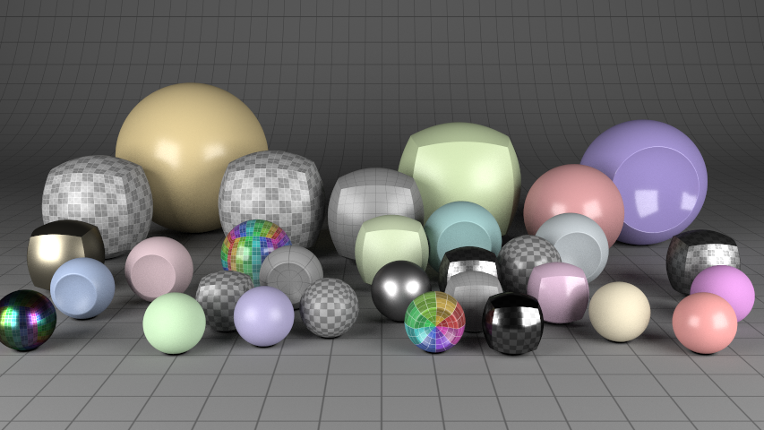

# Yocto/GL: C/C++ Single File Libraries for Physically-Based Graphics

Yocto/GL is a collection of single-file libraries, or single .h/.cpp pairs, for building physically-based graphics applications. Yocto/GL is written in C++ and compiles on OSX (clang), Linux (clang/gcc) and Windows (cl). You can use Yocto/GL as either header-only libraries, for simplicity, or .h/.cpp pairs, to rduce code bloat and compile time.

## Main Libraries

- **yocto_obj (.h/.cpp)** - Wavefront OBJ/MTL loader and writer that supports arbitrary polygons (with/without triangulation), lines, and points. Includes optionals extensions for per-vertex color and radius, camera and environment map. Optionally depends on `yocto_img.h/.cpp` for texture loading.
- **yocto_gltf (.h/.cpp)** - Khronos glTF loader and writer automatically generated by the spec. Supports all glTF format including Khronos extensions. Depends on `json.hpp` for json parsing. Optionally depends on `yocto_img.h/.cpp` for texture loading and writing.
- **yocto_bvh (.h/.cpp)** - Ray casting and closet point queries of points, lines and triangles accelerated by a two-level bounding volume hierarchy. Implementation depends on `yocto_math.h`.
- **yocto_shape (.h/.cpp)** - Utilities for manipulating shapes composed of points, lines, triangles or quads. Includes parametric shape generation, uniform tesselation, normal computation, uniform shape sampling. Implementation depends on `yocto_math.h`.
- **yocto_trace (.h/.cpp)** - Path tracer with support for point, line or triangle geometry, mesh area lights and environment maps, materials with either GGX or Phong (only opaque for now). Support both incremental and offline computation on single- or multi-core machines. Implementation depends on `yocto_math.h`.
- **yocto_sym (.h/.cpp)** - Rigid body solver supporting convex and concave triangle meshes based on Sequential Impulses (aka Projected Gauss-Sidel). Implementation depends on `yocto_math.h`.

## Support Libraries

- **yocto_cmd (.h only)** - Utilities for writing command line applications. Includes in  particular a command line parsing library that support options and arguments of ints, floats, strings, enums. Likely, we will move this to (.h,.cpp).
- **yocto_glu (.h/.cpp)** - Quick and dirty rendering of images and shapes in OpenGL, useful to create interactive viewers.
- **yocto_img (.h/.cpp)** - Quick and dirty image loading and saving baSed on stb_image.
- **yocto_math (.h only)** - A few vector math routines used to implement Yocto/GL libraries.

## Documentation

All documentation is included in each library file in plain ASCII. If desired, runs `doxygen` in the root directory to get html formatted documentation.

## Examples

This repository contains Yocto/GL applications written to test the libraries.

- **yobj2gltf.cpp**: Converts Wavefront OBJ to glTF 1.1.
- **ytestgen.cpp**: Creates various test cases for the path tracer and GL viewer.
- **yimview.cpp**: HDR/PNG/JPG image viewer with exposure/gamma tone mapping.
- **yshade.cpp**: Simple OpenGL viewer.
- **yitrace.cpp**: Interactive path-tracer.
- **ytrace.cpp**: Offline path-tracer.
- **yisym.cpp**: Interactive rigid body demo code.
- **ysym.cpp**: Offline rigid body demo.
- **yimproc.cpp**: Offline image manipulation.

A few screenshots from **ytrace** are included here for demonstration.

A screenshotted movie from **ysym** is included here for demonstration.

### Building

You can build the non-interactive example apps using [cmake](http://cmake.org)
with

    mkdir cmake
    cd cmake
    cmake ..\apps
    make -j4        # linux/OSX
    msbuild         # Windows

The interactive apps use OpenGL, GLFW and GLEW. We include binaries for Windows, but you have to install the libraries youself on Linux (we use `apt-get`) and OSX (we use [homebrew](http://brew.sh)). After installing these libraries, you can include these examples in the build by changing the cmake line above with

    cmake -DBUILD_OPENGL_APPS=ON ..\apps

## Brief Development History

- Switch to .H/.CPP pairs
    - Compilation times are three times faster for the example applications
    - Better separation of interface and implementation
- Doxygen documentation
- Internal speedup using raw pointers
- Khronos glTF support
- Modern C++ API
    - Using references to avoid pointer chasing and memory management
    - OBJ loading conforms better to raw file format
    - significantly reduce code length, but maintaining same features
- Moving to C++
    - Removed old C API
    - Use STL containers by default
- Switched
- Moved to C++ internals and common math library.
- Rigid body solver.
- Initial release.

## License

Yocto/GL libraries are released under the permissive MIT license, while the example apps are released under the 2-clause BSD (to include warranty for binary distribution).
