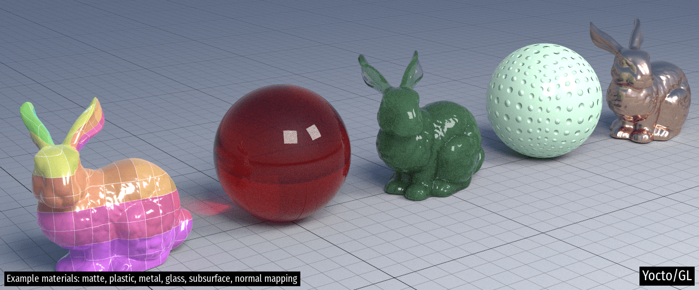
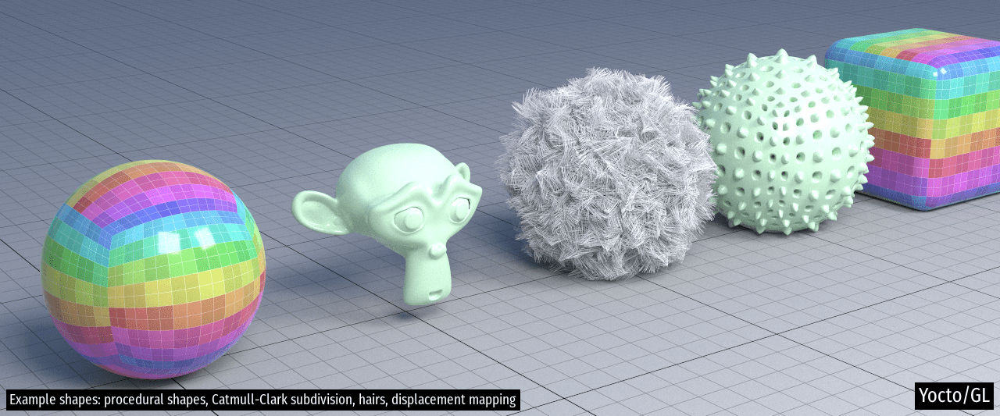

# Yocto/GL: Tiny C++ Libraries for Data-Oriented Physically-based Graphics

Yocto/GL is a collection of small C++17 libraries for building
physically-based graphics algorithms released under the MIT license.
Yocto/GL is written in a deliberatly data-oriented style for ease of
development and use.
Yocto/GL is split into small libraries to make code navigation easier.
See each header file for documentation.

- `yocto/yocto_math.{h}`: fixed-size vectors, matrices, rigid frames, rays,
   bounding boxes, transforms, random number generation, color and geometry
   functions, Perlin noise, shading and integration utilities
- `yocto/yocto_shape.{h,cpp}`:  various utilities for manipulating
   triangle meshes, quads meshes and line sets, computation of normals and
   tangents, linear and Catmull-Clark subdivision, mesh loading and saving,
   procedural shapes generation, ray intersection and closest point queries of
   triangle meshes, quads meshes, line sets and instances scenes using a
   two-level bounding volume hierarchy
- `yocto/yocto_image.{h,cpp}`: simple image data type, image resizing,
   tonemapping, color correction, image loading and saving,
   procedural images, procedural sun-sky, advanced color conversion utilities
- `yocto/yocto_trace.{h,cpp}`: path tracing of surfaces and hairs supporting
   area and environment illumination, microfacet GGX and subsurface scattering,
   multiple importance sampling
- `yocto/yocto_sceneio.{h,cpp}`: scene loading and saving of Ply/Obj/Pbrt/glTF 
   and a custom and scalable Json format
- `yocto/yocto_ply.h`: parsing and writing for Ply format
- `yocto/yocto_obj.h`: parsing and writing for Obj format
- `yocto/yocto_pbrt.h`: parsing and writing for Pbrt format
- `yocto/yocto_commonio.h`: printing utilities, file io utilities,
  command line parsing
- `yocto/yocto_common.h`: container, iterators and concurrency utilities

You can see Yocto/GL in action in the following applications written to
test the library:

- `apps/yscntrace.cpp`:   command-line path-tracer
- `apps/yscnitrace.cpp`:  interactive path-tracer
- `apps/yscnitraces.cpp`: simpler version of `apps/yscnitrace.cpp` for demos
- `apps/yscnproc.cpp`: command-line scene manipulation and conversion
- `apps/ymshproc.cpp`: command-line mesh manipulation and conversion
- `apps/yimgview.cpp`: Hdr/Ldr image viewer with tonemapping and color grading
- `apps/yimgviews.cpp`: simpler version of `apps/yimgview.cpp` for demos
- `apps/yimgproc.cpp`: command-line image manipulation
- `apps/yscnview.cpp`: simple OpenGL viewer

Here are some test images rendered with the path tracer. More images are
included in the [project site](https://xelatihy.github.io/yocto-gl/).

## Design Considerations

Yocto/GL follows a "data-oriented programming model" that makes data explicit.
Data is stored in simple structs and accessed with free functions or directly.
All data is public, so we make no attempt at encapsulation.
Most objects is Yocto/GL have value semantic, while large data structures 
use reference semnatic with strict ownership. This means that everything 
can be trivially serialized and there is no need for memory management.

We do this since this makes Yocto/GL easier to extend and quicker to learn,
with a more explicit data flow that is easier when writing parallel code.
Since Yocto/GL is mainly used for research and teaching,
explicit data is both more hackable and easier to understand.

In terms of code style we prefer a functional approach rather than an
object oriented one, favoring free functions to class methods. All functions
and data are defined in sibling namespaces contained in the `yocto` namespace 
so libraries can call all others, but have to do so explicitly. 

The use of templates in Yocto was the reason for many refactorings, going
from no template to heavy template use. At this point, Yocto uses few templates 
for readability. In the future, we will increase the use of templates in code
implementation, while keeping most APIs explicitly typed and nor generic.

We do not use exception for error repoting, but only to report "programmers"
errors. For example, IO operations use boolean flags and error strings for
human readable errors, while exceptions are used when preconditions or 
postconditions are violatd in functions.

The current version of the library (2.x) is a major refacting of the previous 
library versions (1.x) in three main aspects. First, we now allow the use of 
reference semantric via pointers and adopt it for all large objects, while 
keeping value semantic for all others. We did this to avoid erroneous copies
that cannot detected and avoided at compile time. Second, we had trouble 
interacting with C libraries that mostly use reference semantic. Third, we
reduce the use of exceptions, again for better intergration with external code.

## Credits

Main contributors:

- Fabio Pellacini (lead developer): [web](http://pellacini.di.uniroma1.it), [github](https://github.com/xelatihy)
- Edoardo Carra: [github](https://github.com/edoardocarra)
- Giacomo Nazzaro: [github](https://github.com/giacomonazzaro)

This library includes code from the [PCG random number generator](http://www.pcg-random.org),
boost `hash_combine`, and public domain code from `github.com/sgorsten/linalg`,
`gist.github.com/badboy/6267743` and `github.com/nothings/stb_perlin.h`.
Other external libraries are included with their own license.

## Compilation

This library requires a C++17 compiler and is know to compiled on
OsX (Xcode >= 10), Windows (MSVC 2019) and Linux (gcc >= 7, clang >= 4).

You can build the example applications using CMake with
    `mkdir build; cd build; cmake ..; cmake --build`

Yocto/GL depends on `stb_image.h`, `stb_image_write.h`, `stb_image_resize.h` and
`tinyexr.h` for image loading, saving and resizing,  `cgltf.h` and `json.hpp`
for glTF and JSON support, and `filesystem.hpp` to support C++17 filesystem API 
when missing. All dependencies are included in the distribution.

We optionally support building OpenGL demos, which are handled by including
glad, GLFW, ImGui as dependecies in apps. OpenGL support might eventually
become part of the Yocto/GL libraries. OpenGL support is enabled by defining
the cmake option `YOCTO_OPENGL` and contained in the `yocto_gui` library.

Finally, we optionally support the use of Intel's Embree for ray casting.
At this point, we rely pon prebuilt binaries distributed by Intel.
See the main CMake file for how to link to it. Embree support is enabled by
defining the cmake option `YOCTO_EMBREE`.
